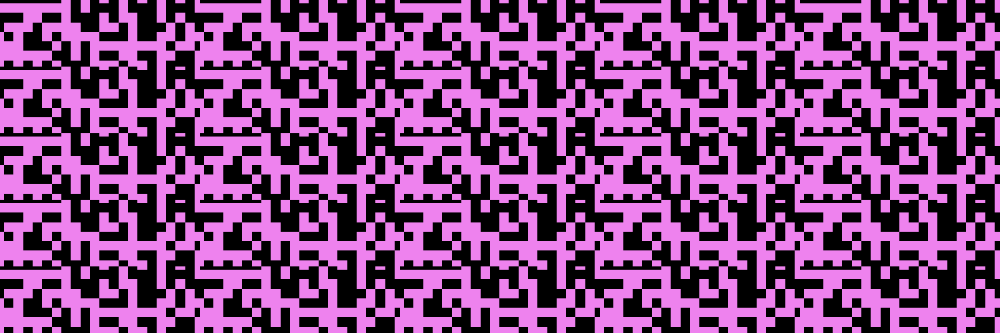

# Q1 universe is mine.
[q1universeismine.net](https://www.q1universeismine.net/)

**QR code references to first 1000 [Wikidata](https://www.wikidata.org/wiki/Wikidata:Main_Page) entities,
digitally signed by the artist.**  
**All these worlds are yours. Attempt no landing at other entities.**

1,000 NFT collectables will be dropped in 20 batches (50 items each) beginning in September 2021. 
They will be dropped into [OpenSea](https://opensea.io/) via [Polygon](https://polygon.technology/). 
Follow [@q1universe](https://twitter.com/q1universe) on Twitter for drop announcements. 
The items are fractionally priced, decreasing in price from Q1 Universe is mine.

**They are concepts, and have references: own them. All of them.**

--- 

**Code**

`_q1universeismine.R`
- fetch Wikidata item via API
- obtain `en` label where available
- digitally sign in the URL query string
- pricing
- pick random background color
- timestamp
- add random batch
- produce QR codes.

`produce_q1universeismine_Rmd.R`
- abstraction to produce `index.Rmd` and
- render `index.html`;
- the rendered batch(es) are controlled via `sb`.

You will also need the following directories to produce your own:
- `_art_frame/`
- `_qr`

**Note.** Because this is unique artwork I am not using `set.seed()` anywhere. You will be able to produce your own artwork - formally equivalent to mine - but the choice of the QR code background color is left random. The works at [q1universeismine.net](https://www.q1universeismine.net/) were rendered **once**, on 2021/09/25.
