
**QR code references to first 1,000 Wikidata entities.** **All these worlds are yours. Attempt no landing at other entities.** 
<h3>Q1 universe is mine.</h3>totality consisting of space, time, matter and energy [https://www.q1universeismine.net#Q1](https://www.q1universeismine.net#Q1) 2021-09-09 07:55:10 UTC { width=45% }
<h3>Q2 Earth is mine.</h3>third planet from the Sun in the Solar System [https://www.q1universeismine.net#Q2](https://www.q1universeismine.net#Q2) 2021-09-09 07:55:11 UTC { width=45% }
<h3>Q3 life is mine.</h3>matter capable of extracting energy from the environment for replication [https://www.q1universeismine.net#Q3](https://www.q1universeismine.net#Q3) 2021-09-09 07:55:12 UTC { width=45% }
<h3>Q4 death is mine.</h3>permanent cessation of vital functions [https://www.q1universeismine.net#Q4](https://www.q1universeismine.net#Q4) 2021-09-09 07:55:12 UTC { width=45% }
<h3>Q5 human is mine.</h3>common name of Homo sapiens, unique extant species of the genus Homo [https://www.q1universeismine.net#Q5](https://www.q1universeismine.net#Q5) 2021-09-09 07:55:13 UTC { width=45% }
<h3>Q6 is mine.</h3>No description [https://www.q1universeismine.net#Q6](https://www.q1universeismine.net#Q6) 2021-09-09 07:55:13 UTC { width=45% }
<h3>Q7 is mine.</h3>No description [https://www.q1universeismine.net#Q7](https://www.q1universeismine.net#Q7) 2021-09-09 07:55:13 UTC [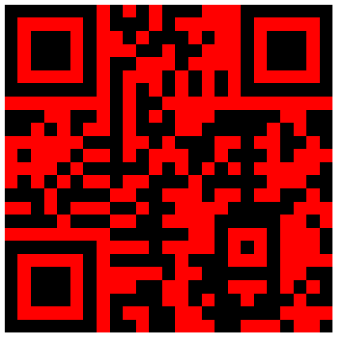](https://www.wikidata.org/wiki/Q7){ width=45% }
<h3>Q8 happiness is mine.</h3>mental or emotional state of well-being characterized by pleasant emotions [https://www.q1universeismine.net#Q8](https://www.q1universeismine.net#Q8) 2021-09-09 07:55:13 UTC { width=45% }
<h3>Q9 is mine.</h3>No description [https://www.q1universeismine.net#Q9](https://www.q1universeismine.net#Q9) 2021-09-09 07:55:14 UTC { width=45% }
<h3>Q10 is mine.</h3>No description [https://www.q1universeismine.net#Q10](https://www.q1universeismine.net#Q10) 2021-09-09 07:55:14 UTC { width=45% }
<h3>Q11 is mine.</h3>No description [https://www.q1universeismine.net#Q11](https://www.q1universeismine.net#Q11) 2021-09-09 07:55:14 UTC [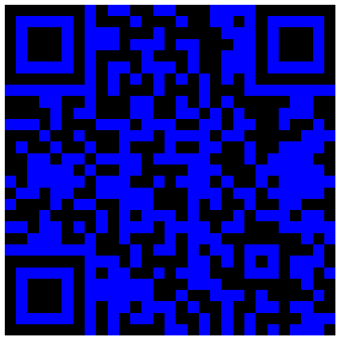](https://www.wikidata.org/wiki/Q11){ width=45% }
<h3>Q12 is mine.</h3>No description [https://www.q1universeismine.net#Q12](https://www.q1universeismine.net#Q12) 2021-09-09 07:55:14 UTC { width=45% }
<h3>Q13 triskaidekaphobia is mine.</h3>fear of the number 13 [https://www.q1universeismine.net#Q13](https://www.q1universeismine.net#Q13) 2021-09-09 07:55:14 UTC [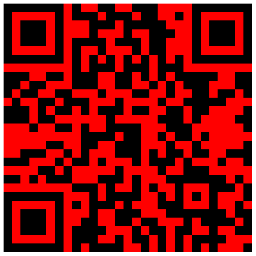](https://www.wikidata.org/wiki/Q13){ width=45% }
<h3>Q14 is mine.</h3>No description [https://www.q1universeismine.net#Q14](https://www.q1universeismine.net#Q14) 2021-09-09 07:55:15 UTC { width=45% }
<h3>Q15 Africa is mine.</h3>continent on the Earth's northern and southern hemispheres [https://www.q1universeismine.net#Q15](https://www.q1universeismine.net#Q15) 2021-09-09 07:55:15 UTC { width=45% }
<h3>Q16 Canada is mine.</h3>sovereign state in North America [https://www.q1universeismine.net#Q16](https://www.q1universeismine.net#Q16) 2021-09-09 07:55:17 UTC { width=45% }
<h3>Q17 Japan is mine.</h3>sovereign state in East Asia [https://www.q1universeismine.net#Q17](https://www.q1universeismine.net#Q17) 2021-09-09 07:55:18 UTC { width=45% }
<h3>Q18 South America is mine.</h3>continent, mainly on the Earth's southwestern quadrant [https://www.q1universeismine.net#Q18](https://www.q1universeismine.net#Q18) 2021-09-09 07:55:19 UTC { width=45% }
<h3>Q19 cheating is mine.</h3>breaking of rules to gain advantage [https://www.q1universeismine.net#Q19](https://www.q1universeismine.net#Q19) 2021-09-09 07:55:19 UTC { width=45% }
<h3>Q20 Norway is mine.</h3>country in northern Europe [https://www.q1universeismine.net#Q20](https://www.q1universeismine.net#Q20) 2021-09-09 07:55:21 UTC { width=45% }
<h3>Q21 England is mine.</h3>country in north-west Europe, part of the United Kingdom [https://www.q1universeismine.net#Q21](https://www.q1universeismine.net#Q21) 2021-09-09 07:55:21 UTC [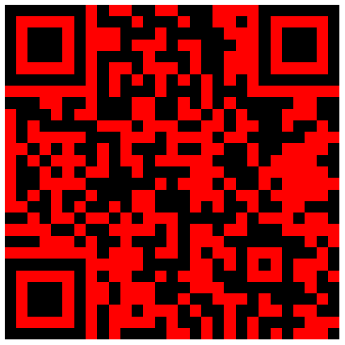](https://www.wikidata.org/wiki/Q21){ width=45% }
<h3>Q22 Scotland is mine.</h3>country in Northwest Europe, part of the United Kingdom [https://www.q1universeismine.net#Q22](https://www.q1universeismine.net#Q22) 2021-09-09 07:55:22 UTC { width=45% }
<h3>Q23 George Washington is mine.</h3>1st president of the United States (1732-1799) [https://www.q1universeismine.net#Q23](https://www.q1universeismine.net#Q23) 2021-09-09 07:55:23 UTC { width=45% }
<h3>Q24 Jack Bauer is mine.</h3>character from the television series 24 [https://www.q1universeismine.net#Q24](https://www.q1universeismine.net#Q24) 2021-09-09 07:55:23 UTC [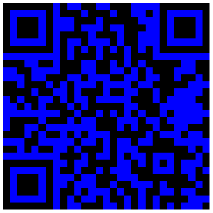](https://www.wikidata.org/wiki/Q24){ width=45% }
<h3>Q25 Wales is mine.</h3>country in Northwest Europe, part of the United Kingdom [https://www.q1universeismine.net#Q25](https://www.q1universeismine.net#Q25) 2021-09-09 07:55:24 UTC [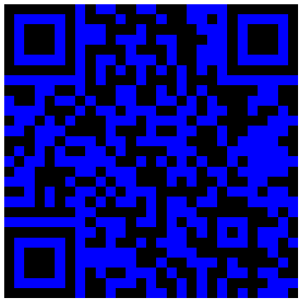](https://www.wikidata.org/wiki/Q25){ width=45% }
<h3>Q26 Northern Ireland is mine.</h3>country in the northern part of the island of Ireland; part of the United Kingdom [https://www.q1universeismine.net#Q26](https://www.q1universeismine.net#Q26) 2021-09-09 07:55:25 UTC [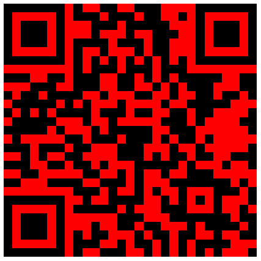](https://www.wikidata.org/wiki/Q26){ width=45% }
<h3>Q27 Ireland is mine.</h3>sovereign state in northwestern Europe covering five-sixths of the island of Ireland [https://www.q1universeismine.net#Q27](https://www.q1universeismine.net#Q27) 2021-09-09 07:55:26 UTC { width=45% }
<h3>Q28 Hungary is mine.</h3>country in Central Europe [https://www.q1universeismine.net#Q28](https://www.q1universeismine.net#Q28) 2021-09-09 07:55:27 UTC [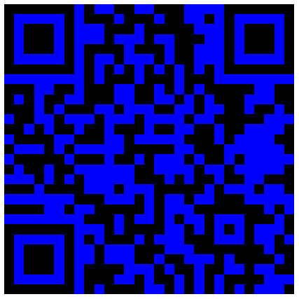](https://www.wikidata.org/wiki/Q28){ width=45% }
<h3>Q29 Spain is mine.</h3>country in southwestern Europe [https://www.q1universeismine.net#Q29](https://www.q1universeismine.net#Q29) 2021-09-09 07:55:29 UTC [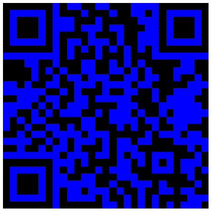](https://www.wikidata.org/wiki/Q29){ width=45% }
<h3>Q30 United States of America is mine.</h3>sovereign state in North America [https://www.q1universeismine.net#Q30](https://www.q1universeismine.net#Q30) 2021-09-09 07:55:30 UTC { width=45% }
<h3>Q31 Belgium is mine.</h3>country in western Europe [https://www.q1universeismine.net#Q31](https://www.q1universeismine.net#Q31) 2021-09-09 07:55:32 UTC { width=45% }
<h3>Q32 Luxembourg is mine.</h3>country in Western Europe [https://www.q1universeismine.net#Q32](https://www.q1universeismine.net#Q32) 2021-09-09 07:55:33 UTC { width=45% }
<h3>Q33 Finland is mine.</h3>country in northern Europe [https://www.q1universeismine.net#Q33](https://www.q1universeismine.net#Q33) 2021-09-09 07:55:34 UTC { width=45% }
<h3>Q34 Sweden is mine.</h3>sovereign state in northern Europe [https://www.q1universeismine.net#Q34](https://www.q1universeismine.net#Q34) 2021-09-09 07:55:36 UTC { width=45% }
<h3>Q35 Denmark is mine.</h3>country in northern Europe [https://www.q1universeismine.net#Q35](https://www.q1universeismine.net#Q35) 2021-09-09 07:55:37 UTC { width=45% }
<h3>Q36 Poland is mine.</h3>country in Central Europe [https://www.q1universeismine.net#Q36](https://www.q1universeismine.net#Q36) 2021-09-09 07:55:39 UTC { width=45% }
<h3>Q37 Lithuania is mine.</h3>sovereign state in northeastern Europe [https://www.q1universeismine.net#Q37](https://www.q1universeismine.net#Q37) 2021-09-09 07:55:40 UTC { width=45% }
<h3>Q38 Italy is mine.</h3>country in Southern Europe [https://www.q1universeismine.net#Q38](https://www.q1universeismine.net#Q38) 2021-09-09 07:55:41 UTC { width=45% }
<h3>Q39 Switzerland is mine.</h3>federal state in Western Europe [https://www.q1universeismine.net#Q39](https://www.q1universeismine.net#Q39) 2021-09-09 07:55:43 UTC { width=45% }
<h3>Q40 Austria is mine.</h3>country in Central Europe [https://www.q1universeismine.net#Q40](https://www.q1universeismine.net#Q40) 2021-09-09 07:55:44 UTC { width=45% }
<h3>Q41 Greece is mine.</h3>country in southeastern Europe [https://www.q1universeismine.net#Q41](https://www.q1universeismine.net#Q41) 2021-09-09 07:55:46 UTC [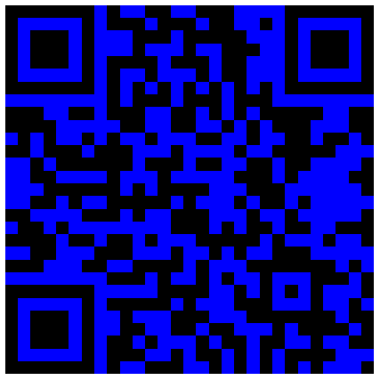](https://www.wikidata.org/wiki/Q41){ width=45% }
<h3>Q42 Douglas Adams is mine.</h3>English writer and humorist [https://www.q1universeismine.net#Q42](https://www.q1universeismine.net#Q42) 2021-09-09 07:55:46 UTC { width=45% }
<h3>Q43 Turkey is mine.</h3>sovereign state straddling Southeastern Europe and Western Asia [https://www.q1universeismine.net#Q43](https://www.q1universeismine.net#Q43) 2021-09-09 07:55:48 UTC { width=45% }
<h3>Q44 beer is mine.</h3>alcoholic drink [https://www.q1universeismine.net#Q44](https://www.q1universeismine.net#Q44) 2021-09-09 07:55:48 UTC { width=45% }
<h3>Q45 Portugal is mine.</h3>country in southwestern Europe [https://www.q1universeismine.net#Q45](https://www.q1universeismine.net#Q45) 2021-09-09 07:55:49 UTC { width=45% }
<h3>Q46 Europe is mine.</h3>continent on Earth, mainly on the northeastern quadrant, i.e. north-western Eurasia [https://www.q1universeismine.net#Q46](https://www.q1universeismine.net#Q46) 2021-09-09 07:55:50 UTC { width=45% }
<h3>Q47 is mine.</h3>No description [https://www.q1universeismine.net#Q47](https://www.q1universeismine.net#Q47) 2021-09-09 07:55:50 UTC { width=45% }
<h3>Q48 Asia is mine.</h3>continent on Earth, mainly on the Earth's northeastern quadrant [https://www.q1universeismine.net#Q48](https://www.q1universeismine.net#Q48) 2021-09-09 07:55:51 UTC { width=45% }
<h3>Q49 North America is mine.</h3>continent on the Earth's northwestern quadrant [https://www.q1universeismine.net#Q49](https://www.q1universeismine.net#Q49) 2021-09-09 07:55:52 UTC { width=45% }
<h3>Q50 is mine.</h3>No description [https://www.q1universeismine.net#Q50](https://www.q1universeismine.net#Q50) 2021-09-09 07:55:52 UTC { width=45% }
<h3>Q51 Antarctica is mine.</h3>polar continent on the southern hemisphere [https://www.q1universeismine.net#Q51](https://www.q1universeismine.net#Q51) 2021-09-09 07:55:52 UTC { width=45% }
<h3>Q52 Wikipedia is mine.</h3>free online encyclopedia that anyone can edit [https://www.q1universeismine.net#Q52](https://www.q1universeismine.net#Q52) 2021-09-09 07:55:53 UTC { width=45% }
<h3>Q53 Club-Mate is mine.</h3>caffeinated maté drink [https://www.q1universeismine.net#Q53](https://www.q1universeismine.net#Q53) 2021-09-09 07:55:54 UTC [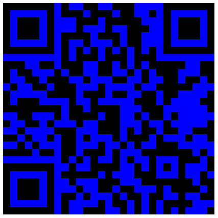](https://www.wikidata.org/wiki/Q53){ width=45% }
<h3>Q54 All your base are belong to us is mine.</h3>Internet meme about a bad translation of a video game [https://www.q1universeismine.net#Q54](https://www.q1universeismine.net#Q54) 2021-09-09 07:55:54 UTC { width=45% }
<h3>Q55 Netherlands is mine.</h3>country in western Europe [https://www.q1universeismine.net#Q55](https://www.q1universeismine.net#Q55) 2021-09-09 07:55:55 UTC { width=45% }
<h3>Q56 lolcat is mine.</h3>image combining a photograph of a cat with text intended to contribute humour [https://www.q1universeismine.net#Q56](https://www.q1universeismine.net#Q56) 2021-09-09 07:55:56 UTC { width=45% }
<h3>Q57 Never Gonna Give You Up is mine.</h3>1987 song performed by Rick Astley, viral internet meme [https://www.q1universeismine.net#Q57](https://www.q1universeismine.net#Q57) 2021-09-09 07:55:56 UTC [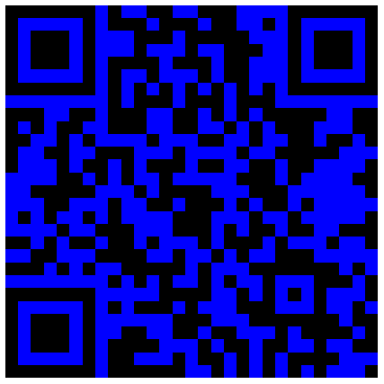](https://www.wikidata.org/wiki/Q57){ width=45% }
<h3>Q58 penis is mine.</h3>primary sexual organ that male animals use to inseminate sexually receptive mates (females or hermaphrodites) during copulation, occurring in many (but not all) animals, including humans [https://www.q1universeismine.net#Q58](https://www.q1universeismine.net#Q58) 2021-09-09 07:55:56 UTC { width=45% }
<h3>Q59 PHP is mine.</h3>scripting language focused on web development [https://www.q1universeismine.net#Q59](https://www.q1universeismine.net#Q59) 2021-09-09 07:55:57 UTC { width=45% }
<h3>Q60 New York City is mine.</h3>largest city in the United States [https://www.q1universeismine.net#Q60](https://www.q1universeismine.net#Q60) 2021-09-09 07:55:58 UTC { width=45% }
<h3>Q61 Washington, D.C. is mine.</h3>capital city of the United States [https://www.q1universeismine.net#Q61](https://www.q1universeismine.net#Q61) 2021-09-09 07:55:59 UTC { width=45% }
<h3>Q62 San Francisco is mine.</h3>consolidated city-county in California, United States [https://www.q1universeismine.net#Q62](https://www.q1universeismine.net#Q62) 2021-09-09 07:56:00 UTC { width=45% }
<h3>Q63 is mine.</h3>No description [https://www.q1universeismine.net#Q63](https://www.q1universeismine.net#Q63) 2021-09-09 07:56:00 UTC { width=45% }
<h3>Q64 Berlin is mine.</h3>federal state, capital and largest city of Germany [https://www.q1universeismine.net#Q64](https://www.q1universeismine.net#Q64) 2021-09-09 07:56:01 UTC [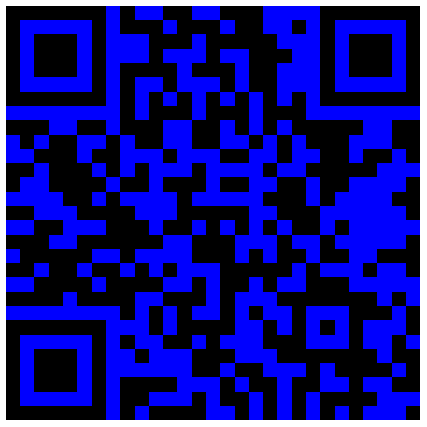](https://www.wikidata.org/wiki/Q64){ width=45% }
<h3>Q65 Los Angeles is mine.</h3>county seat of Los Angeles County, California; second largest city in the United States by population [https://www.q1universeismine.net#Q65](https://www.q1universeismine.net#Q65) 2021-09-09 07:56:02 UTC { width=45% }
<h3>Q66 Boeing is mine.</h3>aerospace and defense manufacturer in the United States [https://www.q1universeismine.net#Q66](https://www.q1universeismine.net#Q66) 2021-09-09 07:56:03 UTC { width=45% }
<h3>Q67 Airbus is mine.</h3>European aircraft manufacturer [https://www.q1universeismine.net#Q67](https://www.q1universeismine.net#Q67) 2021-09-09 07:56:03 UTC { width=45% }
<h3>Q68 computer is mine.</h3>general-purpose device for performing arithmetic or logical operations [https://www.q1universeismine.net#Q68](https://www.q1universeismine.net#Q68) 2021-09-09 07:56:04 UTC { width=45% }
<h3>Q69 Courrendlin is mine.</h3>municipality in the canton of Jura, Switzerland [https://www.q1universeismine.net#Q69](https://www.q1universeismine.net#Q69) 2021-09-09 07:56:05 UTC { width=45% }
<h3>Q70 Bern is mine.</h3>De facto capital of Switzerland [https://www.q1universeismine.net#Q70](https://www.q1universeismine.net#Q70) 2021-09-09 07:56:05 UTC { width=45% }
<h3>Q71 Geneva is mine.</h3>city in Switzerland and capital of its canton [https://www.q1universeismine.net#Q71](https://www.q1universeismine.net#Q71) 2021-09-09 07:56:06 UTC [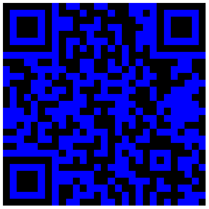](https://www.wikidata.org/wiki/Q71){ width=45% }
<h3>Q72 Zürich is mine.</h3>capital of the canton of Zürich, Switzerland [https://www.q1universeismine.net#Q72](https://www.q1universeismine.net#Q72) 2021-09-09 07:56:07 UTC { width=45% }
<h3>Q73 Internet Relay Chat is mine.</h3>protocol for real-time Internet chat and messaging [https://www.q1universeismine.net#Q73](https://www.q1universeismine.net#Q73) 2021-09-09 07:56:08 UTC { width=45% }
<h3>Q74 Breighton is mine.</h3>village in Yorkshire, England [https://www.q1universeismine.net#Q74](https://www.q1universeismine.net#Q74) 2021-09-09 07:56:08 UTC [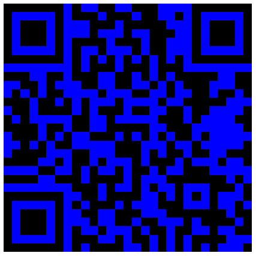](https://www.wikidata.org/wiki/Q74){ width=45% }
<h3>Q75 Internet is mine.</h3>global system of connected computer networks [https://www.q1universeismine.net#Q75](https://www.q1universeismine.net#Q75) 2021-09-09 07:56:09 UTC { width=45% }
<h3>Q76 Barack Obama is mine.</h3>44th president of the United States [https://www.q1universeismine.net#Q76](https://www.q1universeismine.net#Q76) 2021-09-09 07:56:10 UTC { width=45% }
<h3>Q77 Uruguay is mine.</h3>sovereign state in South America [https://www.q1universeismine.net#Q77](https://www.q1universeismine.net#Q77) 2021-09-09 07:56:11 UTC { width=45% }
<h3>Q78 Basel is mine.</h3>city on the Rhine, in Switzerland [https://www.q1universeismine.net#Q78](https://www.q1universeismine.net#Q78) 2021-09-09 07:56:11 UTC { width=45% }
<h3>Q79 Egypt is mine.</h3>sovereign state in North Africa and Asia [https://www.q1universeismine.net#Q79](https://www.q1universeismine.net#Q79) 2021-09-09 07:56:13 UTC [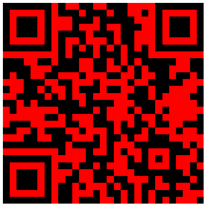](https://www.wikidata.org/wiki/Q79){ width=45% }
<h3>Q80 Tim Berners-Lee is mine.</h3>British computer scientist, inventor of the World Wide Web [https://www.q1universeismine.net#Q80](https://www.q1universeismine.net#Q80) 2021-09-09 07:56:13 UTC { width=45% }
<h3>Q81 carrot is mine.</h3>root vegetable, usually orange in color [https://www.q1universeismine.net#Q81](https://www.q1universeismine.net#Q81) 2021-09-09 07:56:14 UTC { width=45% }
<h3>Q82 printer is mine.</h3>computer peripheral that prints text or graphics [https://www.q1universeismine.net#Q82](https://www.q1universeismine.net#Q82) 2021-09-09 07:56:14 UTC { width=45% }
<h3>Q83 MediaWiki is mine.</h3>wiki software developed by the Wikimedia Foundation (WMF) [https://www.q1universeismine.net#Q83](https://www.q1universeismine.net#Q83) 2021-09-09 07:56:16 UTC { width=45% }
<h3>Q84 London is mine.</h3>capital and largest city of the United Kingdom [https://www.q1universeismine.net#Q84](https://www.q1universeismine.net#Q84) 2021-09-09 07:56:16 UTC { width=45% }
<h3>Q85 Cairo is mine.</h3>capital city of Egypt [https://www.q1universeismine.net#Q85](https://www.q1universeismine.net#Q85) 2021-09-09 07:56:17 UTC { width=45% }
<h3>Q86 headache is mine.</h3>pain in the head or neck [https://www.q1universeismine.net#Q86](https://www.q1universeismine.net#Q86) 2021-09-09 07:56:18 UTC { width=45% }
<h3>Q87 Alexandria is mine.</h3>second largest city in Egypt [https://www.q1universeismine.net#Q87](https://www.q1universeismine.net#Q87) 2021-09-09 07:56:18 UTC { width=45% }
<h3>Q88 Alexandria is mine.</h3>city in the state of Virginia, US [https://www.q1universeismine.net#Q88](https://www.q1universeismine.net#Q88) 2021-09-09 07:56:19 UTC { width=45% }
<h3>Q89 apple is mine.</h3>fruit of the apple tree [https://www.q1universeismine.net#Q89](https://www.q1universeismine.net#Q89) 2021-09-09 07:56:20 UTC { width=45% }
<h3>Q90 Paris is mine.</h3>capital and largest city of France [https://www.q1universeismine.net#Q90](https://www.q1universeismine.net#Q90) 2021-09-09 07:56:21 UTC { width=45% }
<h3>Q91 Abraham Lincoln is mine.</h3>16th president of the United States (1809-1865) [https://www.q1universeismine.net#Q91](https://www.q1universeismine.net#Q91) 2021-09-09 07:56:22 UTC { width=45% }
<h3>Q92 is mine.</h3>No description [https://www.q1universeismine.net#Q92](https://www.q1universeismine.net#Q92) 2021-09-09 07:56:22 UTC { width=45% }
<h3>Q93 is mine.</h3>No description [https://www.q1universeismine.net#Q93](https://www.q1universeismine.net#Q93) 2021-09-09 07:56:22 UTC [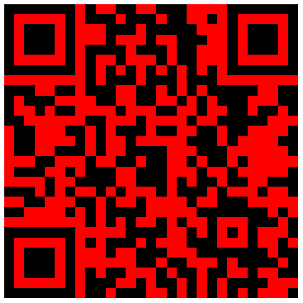](https://www.wikidata.org/wiki/Q93){ width=45% }
<h3>Q94 Android is mine.</h3>open-source operating system for mobile devices created by Google [https://www.q1universeismine.net#Q94](https://www.q1universeismine.net#Q94) 2021-09-09 07:56:23 UTC { width=45% }
<h3>Q95 Google is mine.</h3>American multinational Internet and technology corporation [https://www.q1universeismine.net#Q95](https://www.q1universeismine.net#Q95) 2021-09-09 07:56:23 UTC { width=45% }
<h3>Q96 Mexico is mine.</h3>sovereign state in North America [https://www.q1universeismine.net#Q96](https://www.q1universeismine.net#Q96) 2021-09-09 07:56:25 UTC { width=45% }
<h3>Q97 Atlantic Ocean is mine.</h3>second largest ocean on Earth [https://www.q1universeismine.net#Q97](https://www.q1universeismine.net#Q97) 2021-09-09 07:56:26 UTC [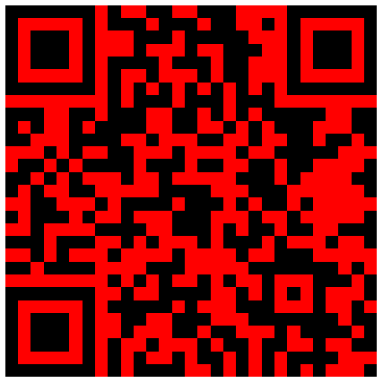](https://www.wikidata.org/wiki/Q97){ width=45% }
<h3>Q98 Pacific Ocean is mine.</h3>ocean between Asia and Australia in the west, the Americas in the east and Antarctica or the Southern Ocean [https://www.q1universeismine.net#Q98](https://www.q1universeismine.net#Q98) 2021-09-09 07:56:26 UTC { width=45% }
<h3>Q99 California is mine.</h3>state of the United States of America [https://www.q1universeismine.net#Q99](https://www.q1universeismine.net#Q99) 2021-09-09 07:56:27 UTC [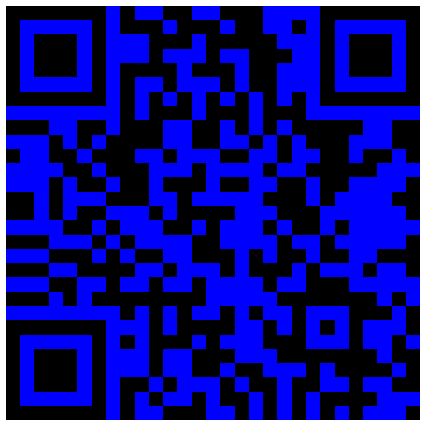](https://www.wikidata.org/wiki/Q99){ width=45% }
<h3>Q100 Boston is mine.</h3>city in and state capital of Massachusetts, United States [https://www.q1universeismine.net#Q100](https://www.q1universeismine.net#Q100) 2021-09-09 07:56:27 UTC { width=45% }
<h3>Q101 lopado­temacho­selacho­galeo­kranio­leipsano­drim­hypo­trimmato­silphio­karabo­melito­katakechy­meno­kichl­epi­kossypho­phatto­perister­alektryon­opte­kephallio­kigklo­peleio­lagoio­siraio­baphe­tragano­pterygon is mine.</h3>fictional dish and longest word in ancient Greek language [https://www.q1universeismine.net#Q101](https://www.q1universeismine.net#Q101) 2021-09-09 07:56:28 UTC [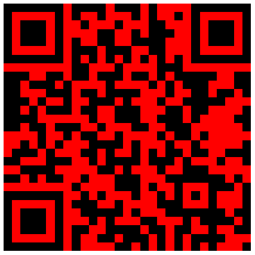](https://www.wikidata.org/wiki/Q101){ width=45% }
<h3>Q102 pneumonoultramicroscopicsilicovolcanoconiosis is mine.</h3>artificial word for a lung disease; longest English word published in a dictionary [https://www.q1universeismine.net#Q102](https://www.q1universeismine.net#Q102) 2021-09-09 07:56:28 UTC [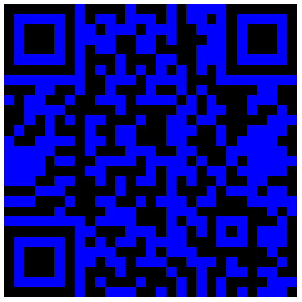](https://www.wikidata.org/wiki/Q102){ width=45% }
<h3>Q103 Supercalifragilisticexpialidocious is mine.</h3>song from the film and musical Mary Poppins [https://www.q1universeismine.net#Q103](https://www.q1universeismine.net#Q103) 2021-09-09 07:56:28 UTC { width=45% }
<h3>Q104 is mine.</h3>No description [https://www.q1universeismine.net#Q104](https://www.q1universeismine.net#Q104) 2021-09-09 07:56:29 UTC { width=45% }
<h3>Q105 Monday is mine.</h3>day of the week [https://www.q1universeismine.net#Q105](https://www.q1universeismine.net#Q105) 2021-09-09 07:56:29 UTC [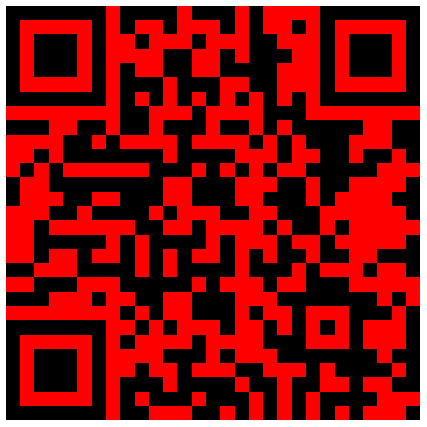](https://www.wikidata.org/wiki/Q105){ width=45% }
<h3>Q106 is mine.</h3>No description [https://www.q1universeismine.net#Q106](https://www.q1universeismine.net#Q106) 2021-09-09 07:56:29 UTC { width=45% }
<h3>Q107 space is mine.</h3>general framework of distances and directions according to a physical observer in its proper time [https://www.q1universeismine.net#Q107](https://www.q1universeismine.net#Q107) 2021-09-09 07:56:29 UTC [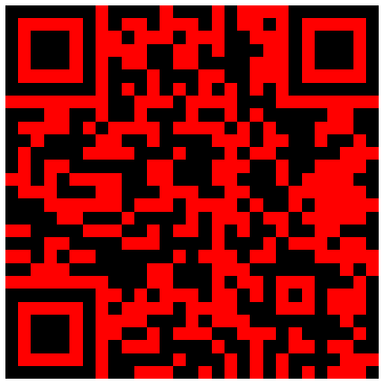](https://www.wikidata.org/wiki/Q107){ width=45% }
<h3>Q108 January is mine.</h3>first month in the Julian and Gregorian calendars [https://www.q1universeismine.net#Q108](https://www.q1universeismine.net#Q108) 2021-09-09 07:56:30 UTC { width=45% }
<h3>Q109 February is mine.</h3>second month in the Julian and Gregorian calendars [https://www.q1universeismine.net#Q109](https://www.q1universeismine.net#Q109) 2021-09-09 07:56:30 UTC { width=45% }
<h3>Q110 March is mine.</h3>third month in the Julian and Gregorian calendars [https://www.q1universeismine.net#Q110](https://www.q1universeismine.net#Q110) 2021-09-09 07:56:31 UTC { width=45% }
<h3>Q111 Mars is mine.</h3>fourth planet from the Sun [https://www.q1universeismine.net#Q111](https://www.q1universeismine.net#Q111) 2021-09-09 07:56:32 UTC [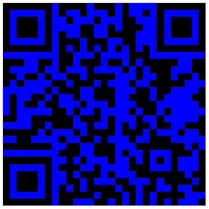](https://www.wikidata.org/wiki/Q111){ width=45% }
<h3>Q112 Mars is mine.</h3>Roman god of war, and guardian of agriculture [https://www.q1universeismine.net#Q112](https://www.q1universeismine.net#Q112) 2021-09-09 07:56:32 UTC { width=45% }
<h3>Q113 Schulze method is mine.</h3>Vote election system [https://www.q1universeismine.net#Q113](https://www.q1universeismine.net#Q113) 2021-09-09 07:56:32 UTC { width=45% }
<h3>Q114 Kenya is mine.</h3>sovereign state in East Africa [https://www.q1universeismine.net#Q114](https://www.q1universeismine.net#Q114) 2021-09-09 07:56:33 UTC { width=45% }
<h3>Q115 Ethiopia is mine.</h3>country in East Africa [https://www.q1universeismine.net#Q115](https://www.q1universeismine.net#Q115) 2021-09-09 07:56:35 UTC { width=45% }
<h3>Q116 monarch is mine.</h3>person at the head of a monarchy [https://www.q1universeismine.net#Q116](https://www.q1universeismine.net#Q116) 2021-09-09 07:56:35 UTC [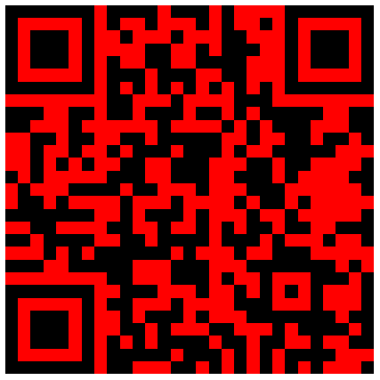](https://www.wikidata.org/wiki/Q116){ width=45% }
<h3>Q117 Ghana is mine.</h3>sovereign state in West Africa [https://www.q1universeismine.net#Q117](https://www.q1universeismine.net#Q117) 2021-09-09 07:56:36 UTC [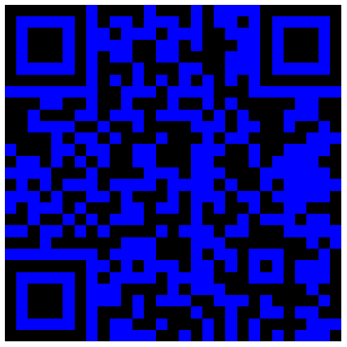](https://www.wikidata.org/wiki/Q117){ width=45% }
<h3>Q118 April is mine.</h3>fourth month in the Julian and Gregorian calendars [https://www.q1universeismine.net#Q118](https://www.q1universeismine.net#Q118) 2021-09-09 07:56:36 UTC { width=45% }
<h3>Q119 May is mine.</h3>fifth month in the Julian and Gregorian calendars [https://www.q1universeismine.net#Q119](https://www.q1universeismine.net#Q119) 2021-09-09 07:56:37 UTC { width=45% }
<h3>Q120 June is mine.</h3>sixth month in the Julian and Gregorian calendars [https://www.q1universeismine.net#Q120](https://www.q1universeismine.net#Q120) 2021-09-09 07:56:37 UTC [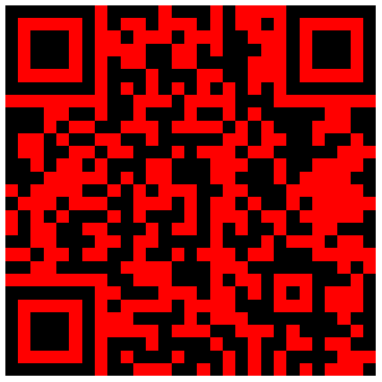](https://www.wikidata.org/wiki/Q120){ width=45% }
<h3>Q121 July is mine.</h3>seventh month in the Julian and Gregorian calendars [https://www.q1universeismine.net#Q121](https://www.q1universeismine.net#Q121) 2021-09-09 07:56:38 UTC [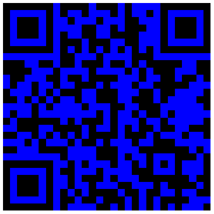](https://www.wikidata.org/wiki/Q121){ width=45% }
<h3>Q122 August is mine.</h3>eighth month in the Julian and Gregorian calendars [https://www.q1universeismine.net#Q122](https://www.q1universeismine.net#Q122) 2021-09-09 07:56:38 UTC { width=45% }
<h3>Q123 September is mine.</h3>ninth month in the Julian and Gregorian calendars [https://www.q1universeismine.net#Q123](https://www.q1universeismine.net#Q123) 2021-09-09 07:56:39 UTC { width=45% }
<h3>Q124 October is mine.</h3>tenth month in the Julian and Gregorian calendars [https://www.q1universeismine.net#Q124](https://www.q1universeismine.net#Q124) 2021-09-09 07:56:39 UTC { width=45% }
<h3>Q125 November is mine.</h3>eleventh month in the Julian and Gregorian calendars [https://www.q1universeismine.net#Q125](https://www.q1universeismine.net#Q125) 2021-09-09 07:56:40 UTC { width=45% }
<h3>Q126 December is mine.</h3>twelfth month in the Julian and Gregorian calendars [https://www.q1universeismine.net#Q126](https://www.q1universeismine.net#Q126) 2021-09-09 07:56:40 UTC { width=45% }
<h3>Q127 Tuesday is mine.</h3>day of the week [https://www.q1universeismine.net#Q127](https://www.q1universeismine.net#Q127) 2021-09-09 07:56:41 UTC { width=45% }
<h3>Q128 Wednesday is mine.</h3>day of the week [https://www.q1universeismine.net#Q128](https://www.q1universeismine.net#Q128) 2021-09-09 07:56:41 UTC [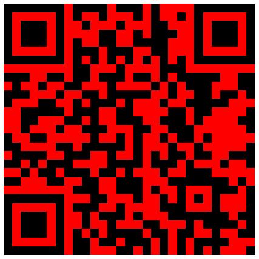](https://www.wikidata.org/wiki/Q128){ width=45% }
<h3>Q129 Thursday is mine.</h3>day of the week [https://www.q1universeismine.net#Q129](https://www.q1universeismine.net#Q129) 2021-09-09 07:56:42 UTC [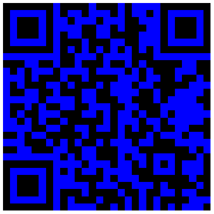](https://www.wikidata.org/wiki/Q129){ width=45% }
<h3>Q130 Friday is mine.</h3>day of the week [https://www.q1universeismine.net#Q130](https://www.q1universeismine.net#Q130) 2021-09-09 07:56:42 UTC { width=45% }
<h3>Q131 Saturday is mine.</h3>day of the week [https://www.q1universeismine.net#Q131](https://www.q1universeismine.net#Q131) 2021-09-09 07:56:43 UTC { width=45% }
<h3>Q132 Sunday is mine.</h3>day of the week [https://www.q1universeismine.net#Q132](https://www.q1universeismine.net#Q132) 2021-09-09 07:56:43 UTC { width=45% }
<h3>Q133 mixed-member proportional representation is mine.</h3>electoral voting system [https://www.q1universeismine.net#Q133](https://www.q1universeismine.net#Q133) 2021-09-09 07:56:43 UTC { width=45% }
<h3>Q134 bishop is mine.</h3>piece in the board game chess [https://www.q1universeismine.net#Q134](https://www.q1universeismine.net#Q134) 2021-09-09 07:56:44 UTC [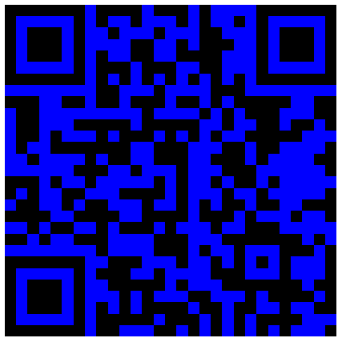](https://www.wikidata.org/wiki/Q134){ width=45% }
<h3>Q135 pawn is mine.</h3>most numerous but the weakest piece in chess [https://www.q1universeismine.net#Q135](https://www.q1universeismine.net#Q135) 2021-09-09 07:56:44 UTC { width=45% }
<h3>Q136 knight is mine.</h3>piece in the board game of chess [https://www.q1universeismine.net#Q136](https://www.q1universeismine.net#Q136) 2021-09-09 07:56:44 UTC { width=45% }
<h3>Q137 rook is mine.</h3>piece from the board game chess [https://www.q1universeismine.net#Q137](https://www.q1universeismine.net#Q137) 2021-09-09 07:56:44 UTC [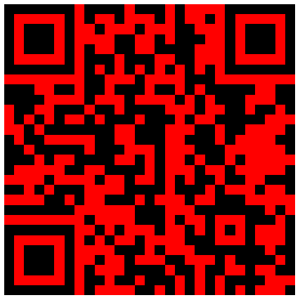](https://www.wikidata.org/wiki/Q137){ width=45% }
<h3>Q138 king is mine.</h3>piece from the board game chess [https://www.q1universeismine.net#Q138](https://www.q1universeismine.net#Q138) 2021-09-09 07:56:45 UTC { width=45% }
<h3>Q139 queen is mine.</h3>chess piece, able to move any number of squares vertically, horizontally or diagonally [https://www.q1universeismine.net#Q139](https://www.q1universeismine.net#Q139) 2021-09-09 07:56:45 UTC [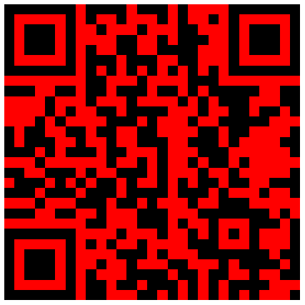](https://www.wikidata.org/wiki/Q139){ width=45% }
<h3>Q140 lion is mine.</h3>species of big cat [https://www.q1universeismine.net#Q140](https://www.q1universeismine.net#Q140) 2021-09-09 07:56:46 UTC { width=45% }
<h3>Q141 Timbits is mine.</h3>Canadian doughnut holes [https://www.q1universeismine.net#Q141](https://www.q1universeismine.net#Q141) 2021-09-09 07:56:46 UTC [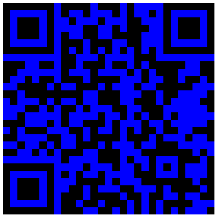](https://www.wikidata.org/wiki/Q141){ width=45% }
<h3>Q142 France is mine.</h3>country in Western Europe [https://www.q1universeismine.net#Q142](https://www.q1universeismine.net#Q142) 2021-09-09 07:56:47 UTC { width=45% }
<h3>Q143 Esperanto is mine.</h3>international auxiliary language designed by Ludwik Lejzer Zamenhof [https://www.q1universeismine.net#Q143](https://www.q1universeismine.net#Q143) 2021-09-09 07:56:48 UTC { width=45% }
<h3>Q144 dog is mine.</h3>domestic animal [https://www.q1universeismine.net#Q144](https://www.q1universeismine.net#Q144) 2021-09-09 07:56:49 UTC [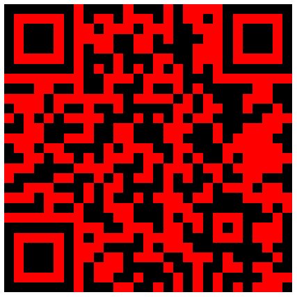](https://www.wikidata.org/wiki/Q144){ width=45% }
<h3>Q145 United Kingdom is mine.</h3>Country in north-west Europe [https://www.q1universeismine.net#Q145](https://www.q1universeismine.net#Q145) 2021-09-09 07:56:50 UTC [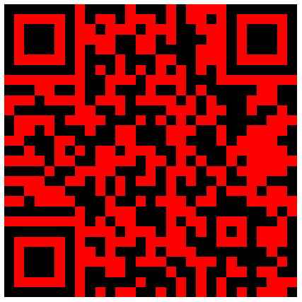](https://www.wikidata.org/wiki/Q145){ width=45% }
<h3>Q146 house cat is mine.</h3>domesticated feline [https://www.q1universeismine.net#Q146](https://www.q1universeismine.net#Q146) 2021-09-09 07:56:51 UTC { width=45% }
<h3>Q147 kitten is mine.</h3>young cat [https://www.q1universeismine.net#Q147](https://www.q1universeismine.net#Q147) 2021-09-09 07:56:51 UTC [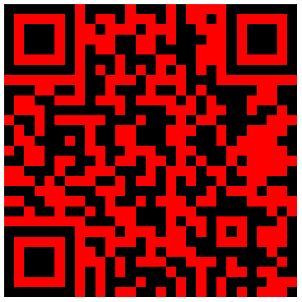](https://www.wikidata.org/wiki/Q147){ width=45% }
<h3>Q148 People's Republic of China is mine.</h3>sovereign state in East Asia [https://www.q1universeismine.net#Q148](https://www.q1universeismine.net#Q148) 2021-09-09 07:56:52 UTC [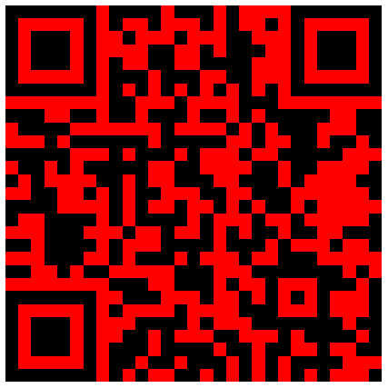](https://www.wikidata.org/wiki/Q148){ width=45% }
<h3>Q149 Nyan Cat is mine.</h3>2011 Internet meme [https://www.q1universeismine.net#Q149](https://www.q1universeismine.net#Q149) 2021-09-09 07:56:53 UTC { width=45% }
<h3>Q150 French is mine.</h3>Romance language of the Indo-European family [https://www.q1universeismine.net#Q150](https://www.q1universeismine.net#Q150) 2021-09-09 07:56:53 UTC { width=45% }
<h3>Q151 Wiktionary is mine.</h3>free online dictionary that anyone can edit [https://www.q1universeismine.net#Q151](https://www.q1universeismine.net#Q151) 2021-09-09 07:56:54 UTC [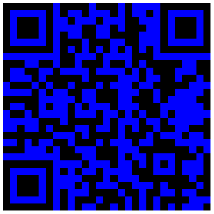](https://www.wikidata.org/wiki/Q151){ width=45% }
<h3>Q152 fish is mine.</h3>vertebrate animal that lives in water and (typically) has gills [https://www.q1universeismine.net#Q152](https://www.q1universeismine.net#Q152) 2021-09-09 07:56:54 UTC { width=45% }
<h3>Q153 ethanol is mine.</h3>chemical compound [https://www.q1universeismine.net#Q153](https://www.q1universeismine.net#Q153) 2021-09-09 07:56:55 UTC { width=45% }
<h3>Q154 alcoholic beverage is mine.</h3>drink containing alcohols, typically ethanol [https://www.q1universeismine.net#Q154](https://www.q1universeismine.net#Q154) 2021-09-09 07:56:56 UTC { width=45% }
<h3>Q155 Brazil is mine.</h3>country in South America [https://www.q1universeismine.net#Q155](https://www.q1universeismine.net#Q155) 2021-09-09 07:56:57 UTC { width=45% }
<h3>Q156 alcohols is mine.</h3>any organic compound in which the hydroxyl functional group (–OH) is bound to a saturated carbon atom [https://www.q1universeismine.net#Q156](https://www.q1universeismine.net#Q156) 2021-09-09 07:56:58 UTC [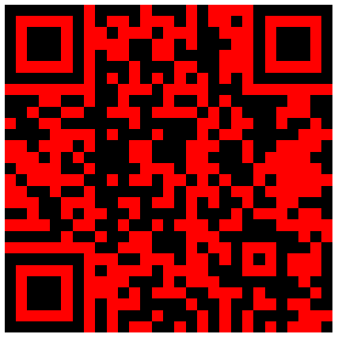](https://www.wikidata.org/wiki/Q156){ width=45% }
<h3>Q157 François Hollande is mine.</h3>French official and statesman [https://www.q1universeismine.net#Q157](https://www.q1universeismine.net#Q157) 2021-09-09 07:56:59 UTC [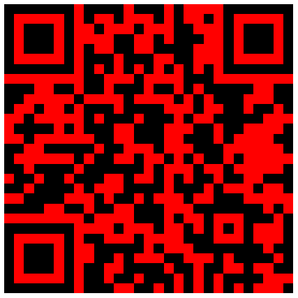](https://www.wikidata.org/wiki/Q157){ width=45% }
<h3>Q158 is mine.</h3>No description [https://www.q1universeismine.net#Q158](https://www.q1universeismine.net#Q158) 2021-09-09 07:56:59 UTC { width=45% }
<h3>Q159 Russia is mine.</h3>sovereign state in Eastern Europe and Northern Asia [https://www.q1universeismine.net#Q159](https://www.q1universeismine.net#Q159) 2021-09-09 07:57:00 UTC [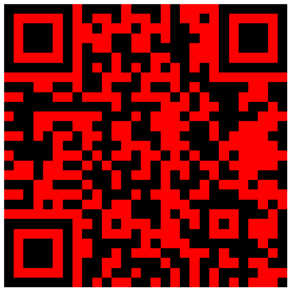](https://www.wikidata.org/wiki/Q159){ width=45% }
<h3>Q160 Cetacea is mine.</h3>infraorder of mammals [https://www.q1universeismine.net#Q160](https://www.q1universeismine.net#Q160) 2021-09-09 07:57:01 UTC { width=45% }
<h3>Q161 fiber is mine.</h3>natural or synthetic substance made of long, thin filaments [https://www.q1universeismine.net#Q161](https://www.q1universeismine.net#Q161) 2021-09-09 07:57:01 UTC [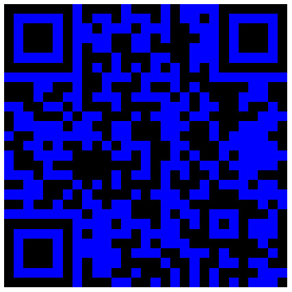](https://www.wikidata.org/wiki/Q161){ width=45% }
<h3>Q162 optical fiber is mine.</h3>light-conducting fiber [https://www.q1universeismine.net#Q162](https://www.q1universeismine.net#Q162) 2021-09-09 07:57:02 UTC { width=45% }
<h3>Q163 Yorkshire is mine.</h3>historic county of England [https://www.q1universeismine.net#Q163](https://www.q1universeismine.net#Q163) 2021-09-09 07:57:02 UTC { width=45% }
<h3>Q164 square is mine.</h3>regular quadrilateral [https://www.q1universeismine.net#Q164](https://www.q1universeismine.net#Q164) 2021-09-09 07:57:03 UTC { width=45% }
<h3>Q165 sea is mine.</h3>large body of saline water [https://www.q1universeismine.net#Q165](https://www.q1universeismine.net#Q165) 2021-09-09 07:57:03 UTC { width=45% }
<h3>Q166 Black Sea is mine.</h3>sea between Europe and Asia [https://www.q1universeismine.net#Q166](https://www.q1universeismine.net#Q166) 2021-09-09 07:57:04 UTC { width=45% }
<h3>Q167 pi is mine.</h3>ratio of the circumference of a circle to its diameter [https://www.q1universeismine.net#Q167](https://www.q1universeismine.net#Q167) 2021-09-09 07:57:04 UTC [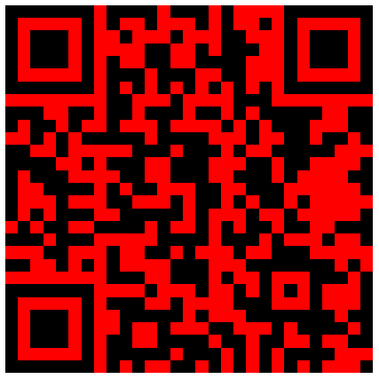](https://www.wikidata.org/wiki/Q167){ width=45% }
<h3>Q168 Π is mine.</h3>16th letter in the Greek alphabet [https://www.q1universeismine.net#Q168](https://www.q1universeismine.net#Q168) 2021-09-09 07:57:05 UTC { width=45% }
<h3>Q169 mango is mine.</h3>fruit [https://www.q1universeismine.net#Q169](https://www.q1universeismine.net#Q169) 2021-09-09 07:57:05 UTC { width=45% }
<h3>Q170 Pirate Parties International is mine.</h3>political international grouping [https://www.q1universeismine.net#Q170](https://www.q1universeismine.net#Q170) 2021-09-09 07:57:05 UTC { width=45% }
<h3>Q171 wiki is mine.</h3>type of website that visitors can edit [https://www.q1universeismine.net#Q171](https://www.q1universeismine.net#Q171) 2021-09-09 07:57:06 UTC { width=45% }
<h3>Q172 Toronto is mine.</h3>capital city of the province of Ontario, Canada [https://www.q1universeismine.net#Q172](https://www.q1universeismine.net#Q172) 2021-09-09 07:57:07 UTC { width=45% }
<h3>Q173 Alabama is mine.</h3>state of the United States of America [https://www.q1universeismine.net#Q173](https://www.q1universeismine.net#Q173) 2021-09-09 07:57:07 UTC { width=45% }
<h3>Q174 São Paulo is mine.</h3>largest city in Brazil [https://www.q1universeismine.net#Q174](https://www.q1universeismine.net#Q174) 2021-09-09 07:57:08 UTC { width=45% }
<h3>Q175 São Paulo is mine.</h3>state of Brazil [https://www.q1universeismine.net#Q175](https://www.q1universeismine.net#Q175) 2021-09-09 07:57:09 UTC { width=45% }
<h3>Q176 Quebec is mine.</h3>province of Canada [https://www.q1universeismine.net#Q176](https://www.q1universeismine.net#Q176) 2021-09-09 07:57:10 UTC [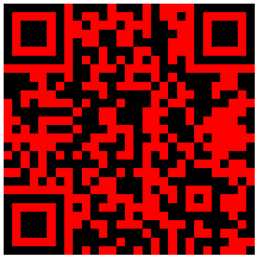](https://www.wikidata.org/wiki/Q176){ width=45% }
<h3>Q177 pizza is mine.</h3>Italian dish of oven-baked bread with various toppings [https://www.q1universeismine.net#Q177](https://www.q1universeismine.net#Q177) 2021-09-09 07:57:10 UTC [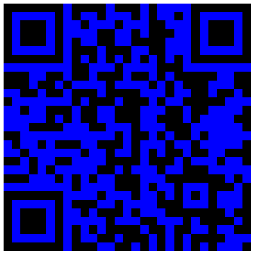](https://www.wikidata.org/wiki/Q177){ width=45% }
<h3>Q178 pasta is mine.</h3>Italian food made from flour, eggs and water and shaped in different forms, usually cooked and served with a sauce [https://www.q1universeismine.net#Q178](https://www.q1universeismine.net#Q178) 2021-09-09 07:57:10 UTC { width=45% }
<h3>Q179 Boeing 747 is mine.</h3>airliner family by Boeing [https://www.q1universeismine.net#Q179](https://www.q1universeismine.net#Q179) 2021-09-09 07:57:11 UTC { width=45% }
<h3>Q180 Wikimedia Foundation is mine.</h3>American non-profit charitable organization [https://www.q1universeismine.net#Q180](https://www.q1universeismine.net#Q180) 2021-09-09 07:57:12 UTC [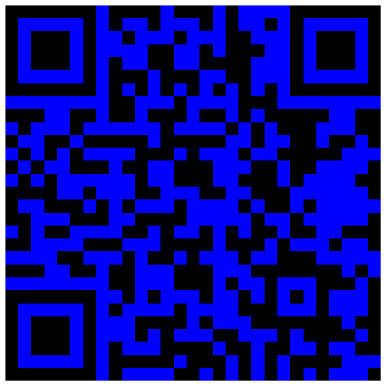](https://www.wikidata.org/wiki/Q180){ width=45% }
<h3>Q181 Jimmy Wales is mine.</h3>Wikipedia co-founder and American Internet entrepreneur [https://www.q1universeismine.net#Q181](https://www.q1universeismine.net#Q181) 2021-09-09 07:57:12 UTC [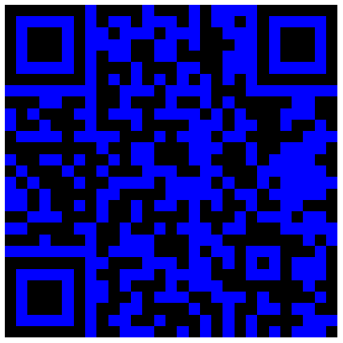](https://www.wikidata.org/wiki/Q181){ width=45% }
<h3>Q182 English is mine.</h3>Wikimedia disambiguation page [https://www.q1universeismine.net#Q182](https://www.q1universeismine.net#Q182) 2021-09-09 07:57:13 UTC [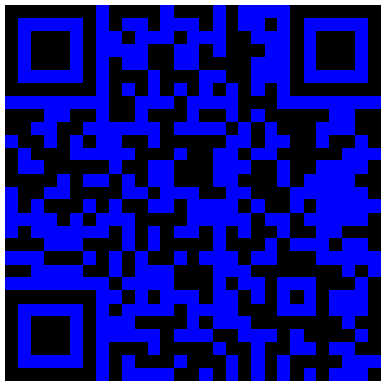](https://www.wikidata.org/wiki/Q182){ width=45% }
<h3>Q183 Germany is mine.</h3>country in Central Europe [https://www.q1universeismine.net#Q183](https://www.q1universeismine.net#Q183) 2021-09-09 07:57:15 UTC { width=45% }
<h3>Q184 Belarus is mine.</h3>country in eastern Europe [https://www.q1universeismine.net#Q184](https://www.q1universeismine.net#Q184) 2021-09-09 07:57:16 UTC [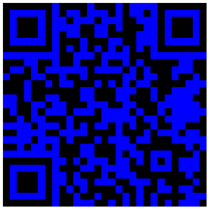](https://www.wikidata.org/wiki/Q184){ width=45% }
<h3>Q185 Larry Sanger is mine.</h3>American former professor, co-founder of Wikipedia, founder of Citizendium and other projects [https://www.q1universeismine.net#Q185](https://www.q1universeismine.net#Q185) 2021-09-09 07:57:17 UTC { width=45% }
<h3>Q186 Ken Jennings is mine.</h3>American game show contestant and writer [https://www.q1universeismine.net#Q186](https://www.q1universeismine.net#Q186) 2021-09-09 07:57:17 UTC { width=45% }
<h3>Q187 Il Canto degli Italiani is mine.</h3>national anthem of Italy [https://www.q1universeismine.net#Q187](https://www.q1universeismine.net#Q187) 2021-09-09 07:57:17 UTC { width=45% }
<h3>Q188 German is mine.</h3>West Germanic language [https://www.q1universeismine.net#Q188](https://www.q1universeismine.net#Q188) 2021-09-09 07:57:18 UTC { width=45% }
<h3>Q189 Iceland is mine.</h3>sovereign state in Northern Europe, situated on an island in the far North Atlantic Ocean [https://www.q1universeismine.net#Q189](https://www.q1universeismine.net#Q189) 2021-09-09 07:57:19 UTC { width=45% }
<h3>Q190 God is mine.</h3>principal object of faith in monotheistic religions; a divine entity that supervises all existence [https://www.q1universeismine.net#Q190](https://www.q1universeismine.net#Q190) 2021-09-09 07:57:19 UTC { width=45% }
<h3>Q191 Estonia is mine.</h3>sovereign state in northeastern Europe [https://www.q1universeismine.net#Q191](https://www.q1universeismine.net#Q191) 2021-09-09 07:57:21 UTC { width=45% }
<h3>Q192 David Cameron is mine.</h3>former prime minister of the United Kingdom (born 1966) [https://www.q1universeismine.net#Q192](https://www.q1universeismine.net#Q192) 2021-09-09 07:57:21 UTC { width=45% }
<h3>Q193 Saturn is mine.</h3>sixth planet from the Sun and the second-largest planet in the Solar System, after Jupiter [https://www.q1universeismine.net#Q193](https://www.q1universeismine.net#Q193) 2021-09-09 07:57:22 UTC { width=45% }
<h3>Q194 rings of Saturn is mine.</h3>planar assemblage of icy particles orbiting Saturn [https://www.q1universeismine.net#Q194](https://www.q1universeismine.net#Q194) 2021-09-09 07:57:22 UTC { width=45% }
<h3>Q195 chocolate is mine.</h3>food produced from the seed of Theobroma cacao [https://www.q1universeismine.net#Q195](https://www.q1universeismine.net#Q195) 2021-09-09 07:57:23 UTC { width=45% }
<h3>Q196 cherry is mine.</h3>fruit of the cherry tree [https://www.q1universeismine.net#Q196](https://www.q1universeismine.net#Q196) 2021-09-09 07:57:23 UTC { width=45% }
<h3>Q197 airplane is mine.</h3>powered fixed-wing aircraft [https://www.q1universeismine.net#Q197](https://www.q1universeismine.net#Q197) 2021-09-09 07:57:24 UTC { width=45% }
<h3>Q198 war is mine.</h3>organised and prolonged violent conflict between states [https://www.q1universeismine.net#Q198](https://www.q1universeismine.net#Q198) 2021-09-09 07:57:24 UTC { width=45% }
<h3>Q199 1 is mine.</h3>natural number [https://www.q1universeismine.net#Q199](https://www.q1universeismine.net#Q199) 2021-09-09 07:57:25 UTC { width=45% }
<h3>Q200 2 is mine.</h3>natural number [https://www.q1universeismine.net#Q200](https://www.q1universeismine.net#Q200) 2021-09-09 07:57:25 UTC { width=45% }
<h3>Q201 3 is mine.</h3>natural number [https://www.q1universeismine.net#Q201](https://www.q1universeismine.net#Q201) 2021-09-09 07:57:26 UTC { width=45% }
<h3>Q202 4 is mine.</h3>natural number [https://www.q1universeismine.net#Q202](https://www.q1universeismine.net#Q202) 2021-09-09 07:57:26 UTC { width=45% }
<h3>Q203 5 is mine.</h3>natural number [https://www.q1universeismine.net#Q203](https://www.q1universeismine.net#Q203) 2021-09-09 07:57:27 UTC { width=45% }
<h3>Q204 zero is mine.</h3>integer number [https://www.q1universeismine.net#Q204](https://www.q1universeismine.net#Q204) 2021-09-09 07:57:27 UTC { width=45% }
<h3>Q205 infinity is mine.</h3>mathematical concept [https://www.q1universeismine.net#Q205](https://www.q1universeismine.net#Q205) 2021-09-09 07:57:28 UTC { width=45% }
<h3>Q206 Stephen Harper is mine.</h3>Canadian politician [https://www.q1universeismine.net#Q206](https://www.q1universeismine.net#Q206) 2021-09-09 07:57:28 UTC { width=45% }
<h3>Q207 George W. Bush is mine.</h3>43rd president of the United States [https://www.q1universeismine.net#Q207](https://www.q1universeismine.net#Q207) 2021-09-09 07:57:29 UTC { width=45% }
<h3>Q208 rakfisk is mine.</h3>Norwegian fish dish made from trout or char [https://www.q1universeismine.net#Q208](https://www.q1universeismine.net#Q208) 2021-09-09 07:57:29 UTC { width=45% }
<h3>Q209 rectangle is mine.</h3>quadrilateral with four right angles [https://www.q1universeismine.net#Q209](https://www.q1universeismine.net#Q209) 2021-09-09 07:57:30 UTC { width=45% }
<h3>Q210 right angle is mine.</h3>90° angle (π/2 radians): an angle that bisects the angle formed by two halves of a straight line [https://www.q1universeismine.net#Q210](https://www.q1universeismine.net#Q210) 2021-09-09 07:57:30 UTC { width=45% }
<h3>Q211 Latvia is mine.</h3>sovereign state in northeastern Europe [https://www.q1universeismine.net#Q211](https://www.q1universeismine.net#Q211) 2021-09-09 07:57:31 UTC { width=45% }
<h3>Q212 Ukraine is mine.</h3>sovereign state in eastern Europe [https://www.q1universeismine.net#Q212](https://www.q1universeismine.net#Q212) 2021-09-09 07:57:32 UTC { width=45% }
<h3>Q213 Czech Republic is mine.</h3>country in Central Europe [https://www.q1universeismine.net#Q213](https://www.q1universeismine.net#Q213) 2021-09-09 07:57:34 UTC { width=45% }
<h3>Q214 Slovakia is mine.</h3>country in Central Europe [https://www.q1universeismine.net#Q214](https://www.q1universeismine.net#Q214) 2021-09-09 07:57:35 UTC { width=45% }
<h3>Q215 Slovenia is mine.</h3>country in Central Europe [https://www.q1universeismine.net#Q215](https://www.q1universeismine.net#Q215) 2021-09-09 07:57:36 UTC { width=45% }
<h3>Q216 Vilnius is mine.</h3>capital and largest city of Lithuania [https://www.q1universeismine.net#Q216](https://www.q1universeismine.net#Q216) 2021-09-09 07:57:36 UTC { width=45% }
<h3>Q217 Moldova is mine.</h3>sovereign state in southeastern Europe [https://www.q1universeismine.net#Q217](https://www.q1universeismine.net#Q217) 2021-09-09 07:57:37 UTC { width=45% }
<h3>Q218 Romania is mine.</h3>country in Central and Eastern Europe [https://www.q1universeismine.net#Q218](https://www.q1universeismine.net#Q218) 2021-09-09 07:57:39 UTC { width=45% }
<h3>Q219 Bulgaria is mine.</h3>sovereign state in southeastern Europe [https://www.q1universeismine.net#Q219](https://www.q1universeismine.net#Q219) 2021-09-09 07:57:40 UTC { width=45% }
<h3>Q220 Rome is mine.</h3>capital and largest city of Italy [https://www.q1universeismine.net#Q220](https://www.q1universeismine.net#Q220) 2021-09-09 07:57:40 UTC { width=45% }
<h3>Q221 North Macedonia is mine.</h3>country in southeastern Europe [https://www.q1universeismine.net#Q221](https://www.q1universeismine.net#Q221) 2021-09-09 07:57:41 UTC { width=45% }
<h3>Q222 Albania is mine.</h3>country in southeastern Europe [https://www.q1universeismine.net#Q222](https://www.q1universeismine.net#Q222) 2021-09-09 07:57:43 UTC { width=45% }
<h3>Q223 Greenland is mine.</h3>autonomous country within the Kingdom of Denmark [https://www.q1universeismine.net#Q223](https://www.q1universeismine.net#Q223) 2021-09-09 07:57:43 UTC { width=45% }
<h3>Q224 Croatia is mine.</h3>country in southeastern Europe [https://www.q1universeismine.net#Q224](https://www.q1universeismine.net#Q224) 2021-09-09 07:57:45 UTC { width=45% }
<h3>Q225 Bosnia and Herzegovina is mine.</h3>country in southeastern Europe [https://www.q1universeismine.net#Q225](https://www.q1universeismine.net#Q225) 2021-09-09 07:57:45 UTC { width=45% }
<h3>Q226 Nuuk is mine.</h3>capital of Greenland [https://www.q1universeismine.net#Q226](https://www.q1universeismine.net#Q226) 2021-09-09 07:57:46 UTC { width=45% }
<h3>Q227 Azerbaijan is mine.</h3>sovereign state in Western Asia and Eastern Europe [https://www.q1universeismine.net#Q227](https://www.q1universeismine.net#Q227) 2021-09-09 07:57:47 UTC { width=45% }
<h3>Q228 Andorra is mine.</h3>sovereign microstate between France and Spain, in Western Europe [https://www.q1universeismine.net#Q228](https://www.q1universeismine.net#Q228) 2021-09-09 07:57:48 UTC { width=45% }
<h3>Q229 Cyprus is mine.</h3>sovereign state situated on an island in the Eastern Mediterranean Sea [https://www.q1universeismine.net#Q229](https://www.q1universeismine.net#Q229) 2021-09-09 07:57:49 UTC { width=45% }
<h3>Q230 Georgia is mine.</h3>country in the Caucasus between Europe and Asia [https://www.q1universeismine.net#Q230](https://www.q1universeismine.net#Q230) 2021-09-09 07:57:50 UTC { width=45% }
<h3>Q231 Wallonia is mine.</h3>federal region of Belgium [https://www.q1universeismine.net#Q231](https://www.q1universeismine.net#Q231) 2021-09-09 07:57:51 UTC { width=45% }
<h3>Q232 Kazakhstan is mine.</h3>sovereign state in Eastern Europe and Central Asia [https://www.q1universeismine.net#Q232](https://www.q1universeismine.net#Q232) 2021-09-09 07:57:52 UTC { width=45% }
<h3>Q233 Malta is mine.</h3>sovereign state in Southern Europe situated on an archipelago in the Mediterranean Sea [https://www.q1universeismine.net#Q233](https://www.q1universeismine.net#Q233) 2021-09-09 07:57:53 UTC { width=45% }
<h3>Q234 Flanders is mine.</h3>Dutch-speaking northern portion of Belgium [https://www.q1universeismine.net#Q234](https://www.q1universeismine.net#Q234) 2021-09-09 07:57:53 UTC { width=45% }
<h3>Q235 Monaco is mine.</h3>sovereign city-state on the French Riviera [https://www.q1universeismine.net#Q235](https://www.q1universeismine.net#Q235) 2021-09-09 07:57:54 UTC { width=45% }
<h3>Q236 Montenegro is mine.</h3>country in southeastern Europe [https://www.q1universeismine.net#Q236](https://www.q1universeismine.net#Q236) 2021-09-09 07:57:55 UTC { width=45% }
<h3>Q237 Vatican City is mine.</h3>independent city-state enclaved within Rome, Italy under the sovereignty of the Holy See; world's smallest sovereign state [https://www.q1universeismine.net#Q237](https://www.q1universeismine.net#Q237) 2021-09-09 07:57:56 UTC { width=45% }
<h3>Q238 San Marino is mine.</h3>sovereign state in Southern Europe, enclaved within Italy [https://www.q1universeismine.net#Q238](https://www.q1universeismine.net#Q238) 2021-09-09 07:57:57 UTC { width=45% }
<h3>Q239 City of Brussels is mine.</h3>municipality and capital city of Belgium [https://www.q1universeismine.net#Q239](https://www.q1universeismine.net#Q239) 2021-09-09 07:57:57 UTC { width=45% }
<h3>Q240 Brussels Capital Region is mine.</h3>federal region of Belgium [https://www.q1universeismine.net#Q240](https://www.q1universeismine.net#Q240) 2021-09-09 07:57:58 UTC { width=45% }
<h3>Q241 Cuba is mine.</h3>sovereign state situated on an island in the Caribbean Sea [https://www.q1universeismine.net#Q241](https://www.q1universeismine.net#Q241) 2021-09-09 07:57:59 UTC { width=45% }
<h3>Q242 Belize is mine.</h3>sovereign state in Central America [https://www.q1universeismine.net#Q242](https://www.q1universeismine.net#Q242) 2021-09-09 07:58:00 UTC { width=45% }
<h3>Q243 Eiffel Tower is mine.</h3>tower located on the Champ de Mars in Paris, France [https://www.q1universeismine.net#Q243](https://www.q1universeismine.net#Q243) 2021-09-09 07:58:01 UTC { width=45% }
<h3>Q244 Barbados is mine.</h3>sovereign state situated on an island in the Western Atlantic Ocean [https://www.q1universeismine.net#Q244](https://www.q1universeismine.net#Q244) 2021-09-09 07:58:02 UTC { width=45% }
<h3>Q245 Raspberry Pi is mine.</h3>series of low-cost single-board computers used for educational purposes and embedded systems [https://www.q1universeismine.net#Q245](https://www.q1universeismine.net#Q245) 2021-09-09 07:58:02 UTC { width=45% }
<h3>Q246 Volkswagen is mine.</h3>automotive brand; manufacturing subsidiary of Volkswagen Group [https://www.q1universeismine.net#Q246](https://www.q1universeismine.net#Q246) 2021-09-09 07:58:03 UTC { width=45% }
<h3>Q247 Volkswagen Golf is mine.</h3>small family car manufactured by Volkswagen [https://www.q1universeismine.net#Q247](https://www.q1universeismine.net#Q247) 2021-09-09 07:58:03 UTC { width=45% }
<h3>Q248 Intel is mine.</h3>American semiconductor chip manufacturer [https://www.q1universeismine.net#Q248](https://www.q1universeismine.net#Q248) 2021-09-09 07:58:04 UTC { width=45% }
<h3>Q249 wireless communication is mine.</h3>transfer of information or power that does not require the use of physical wires [https://www.q1universeismine.net#Q249](https://www.q1universeismine.net#Q249) 2021-09-09 07:58:04 UTC { width=45% }
<h3>Q250 computer keyboard is mine.</h3>device comprising an arrangement of buttons or keys used to input text in computers [https://www.q1universeismine.net#Q250](https://www.q1universeismine.net#Q250) 2021-09-09 07:58:05 UTC { width=45% }
<h3>Q251 Java is mine.</h3>object-oriented programming language [https://www.q1universeismine.net#Q251](https://www.q1universeismine.net#Q251) 2021-09-09 07:58:05 UTC { width=45% }
<h3>Q252 Indonesia is mine.</h3>sovereign state in Southeast Asia situated on more than 17,000 islands [https://www.q1universeismine.net#Q252](https://www.q1universeismine.net#Q252) 2021-09-09 07:58:07 UTC { width=45% }
<h3>Q253 QWERTY is mine.</h3>Keyboard layout where the first line is QWERTYUIOP [https://www.q1universeismine.net#Q253](https://www.q1universeismine.net#Q253) 2021-09-09 07:58:07 UTC { width=45% }
<h3>Q254 Wolfgang Amadeus Mozart is mine.</h3>Austrian composer of the Classical period [https://www.q1universeismine.net#Q254](https://www.q1universeismine.net#Q254) 2021-09-09 07:58:08 UTC { width=45% }
<h3>Q255 Ludwig van Beethoven is mine.</h3>German classical and romantic composer [https://www.q1universeismine.net#Q255](https://www.q1universeismine.net#Q255) 2021-09-09 07:58:09 UTC { width=45% }
<h3>Q256 Turkish is mine.</h3>Turkic language [https://www.q1universeismine.net#Q256](https://www.q1universeismine.net#Q256) 2021-09-09 07:58:09 UTC { width=45% }
<h3>Q257 Mandelbrot set is mine.</h3>fractal named after mathematician Benoit Mandelbrot [https://www.q1universeismine.net#Q257](https://www.q1universeismine.net#Q257) 2021-09-09 07:58:10 UTC { width=45% }
<h3>Q258 South Africa is mine.</h3>sovereign state in Southern Africa [https://www.q1universeismine.net#Q258](https://www.q1universeismine.net#Q258) 2021-09-09 07:58:11 UTC { width=45% }
<h3>Q259 is mine.</h3>No description [https://www.q1universeismine.net#Q259](https://www.q1universeismine.net#Q259) 2021-09-09 07:58:11 UTC { width=45% }
<h3>Q260 Jean-François Champollion is mine.</h3>French classical scholar [https://www.q1universeismine.net#Q260](https://www.q1universeismine.net#Q260) 2021-09-09 07:58:12 UTC { width=45% }
<h3>Q261 Linkin Park is mine.</h3>American rock band [https://www.q1universeismine.net#Q261](https://www.q1universeismine.net#Q261) 2021-09-09 07:58:13 UTC { width=45% }
<h3>Q262 Algeria is mine.</h3>sovereign country in North Africa [https://www.q1universeismine.net#Q262](https://www.q1universeismine.net#Q262) 2021-09-09 07:58:14 UTC { width=45% }
<h3>Q263 Wikisource is mine.</h3>free online digital library that anyone can improve; Wikimedia project [https://www.q1universeismine.net#Q263](https://www.q1universeismine.net#Q263) 2021-09-09 07:58:14 UTC { width=45% }
<h3>Q264 Hurricane Sandy is mine.</h3>Category 3 Atlantic hurricane in 2012 [https://www.q1universeismine.net#Q264](https://www.q1universeismine.net#Q264) 2021-09-09 07:58:15 UTC { width=45% }
<h3>Q265 Uzbekistan is mine.</h3>sovereign state in Central Asia [https://www.q1universeismine.net#Q265](https://www.q1universeismine.net#Q265) 2021-09-09 07:58:16 UTC { width=45% }
<h3>Q266 Drosera is mine.</h3>genus of plants [https://www.q1universeismine.net#Q266](https://www.q1universeismine.net#Q266) 2021-09-09 07:58:16 UTC { width=45% }
<h3>Q267 Cafeteria is mine.</h3>genus of marine bicosoecid [https://www.q1universeismine.net#Q267](https://www.q1universeismine.net#Q267) 2021-09-09 07:58:16 UTC { width=45% }
<h3>Q268 Poznań is mine.</h3>capital of the Greater Poland Voivodeship in west-central Poland [https://www.q1universeismine.net#Q268](https://www.q1universeismine.net#Q268) 2021-09-09 07:58:17 UTC { width=45% }
<h3>Q269 Tashkent is mine.</h3>capital of Uzbekistan [https://www.q1universeismine.net#Q269](https://www.q1universeismine.net#Q269) 2021-09-09 07:58:18 UTC { width=45% }
<h3>Q270 Warsaw is mine.</h3>capital and largest city of Poland [https://www.q1universeismine.net#Q270](https://www.q1universeismine.net#Q270) 2021-09-09 07:58:19 UTC { width=45% }
<h3>Q271 Prytanée National Militaire is mine.</h3>French military school [https://www.q1universeismine.net#Q271](https://www.q1universeismine.net#Q271) 2021-09-09 07:58:19 UTC { width=45% }
<h3>Q272 Paul Morand is mine.</h3>French writer [https://www.q1universeismine.net#Q272](https://www.q1universeismine.net#Q272) 2021-09-09 07:58:20 UTC { width=45% }
<h3>Q273 Islay is mine.</h3>southernmost island of the Inner Hebrides in Argyll and Bute, Scotland, UK [https://www.q1universeismine.net#Q273](https://www.q1universeismine.net#Q273) 2021-09-09 07:58:20 UTC { width=45% }
<h3>Q274 Ardbeg is mine.</h3>Scotch whisky distillery [https://www.q1universeismine.net#Q274](https://www.q1universeismine.net#Q274) 2021-09-09 07:58:20 UTC { width=45% }
<h3>Q275 Forth Bridge is mine.</h3>cantilever railway bridge over the Firth of Forth in the east of Scotland [https://www.q1universeismine.net#Q275](https://www.q1universeismine.net#Q275) 2021-09-09 07:58:21 UTC { width=45% }
<h3>Q276 Eurovision Song Contest is mine.</h3>annual song competition held among the member countries of the European Broadcasting Union [https://www.q1universeismine.net#Q276](https://www.q1universeismine.net#Q276) 2021-09-09 07:58:22 UTC { width=45% }
<h3>Q277 Kilchoman is mine.</h3>distillery that produces single malt Scotch whisky on Islay [https://www.q1universeismine.net#Q277](https://www.q1universeismine.net#Q277) 2021-09-09 07:58:22 UTC { width=45% }
<h3>Q278 Talisker distillery is mine.</h3>Island single malt Scotch whisky distillery [https://www.q1universeismine.net#Q278](https://www.q1universeismine.net#Q278) 2021-09-09 07:58:22 UTC { width=45% }
<h3>Q279 Modena is mine.</h3>Italian city and municipality [https://www.q1universeismine.net#Q279](https://www.q1universeismine.net#Q279) 2021-09-09 07:58:23 UTC { width=45% }
<h3>Q280 Lagavulin Distillery is mine.</h3>Scotch whisky distillery in Lagavulin, Islay, United Kingdom [https://www.q1universeismine.net#Q280](https://www.q1universeismine.net#Q280) 2021-09-09 07:58:23 UTC { width=45% }
<h3>Q281 whisky is mine.</h3>type of distilled alcoholic beverage made from fermented grain mash [https://www.q1universeismine.net#Q281](https://www.q1universeismine.net#Q281) 2021-09-09 07:58:23 UTC { width=45% }
<h3>Q282 wine is mine.</h3>alcoholic drink typically made from grapes [https://www.q1universeismine.net#Q282](https://www.q1universeismine.net#Q282) 2021-09-09 07:58:24 UTC { width=45% }
<h3>Q283 water is mine.</h3>chemical compound; main constituent of the fluids of most living organisms [https://www.q1universeismine.net#Q283](https://www.q1universeismine.net#Q283) 2021-09-09 07:58:25 UTC { width=45% }
<h3>Q284 cognac is mine.</h3>alcoholic beverage; variety of brandy [https://www.q1universeismine.net#Q284](https://www.q1universeismine.net#Q284) 2021-09-09 07:58:25 UTC { width=45% }
<h3>Q285 Cognac is mine.</h3>commune in Charente, France [https://www.q1universeismine.net#Q285](https://www.q1universeismine.net#Q285) 2021-09-09 07:58:26 UTC { width=45% }
<h3>Q286 leather is mine.</h3>durable and flexible material created by the tanning of animal rawhide and skin [https://www.q1universeismine.net#Q286](https://www.q1universeismine.net#Q286) 2021-09-09 07:58:26 UTC { width=45% }
<h3>Q287 wood is mine.</h3>fibrous material from trees or other plants [https://www.q1universeismine.net#Q287](https://www.q1universeismine.net#Q287) 2021-09-09 07:58:26 UTC { width=45% }
<h3>Q288 Tours is mine.</h3>commune in Indre-et-Loire department, Centre Region, France [https://www.q1universeismine.net#Q288](https://www.q1universeismine.net#Q288) 2021-09-09 07:58:27 UTC { width=45% }
<h3>Q289 television is mine.</h3>telecommunication medium for transmitting and receiving moving images [https://www.q1universeismine.net#Q289](https://www.q1universeismine.net#Q289) 2021-09-09 07:58:28 UTC { width=45% }
<h3>Q290 sex is mine.</h3>either of two main divisions (male and female) into which many organisms can be placed according to reproductive function or organs [https://www.q1universeismine.net#Q290](https://www.q1universeismine.net#Q290) 2021-09-09 07:58:28 UTC { width=45% }
<h3>Q291 pornography is mine.</h3>explicit portrayal of sexual acts and intercourse in media [https://www.q1universeismine.net#Q291](https://www.q1universeismine.net#Q291) 2021-09-09 07:58:29 UTC { width=45% }
<h3>Q292 Russian is mine.</h3>East Slavic language originating in European Russia [https://www.q1universeismine.net#Q292](https://www.q1universeismine.net#Q292) 2021-09-09 07:58:29 UTC { width=45% }
<h3>Q293 Eurymorion is mine.</h3>genus of arachnids [https://www.q1universeismine.net#Q293](https://www.q1universeismine.net#Q293) 2021-09-09 07:58:30 UTC { width=45% }
<h3>Q294 Icelandic is mine.</h3>North Germanic language mainly spoken in Iceland [https://www.q1universeismine.net#Q294](https://www.q1universeismine.net#Q294) 2021-09-09 07:58:30 UTC { width=45% }
<h3>Q295 is mine.</h3>No description [https://www.q1universeismine.net#Q295](https://www.q1universeismine.net#Q295) 2021-09-09 07:58:30 UTC { width=45% }
<h3>Q296 Claude Monet is mine.</h3>French impressionist painter (1840-1926) [https://www.q1universeismine.net#Q296](https://www.q1universeismine.net#Q296) 2021-09-09 07:58:32 UTC { width=45% }
<h3>Q297 Diego Velázquez is mine.</h3>Spanish painter (1599-1660) [https://www.q1universeismine.net#Q297](https://www.q1universeismine.net#Q297) 2021-09-09 07:58:32 UTC { width=45% }
<h3>Q298 Chile is mine.</h3>sovereign state in South America [https://www.q1universeismine.net#Q298](https://www.q1universeismine.net#Q298) 2021-09-09 07:58:34 UTC { width=45% }
<h3>Q299 Vidov is mine.</h3>village and municipality in the South Bohemian Region of the Czech Republic [https://www.q1universeismine.net#Q299](https://www.q1universeismine.net#Q299) 2021-09-09 07:58:34 UTC { width=45% }
<h3>Q300 Sagas of Icelanders is mine.</h3>group of narratives [https://www.q1universeismine.net#Q300](https://www.q1universeismine.net#Q300) 2021-09-09 07:58:34 UTC { width=45% }
<h3>Q301 El Greco is mine.</h3>Greek artist, painter, sculptor and architect, 1541-1614 [https://www.q1universeismine.net#Q301](https://www.q1universeismine.net#Q301) 2021-09-09 07:58:35 UTC { width=45% }
<h3>Q302 Jesus is mine.</h3>Jewish preacher and religious leader, central figure of Christianity [https://www.q1universeismine.net#Q302](https://www.q1universeismine.net#Q302) 2021-09-09 07:58:36 UTC { width=45% }
<h3>Q303 Elvis Presley is mine.</h3>American singer and actor (1935–1977) [https://www.q1universeismine.net#Q303](https://www.q1universeismine.net#Q303) 2021-09-09 07:58:37 UTC { width=45% }
<h3>Q304 is mine.</h3>No description [https://www.q1universeismine.net#Q304](https://www.q1universeismine.net#Q304) 2021-09-09 07:58:37 UTC { width=45% }
<h3>Q305 corporal punishment is mine.</h3>form of physical punishment that involves pain [https://www.q1universeismine.net#Q305](https://www.q1universeismine.net#Q305) 2021-09-09 07:58:38 UTC { width=45% }
<h3>Q306 Sebastián Piñera is mine.</h3>35th and 37th president of Chile [https://www.q1universeismine.net#Q306](https://www.q1universeismine.net#Q306) 2021-09-09 07:58:38 UTC { width=45% }
<h3>Q307 Galileo Galilei is mine.</h3>Italian mathematician, physicist, philosopher and astronomer [https://www.q1universeismine.net#Q307](https://www.q1universeismine.net#Q307) 2021-09-09 07:58:39 UTC { width=45% }
<h3>Q308 Mercury is mine.</h3>smallest and closest planet to the Sun [https://www.q1universeismine.net#Q308](https://www.q1universeismine.net#Q308) 2021-09-09 07:58:40 UTC { width=45% }
<h3>Q309 history is mine.</h3>past events and their tracks or records, studied by various branches of human sciences of history [https://www.q1universeismine.net#Q309](https://www.q1universeismine.net#Q309) 2021-09-09 07:58:40 UTC { width=45% }
<h3>Q310 Taumatawhakatangihangakōauauotamateapōkaiwhenuakitānatahu is mine.</h3>hill in New Zealand [https://www.q1universeismine.net#Q310](https://www.q1universeismine.net#Q310) 2021-09-09 07:58:41 UTC { width=45% }
<h3>Q311 Père Lachaise Cemetery is mine.</h3>cemetery in Paris, France [https://www.q1universeismine.net#Q311](https://www.q1universeismine.net#Q311) 2021-09-09 07:58:41 UTC { width=45% }
<h3>Q312 Apple Inc. is mine.</h3>American technology company based in Cupertino, California [https://www.q1universeismine.net#Q312](https://www.q1universeismine.net#Q312) 2021-09-09 07:58:42 UTC { width=45% }
<h3>Q313 Venus is mine.</h3>telluric planet, second-closest to the Sun [https://www.q1universeismine.net#Q313](https://www.q1universeismine.net#Q313) 2021-09-09 07:58:43 UTC { width=45% }
<h3>Q314 funeral litre is mine.</h3>painted funeral band on the internal or external walls of a church [https://www.q1universeismine.net#Q314](https://www.q1universeismine.net#Q314) 2021-09-09 07:58:43 UTC { width=45% }
<h3>Q315 language is mine.</h3>capability to communicate using signs, such as words or gestures, by learning, choosing or adapting a conventional language to the other locutors for an effective usage [https://www.q1universeismine.net#Q315](https://www.q1universeismine.net#Q315) 2021-09-09 07:58:43 UTC { width=45% }
<h3>Q316 love is mine.</h3>strong, positive emotion based on affection [https://www.q1universeismine.net#Q316](https://www.q1universeismine.net#Q316) 2021-09-09 07:58:44 UTC { width=45% }
<h3>Q317 dictatorship is mine.</h3>autocratic form of government which is ruled by a sole leader [https://www.q1universeismine.net#Q317](https://www.q1universeismine.net#Q317) 2021-09-09 07:58:44 UTC { width=45% }
<h3>Q318 galaxy is mine.</h3>astronomical structure [https://www.q1universeismine.net#Q318](https://www.q1universeismine.net#Q318) 2021-09-09 07:58:45 UTC { width=45% }
<h3>Q319 Jupiter is mine.</h3>fifth planet from the Sun and largest planet in the Solar System [https://www.q1universeismine.net#Q319](https://www.q1universeismine.net#Q319) 2021-09-09 07:58:45 UTC { width=45% }
<h3>Q320 Michelle Bachelet is mine.</h3>34th and 36th president of Chile [https://www.q1universeismine.net#Q320](https://www.q1universeismine.net#Q320) 2021-09-09 07:58:46 UTC { width=45% }
<h3>Q321 Milky Way is mine.</h3>spiral galaxy in the Local Group containing the Solar System [https://www.q1universeismine.net#Q321](https://www.q1universeismine.net#Q321) 2021-09-09 07:58:47 UTC { width=45% }
<h3>Q322 Llanfairpwllgwyngyll is mine.</h3>village in Anglesey, Wales, United Kingdom [https://www.q1universeismine.net#Q322](https://www.q1universeismine.net#Q322) 2021-09-09 07:58:47 UTC { width=45% }
<h3>Q323 Big Bang is mine.</h3>theoretical past period when the Universe was much hotter, denser and rapidly expanding [https://www.q1universeismine.net#Q323](https://www.q1universeismine.net#Q323) 2021-09-09 07:58:47 UTC { width=45% }
<h3>Q324 Uranus is mine.</h3>seventh planet from the Sun [https://www.q1universeismine.net#Q324](https://www.q1universeismine.net#Q324) 2021-09-09 07:58:48 UTC { width=45% }
<h3>Q325 digital dark age is mine.</h3>conceptual situation in which large swathes of historic digitised materials are inaccessible [https://www.q1universeismine.net#Q325](https://www.q1universeismine.net#Q325) 2021-09-09 07:58:48 UTC { width=45% }
<h3>Q326 Eduardo Frei Ruiz-Tagle is mine.</h3>Chilean politician and former president [https://www.q1universeismine.net#Q326](https://www.q1universeismine.net#Q326) 2021-09-09 07:58:49 UTC { width=45% }
<h3>Q327 Brittany is mine.</h3>cultural region and former province of France [https://www.q1universeismine.net#Q327](https://www.q1universeismine.net#Q327) 2021-09-09 07:58:49 UTC { width=45% }
<h3>Q328 English Wikipedia is mine.</h3>English-language edition of Wikipedia [https://www.q1universeismine.net#Q328](https://www.q1universeismine.net#Q328) 2021-09-09 07:58:50 UTC { width=45% }
<h3>Q329 Nicolas Sarkozy is mine.</h3>23rd president of the French Republic [https://www.q1universeismine.net#Q329](https://www.q1universeismine.net#Q329) 2021-09-09 07:58:50 UTC { width=45% }
<h3>Q330 Battle of Marignano is mine.</h3>1515 battle between Switzerland and France [https://www.q1universeismine.net#Q330](https://www.q1universeismine.net#Q330) 2021-09-09 07:58:51 UTC { width=45% }
<h3>Q331 Ricardo Lagos is mine.</h3>Chilean politician [https://www.q1universeismine.net#Q331](https://www.q1universeismine.net#Q331) 2021-09-09 07:58:51 UTC { width=45% }
<h3>Q332 Neptune is mine.</h3>eighth and farthest planet from the Sun in the Solar System [https://www.q1universeismine.net#Q332](https://www.q1universeismine.net#Q332) 2021-09-09 07:58:51 UTC { width=45% }
<h3>Q333 astronomy is mine.</h3>natural science that deals with the study of celestial objects [https://www.q1universeismine.net#Q333](https://www.q1universeismine.net#Q333) 2021-09-09 07:58:52 UTC { width=45% }
<h3>Q334 Singapore is mine.</h3>sovereign city-state in Southeast Asia [https://www.q1universeismine.net#Q334](https://www.q1universeismine.net#Q334) 2021-09-09 07:58:53 UTC { width=45% }
<h3>Q335 Patricio Aylwin is mine.</h3>Chilean politician and former president (1918-2016) [https://www.q1universeismine.net#Q335](https://www.q1universeismine.net#Q335) 2021-09-09 07:58:54 UTC { width=45% }
<h3>Q336 science is mine.</h3>systematic enterprise that builds and organizes knowledge [https://www.q1universeismine.net#Q336](https://www.q1universeismine.net#Q336) 2021-09-09 07:58:54 UTC { width=45% }
<h3>Q337 Lake Chaubunagungamaug is mine.</h3>lake in the town of Webster, Massachusetts, United States [https://www.q1universeismine.net#Q337](https://www.q1universeismine.net#Q337) 2021-09-09 07:58:55 UTC { width=45% }
<h3>Q338 cosmology is mine.</h3>academic study of the universe [https://www.q1universeismine.net#Q338](https://www.q1universeismine.net#Q338) 2021-09-09 07:58:55 UTC { width=45% }
<h3>Q339 Pluto is mine.</h3>dwarf planet in the Solar System [https://www.q1universeismine.net#Q339](https://www.q1universeismine.net#Q339) 2021-09-09 07:58:56 UTC { width=45% }
<h3>Q340 Montreal is mine.</h3>largest city in Quebec, Canada [https://www.q1universeismine.net#Q340](https://www.q1universeismine.net#Q340) 2021-09-09 07:58:56 UTC { width=45% }
<h3>Q341 free software is mine.</h3>software distributed under terms that allow users to freely run, study, change and distribute it and modified versions [https://www.q1universeismine.net#Q341](https://www.q1universeismine.net#Q341) 2021-09-09 07:58:56 UTC { width=45% }
<h3>Q342 Quimper is mine.</h3>commune in Finistère, France [https://www.q1universeismine.net#Q342](https://www.q1universeismine.net#Q342) 2021-09-09 07:58:57 UTC { width=45% }
<h3>Q343 La Flèche is mine.</h3>commune in Sarthe, France [https://www.q1universeismine.net#Q343](https://www.q1universeismine.net#Q343) 2021-09-09 07:58:58 UTC { width=45% }
<h3>Q344 future is mine.</h3>time which has yet to occur [https://www.q1universeismine.net#Q344](https://www.q1universeismine.net#Q344) 2021-09-09 07:58:58 UTC { width=45% }
<h3>Q345 Virgin Mary is mine.</h3>religious figure; mother of Jesus of Nazareth [https://www.q1universeismine.net#Q345](https://www.q1universeismine.net#Q345) 2021-09-09 07:58:58 UTC { width=45% }
<h3>Q346 Louis IX of France is mine.</h3>king of France [https://www.q1universeismine.net#Q346](https://www.q1universeismine.net#Q346) 2021-09-09 07:58:59 UTC { width=45% }
<h3>Q347 Liechtenstein is mine.</h3>country in Central Europe [https://www.q1universeismine.net#Q347](https://www.q1universeismine.net#Q347) 2021-09-09 07:59:00 UTC { width=45% }
<h3>Q348 time capsule is mine.</h3>cache of goods or data secured for some time to be opened at a date in the future [https://www.q1universeismine.net#Q348](https://www.q1universeismine.net#Q348) 2021-09-09 07:59:00 UTC { width=45% }
<h3>Q349 sport is mine.</h3>forms of competitive physical activity or games which, through casual or organized participation, maintain or improve physical ability and skills while providing enjoyment to participants, and in some cases, entertainment for spectators [https://www.q1universeismine.net#Q349](https://www.q1universeismine.net#Q349) 2021-09-09 07:59:01 UTC { width=45% }
<h3>Q350 Cambridge is mine.</h3>city in Cambridgeshire, England [https://www.q1universeismine.net#Q350](https://www.q1universeismine.net#Q350) 2021-09-09 07:59:01 UTC { width=45% }
<h3>Q351 Yellowstone National Park is mine.</h3>first national park in the world, located in Wyoming, Montana and Idaho, United States [https://www.q1universeismine.net#Q351](https://www.q1universeismine.net#Q351) 2021-09-09 07:59:02 UTC { width=45% }
<h3>Q352 Adolf Hitler is mine.</h3>Austrian-born German politician, chancellor and Führer of Germany, leader of the Nazi Party (1889-1945) [https://www.q1universeismine.net#Q352](https://www.q1universeismine.net#Q352) 2021-09-09 07:59:03 UTC { width=45% }
<h3>Q353 Blanche of Castile is mine.</h3>Spanish princess, queen consort of France [https://www.q1universeismine.net#Q353](https://www.q1universeismine.net#Q353) 2021-09-09 07:59:04 UTC { width=45% }
<h3>Q354 Piet Kraak is mine.</h3>Dutch footballer (1921-1984) [https://www.q1universeismine.net#Q354](https://www.q1universeismine.net#Q354) 2021-09-09 07:59:04 UTC { width=45% }
<h3>Q355 Facebook is mine.</h3>Facebook is an online social media and social networking service. [https://www.q1universeismine.net#Q355](https://www.q1universeismine.net#Q355) 2021-09-09 07:59:04 UTC { width=45% }
<h3>Q356 Google+ is mine.</h3>social networking service [https://www.q1universeismine.net#Q356](https://www.q1universeismine.net#Q356) 2021-09-09 07:59:05 UTC { width=45% }
<h3>Q357 Guantanamo Bay detention camp is mine.</h3>United States military prison at the Guantanamo Bay Naval Base, Cuba [https://www.q1universeismine.net#Q357](https://www.q1universeismine.net#Q357) 2021-09-09 07:59:05 UTC { width=45% }
<h3>Q358 heritage site is mine.</h3>general term for a site of cultural heritage for a specific country (please avoid as a P31 value except for large sites containing multiple entities) [https://www.q1universeismine.net#Q358](https://www.q1universeismine.net#Q358) 2021-09-09 07:59:05 UTC { width=45% }
<h3>Q359 WikiLeaks is mine.</h3>international organization which publishes secret information [https://www.q1universeismine.net#Q359](https://www.q1universeismine.net#Q359) 2021-09-09 07:59:06 UTC { width=45% }
<h3>Q360 Julian Assange is mine.</h3>Australian editor, activist, publisher and journalist [https://www.q1universeismine.net#Q360](https://www.q1universeismine.net#Q360) 2021-09-09 07:59:07 UTC { width=45% }
<h3>Q361 World War I is mine.</h3>1914–1918 global war, centered in Europe, between the Allied and Central Powers [https://www.q1universeismine.net#Q361](https://www.q1universeismine.net#Q361) 2021-09-09 07:59:07 UTC { width=45% }
<h3>Q362 World War II is mine.</h3>1939–1945 global war between the Allied and Axis Powers [https://www.q1universeismine.net#Q362](https://www.q1universeismine.net#Q362) 2021-09-09 07:59:08 UTC { width=45% }
<h3>Q363 World War III is mine.</h3>hypothetical future global conflict [https://www.q1universeismine.net#Q363](https://www.q1universeismine.net#Q363) 2021-09-09 07:59:08 UTC { width=45% }
<h3>Q364 GitHub is mine.</h3>hosting service for software projects using Git [https://www.q1universeismine.net#Q364](https://www.q1universeismine.net#Q364) 2021-09-09 07:59:09 UTC { width=45% }
<h3>Q365 Cologne is mine.</h3>city in North Rhine-Westphalia, Germany [https://www.q1universeismine.net#Q365](https://www.q1universeismine.net#Q365) 2021-09-09 07:59:10 UTC { width=45% }
<h3>Q366 corruption is mine.</h3>form of dishonesty or criminal offense undertaken by a person or organization entrusted with a position of authority, to acquire illicit benefit or abuse power for one's private gain [https://www.q1universeismine.net#Q366](https://www.q1universeismine.net#Q366) 2021-09-09 07:59:10 UTC { width=45% }
<h3>Q367 Wikibooks is mine.</h3>free resource library of open-content textbooks written and edited by volunteers [https://www.q1universeismine.net#Q367](https://www.q1universeismine.net#Q367) 2021-09-09 07:59:10 UTC { width=45% }
<h3>Q368 Augusto Pinochet is mine.</h3>Dictador, General, politician of Chile (1915-2006) [https://www.q1universeismine.net#Q368](https://www.q1universeismine.net#Q368) 2021-09-09 07:59:11 UTC { width=45% }
<h3>Q369 Wikiquote is mine.</h3>free collection of quotes hosted by Wikimedia and edited by volunteers [https://www.q1universeismine.net#Q369](https://www.q1universeismine.net#Q369) 2021-09-09 07:59:11 UTC { width=45% }
<h3>Q370 Wikiversity is mine.</h3>Wikiproject focused on learning, teaching, research, service and ideas materials and activities [https://www.q1universeismine.net#Q370](https://www.q1universeismine.net#Q370) 2021-09-09 07:59:12 UTC { width=45% }
<h3>Q371 !!! is mine.</h3>dance-punk band from Sacramento, California, United States [https://www.q1universeismine.net#Q371](https://www.q1universeismine.net#Q371) 2021-09-09 07:59:12 UTC { width=45% }
<h3>Q372 We Live in Public is mine.</h3>2009 documentary film [https://www.q1universeismine.net#Q372](https://www.q1universeismine.net#Q372) 2021-09-09 07:59:12 UTC { width=45% }
<h3>Q373 Wikivoyage is mine.</h3>free travel guide that anyone can edit [https://www.q1universeismine.net#Q373](https://www.q1universeismine.net#Q373) 2021-09-09 07:59:13 UTC { width=45% }
<h3>Q374 vodka is mine.</h3>distilled alcoholic beverage [https://www.q1universeismine.net#Q374](https://www.q1universeismine.net#Q374) 2021-09-09 07:59:13 UTC { width=45% }
<h3>Q375 waffle is mine.</h3>batter- or dough-based food cooked between two patterned, shaped plates [https://www.q1universeismine.net#Q375](https://www.q1universeismine.net#Q375) 2021-09-09 07:59:13 UTC { width=45% }
<h3>Q376 clock is mine.</h3>instrument that measures the passage of time [https://www.q1universeismine.net#Q376](https://www.q1universeismine.net#Q376) 2021-09-09 07:59:14 UTC { width=45% }
<h3>Q377 Yanka Kupala is mine.</h3>Belarusian writer (1882-1942) [https://www.q1universeismine.net#Q377](https://www.q1universeismine.net#Q377) 2021-09-09 07:59:15 UTC { width=45% }
<h3>Q378 May is mine.</h3>fifth month in the Julian and Gregorian calendars [https://www.q1universeismine.net#Q378](https://www.q1universeismine.net#Q378) 2021-09-09 07:59:15 UTC { width=45% }
<h3>Q379 František Plánička is mine.</h3>Czech association football player (1904-1996) [https://www.q1universeismine.net#Q379](https://www.q1universeismine.net#Q379) 2021-09-09 07:59:15 UTC { width=45% }
<h3>Q380 Facebook, Inc. is mine.</h3>American social media and technology company [https://www.q1universeismine.net#Q380](https://www.q1universeismine.net#Q380) 2021-09-09 07:59:16 UTC { width=45% }
<h3>Q381 Ubuntu is mine.</h3>Debian-based Linux operating system [https://www.q1universeismine.net#Q381](https://www.q1universeismine.net#Q381) 2021-09-09 07:59:17 UTC { width=45% }
<h3>Q382 January is mine.</h3>first month in the Julian and Gregorian calendars [https://www.q1universeismine.net#Q382](https://www.q1universeismine.net#Q382) 2021-09-09 07:59:17 UTC { width=45% }
<h3>Q383 January is mine.</h3>first month in the Julian and Gregorian calendars [https://www.q1universeismine.net#Q383](https://www.q1universeismine.net#Q383) 2021-09-09 07:59:18 UTC { width=45% }
<h3>Q384 Skopje is mine.</h3>capital city of North Macedonia [https://www.q1universeismine.net#Q384](https://www.q1universeismine.net#Q384) 2021-09-09 07:59:18 UTC { width=45% }
<h3>Q385 Gdynia is mine.</h3>city in Pomeranian Voivodeship, Poland [https://www.q1universeismine.net#Q385](https://www.q1universeismine.net#Q385) 2021-09-09 07:59:19 UTC { width=45% }
<h3>Q386 Bixi is mine.</h3>bicycle-sharing system [https://www.q1universeismine.net#Q386](https://www.q1universeismine.net#Q386) 2021-09-09 07:59:19 UTC { width=45% }
<h3>Q387 Old Bazaar is mine.</h3>bazaar in Skopje, North Macedonia [https://www.q1universeismine.net#Q387](https://www.q1universeismine.net#Q387) 2021-09-09 07:59:19 UTC { width=45% }
<h3>Q388 Linux is mine.</h3>family of Unix-like operating systems that use the Linux kernel and are open source [https://www.q1universeismine.net#Q388](https://www.q1universeismine.net#Q388) 2021-09-09 07:59:20 UTC { width=45% }
<h3>Q389 Andrew and variants is mine.</h3>male name, and its local variations [https://www.q1universeismine.net#Q389](https://www.q1universeismine.net#Q389) 2021-09-09 07:59:20 UTC { width=45% }
<h3>Q390 Valdemar is mine.</h3>Wikimedia disambiguation page [https://www.q1universeismine.net#Q390](https://www.q1universeismine.net#Q390) 2021-09-09 07:59:20 UTC { width=45% }
<h3>Q391 Saint Catherine Street is mine.</h3>primary commercial artery of downtown Montreal, Quebec, Canada [https://www.q1universeismine.net#Q391](https://www.q1universeismine.net#Q391) 2021-09-09 07:59:20 UTC { width=45% }
<h3>Q392 Bob Dylan is mine.</h3>American recording artist, singer-songwriter, musician, author, artist and Nobel Laureate in 2016 [https://www.q1universeismine.net#Q392](https://www.q1universeismine.net#Q392) 2021-09-09 07:59:21 UTC { width=45% }
<h3>Q393 Szczecin is mine.</h3>capital city of the West Pomeranian Voivodeship, Poland [https://www.q1universeismine.net#Q393](https://www.q1universeismine.net#Q393) 2021-09-09 07:59:22 UTC { width=45% }
<h3>Q394 metrology is mine.</h3>science of measurement and its application [https://www.q1universeismine.net#Q394](https://www.q1universeismine.net#Q394) 2021-09-09 07:59:22 UTC { width=45% }
<h3>Q395 mathematics is mine.</h3>science of abstract objects and structures [https://www.q1universeismine.net#Q395](https://www.q1universeismine.net#Q395) 2021-09-09 07:59:23 UTC { width=45% }
<h3>Q396 U2 is mine.</h3>Irish rock band [https://www.q1universeismine.net#Q396](https://www.q1universeismine.net#Q396) 2021-09-09 07:59:24 UTC { width=45% }
<h3>Q397 Latin is mine.</h3>Indo-European language of the Italic branch [https://www.q1universeismine.net#Q397](https://www.q1universeismine.net#Q397) 2021-09-09 07:59:24 UTC { width=45% }
<h3>Q398 Bahrain is mine.</h3>sovereign state in Southwest Asia [https://www.q1universeismine.net#Q398](https://www.q1universeismine.net#Q398) 2021-09-09 07:59:25 UTC { width=45% }
<h3>Q399 Armenia is mine.</h3>sovereign state in the South Caucasus region of Eurasia [https://www.q1universeismine.net#Q399](https://www.q1universeismine.net#Q399) 2021-09-09 07:59:26 UTC { width=45% }
<h3>Q400 Jenna Jameson is mine.</h3>American entrepreneur, webcam model, and pornographic actress [https://www.q1universeismine.net#Q400](https://www.q1universeismine.net#Q400) 2021-09-09 07:59:27 UTC { width=45% }
<h3>Q401 cuneiform is mine.</h3>ancient writing system used for many languages, including Akkadian and Hittite [https://www.q1universeismine.net#Q401](https://www.q1universeismine.net#Q401) 2021-09-09 07:59:27 UTC { width=45% }
<h3>Q402 Higgs boson is mine.</h3>elementary particle transmitting the Higgs field giving particles mass [https://www.q1universeismine.net#Q402](https://www.q1universeismine.net#Q402) 2021-09-09 07:59:27 UTC { width=45% }
<h3>Q403 Serbia is mine.</h3>country in southeastern Europe [https://www.q1universeismine.net#Q403](https://www.q1universeismine.net#Q403) 2021-09-09 07:59:28 UTC { width=45% }
<h3>Q404 mathematics is mine.</h3>science of abstract objects and structures [https://www.q1universeismine.net#Q404](https://www.q1universeismine.net#Q404) 2021-09-09 07:59:29 UTC { width=45% }
<h3>Q405 Moon is mine.</h3>only natural satellite of Earth [https://www.q1universeismine.net#Q405](https://www.q1universeismine.net#Q405) 2021-09-09 07:59:30 UTC { width=45% }
<h3>Q406 Istanbul is mine.</h3>largest city in Turkey [https://www.q1universeismine.net#Q406](https://www.q1universeismine.net#Q406) 2021-09-09 07:59:30 UTC { width=45% }
<h3>Q407 Linda Lovelace is mine.</h3>American pornographic actress, later anti-porn activist [https://www.q1universeismine.net#Q407](https://www.q1universeismine.net#Q407) 2021-09-09 07:59:31 UTC { width=45% }
<h3>Q408 Australia is mine.</h3>country in the Southern Hemisphere [https://www.q1universeismine.net#Q408](https://www.q1universeismine.net#Q408) 2021-09-09 07:59:33 UTC { width=45% }
<h3>Q409 Bob Marley is mine.</h3>Jamaican singer, songwriter and musician [https://www.q1universeismine.net#Q409](https://www.q1universeismine.net#Q409) 2021-09-09 07:59:34 UTC { width=45% }
<h3>Q410 Carl Sagan is mine.</h3>American astrophysicist, cosmologist, author and science educator [https://www.q1universeismine.net#Q410](https://www.q1universeismine.net#Q410) 2021-09-09 07:59:34 UTC { width=45% }
<h3>Q411 astrobiology is mine.</h3>study of the formation of life on Earth and elsewhere [https://www.q1universeismine.net#Q411](https://www.q1universeismine.net#Q411) 2021-09-09 07:59:35 UTC { width=45% }
<h3>Q412 Pioneer plaque is mine.</h3>plaque attached to the Pioneer 10 and Pioneer 11 spacecraft in case extraterrestrial life finds them [https://www.q1universeismine.net#Q412](https://www.q1universeismine.net#Q412) 2021-09-09 07:59:35 UTC { width=45% }
<h3>Q413 physics is mine.</h3>study of matter and its motion, along with related concepts such as energy and force [https://www.q1universeismine.net#Q413](https://www.q1universeismine.net#Q413) 2021-09-09 07:59:36 UTC { width=45% }
<h3>Q414 Argentina is mine.</h3>sovereign state in South America [https://www.q1universeismine.net#Q414](https://www.q1universeismine.net#Q414) 2021-09-09 07:59:37 UTC { width=45% }
<h3>Q415 Silbo Gomero is mine.</h3>whistled language [https://www.q1universeismine.net#Q415](https://www.q1universeismine.net#Q415) 2021-09-09 07:59:37 UTC { width=45% }
<h3>Q416 disk magazine is mine.</h3>electronic magazine to be read using computers [https://www.q1universeismine.net#Q416](https://www.q1universeismine.net#Q416) 2021-09-09 07:59:37 UTC { width=45% }
<h3>Q417 biology is mine.</h3>branch of science that primarily deals with structure, function, growth, evolution, and distribution of organisms [https://www.q1universeismine.net#Q417](https://www.q1universeismine.net#Q417) 2021-09-09 07:59:38 UTC { width=45% }
<h3>Q418 telecommunication is mine.</h3>electronic transmission of information between locations [https://www.q1universeismine.net#Q418](https://www.q1universeismine.net#Q418) 2021-09-09 07:59:38 UTC { width=45% }
<h3>Q419 Peru is mine.</h3>sovereign state in South America [https://www.q1universeismine.net#Q419](https://www.q1universeismine.net#Q419) 2021-09-09 07:59:39 UTC { width=45% }
<h3>Q420 biology is mine.</h3>branch of science that primarily deals with structure, function, growth, evolution, and distribution of organisms [https://www.q1universeismine.net#Q420](https://www.q1universeismine.net#Q420) 2021-09-09 07:59:40 UTC { width=45% }
<h3>Q421 unidentified flying object is mine.</h3>unusual apparent anomaly in the sky that is not readily identifiable [https://www.q1universeismine.net#Q421](https://www.q1universeismine.net#Q421) 2021-09-09 07:59:40 UTC { width=45% }
<h3>Q422 Muséum de Toulouse is mine.</h3>Natural history museum in Toulouse, France [https://www.q1universeismine.net#Q422](https://www.q1universeismine.net#Q422) 2021-09-09 07:59:41 UTC { width=45% }
<h3>Q423 North Korea is mine.</h3>sovereign state in East Asia [https://www.q1universeismine.net#Q423](https://www.q1universeismine.net#Q423) 2021-09-09 07:59:42 UTC { width=45% }
<h3>Q424 Cambodia is mine.</h3>sovereign state in Southeast Asia [https://www.q1universeismine.net#Q424](https://www.q1universeismine.net#Q424) 2021-09-09 07:59:43 UTC { width=45% }
<h3>Q425 Betsiboka River is mine.</h3>river in central-north Madagascar [https://www.q1universeismine.net#Q425](https://www.q1universeismine.net#Q425) 2021-09-09 07:59:44 UTC { width=45% }
<h3>Q426 animal rights is mine.</h3>idea that the needs of non-human animals should be afforded the same consideration as those of human beings [https://www.q1universeismine.net#Q426](https://www.q1universeismine.net#Q426) 2021-09-09 07:59:44 UTC { width=45% }
<h3>Q427 Kuiper belt is mine.</h3>area of the Solar System beyond the planetary orbits comprising small bodies [https://www.q1universeismine.net#Q427](https://www.q1universeismine.net#Q427) 2021-09-09 07:59:44 UTC { width=45% }
<h3>Q428 Quran is mine.</h3>central religious text of Islam [https://www.q1universeismine.net#Q428](https://www.q1universeismine.net#Q428) 2021-09-09 07:59:45 UTC { width=45% }
<h3>Q429 Pcim is mine.</h3>Polish village in Lesser Poland Voivodeship [https://www.q1universeismine.net#Q429](https://www.q1universeismine.net#Q429) 2021-09-09 07:59:45 UTC { width=45% }
<h3>Q430 dinosaur is mine.</h3>clade of reptiles including prehistoric, now-extinct non-avian dinosaurs and modern birds [https://www.q1universeismine.net#Q430](https://www.q1universeismine.net#Q430) 2021-09-09 07:59:46 UTC { width=45% }
<h3>Q431 zoology is mine.</h3>study of the animal kingdom [https://www.q1universeismine.net#Q431](https://www.q1universeismine.net#Q431) 2021-09-09 07:59:46 UTC { width=45% }
<h3>Q432 Islam is mine.</h3>monotheistic religion, founded by Muhammad in the 7th century, based on the teachings of the Quran and the hadiths [https://www.q1universeismine.net#Q432](https://www.q1universeismine.net#Q432) 2021-09-09 07:59:47 UTC { width=45% }
<h3>Q433 Gmina Kurów is mine.</h3>Polish rural gmina in Lublin Voivodeship [https://www.q1universeismine.net#Q433](https://www.q1universeismine.net#Q433) 2021-09-09 07:59:47 UTC { width=45% }
<h3>Q434 Pyrus is mine.</h3>genus of plants [https://www.q1universeismine.net#Q434](https://www.q1universeismine.net#Q434) 2021-09-09 07:59:48 UTC { width=45% }
<h3>Q435 Library of Alexandria is mine.</h3>one of the largest libraries in the ancient world, located in Alexandria, Egypt [https://www.q1universeismine.net#Q435](https://www.q1universeismine.net#Q435) 2021-09-09 07:59:48 UTC { width=45% }
<h3>Q436 Szczebrzeszyn is mine.</h3>city in Lublin Voivodeship, Poland [https://www.q1universeismine.net#Q436](https://www.q1universeismine.net#Q436) 2021-09-09 07:59:48 UTC { width=45% }
<h3>Q437 Ljubljana is mine.</h3>capital city of Slovenia [https://www.q1universeismine.net#Q437](https://www.q1universeismine.net#Q437) 2021-09-09 07:59:49 UTC { width=45% }
<h3>Q438 Vrhnika is mine.</h3>city in Slovenia [https://www.q1universeismine.net#Q438](https://www.q1universeismine.net#Q438) 2021-09-09 07:59:49 UTC { width=45% }
<h3>Q439 Wąchock is mine.</h3>town in Świętokrzyskie Voivodeship, Poland [https://www.q1universeismine.net#Q439](https://www.q1universeismine.net#Q439) 2021-09-09 07:59:50 UTC { width=45% }
<h3>Q440 Salvador Allende is mine.</h3>28th president of Chile (1908–1973) [https://www.q1universeismine.net#Q440](https://www.q1universeismine.net#Q440) 2021-09-09 07:59:50 UTC { width=45% }
<h3>Q441 botany is mine.</h3>science of plant life [https://www.q1universeismine.net#Q441](https://www.q1universeismine.net#Q441) 2021-09-09 07:59:51 UTC { width=45% }
<h3>Q442 Pliny, Natural History is mine.</h3>encyclopedia published circa AD 77–79 by Pliny the Elder [https://www.q1universeismine.net#Q442](https://www.q1universeismine.net#Q442) 2021-09-09 07:59:51 UTC { width=45% }
<h3>Q443 Ich bin ein Berliner is mine.</h3>speech given by John F. Kennedy in West Berlin in June 1963 [https://www.q1universeismine.net#Q443](https://www.q1universeismine.net#Q443) 2021-09-09 07:59:52 UTC { width=45% }
<h3>Q444 Lech Wałęsa is mine.</h3>statesman, pro-democracy activist, and former president of Poland [https://www.q1universeismine.net#Q444](https://www.q1universeismine.net#Q444) 2021-09-09 07:59:52 UTC { width=45% }
<h3>Q445 Bibliotheca universalis is mine.</h3>1545–49 listing of all the books printed in Latin, Greek, or Hebrew then known [https://www.q1universeismine.net#Q445](https://www.q1universeismine.net#Q445) 2021-09-09 07:59:53 UTC { width=45% }
<h3>Q446 wheel is mine.</h3>circular item that rotates about an axial bearing; one of the six simple machines [https://www.q1universeismine.net#Q446](https://www.q1universeismine.net#Q446) 2021-09-09 07:59:53 UTC { width=45% }
<h3>Q447 Encyclopédie is mine.</h3>general encyclopedia published in Paris, France between 1751 and 1772 [https://www.q1universeismine.net#Q447](https://www.q1universeismine.net#Q447) 2021-09-09 07:59:53 UTC { width=45% }
<h3>Q448 Denis Diderot is mine.</h3>French Enlightenment philosopher and encyclopædist (1713-1784) [https://www.q1universeismine.net#Q448](https://www.q1universeismine.net#Q448) 2021-09-09 07:59:54 UTC { width=45% }
<h3>Q449 Georges Brassens is mine.</h3>French singer-songwriter and poet [https://www.q1universeismine.net#Q449](https://www.q1universeismine.net#Q449) 2021-09-09 07:59:55 UTC { width=45% }
<h3>Q450 mind is mine.</h3>combination of cognitive faculties that provides consciousness, thinking, reasoning, perception, and judgement in humans and potentially other life forms [https://www.q1universeismine.net#Q450](https://www.q1universeismine.net#Q450) 2021-09-09 07:59:55 UTC { width=45% }
<h3>Q451 Mundaneum is mine.</h3>institution aimed to gather together all the world's knowledge [https://www.q1universeismine.net#Q451](https://www.q1universeismine.net#Q451) 2021-09-09 07:59:56 UTC { width=45% }
<h3>Q452 52-hertz whale is mine.</h3>individual whale which has been detected calling at 52 Hz, far above the normal whale vocal range [https://www.q1universeismine.net#Q452](https://www.q1universeismine.net#Q452) 2021-09-09 07:59:56 UTC { width=45% }
<h3>Q453 Borken is mine.</h3>town in the district of Borken, in North Rhine-Westphalia, Germany [https://www.q1universeismine.net#Q453](https://www.q1universeismine.net#Q453) 2021-09-09 07:59:56 UTC { width=45% }
<h3>Q454 peace is mine.</h3>state of harmony characterized by lack of violent conflict and freedom from fear of violence [https://www.q1universeismine.net#Q454](https://www.q1universeismine.net#Q454) 2021-09-09 07:59:57 UTC { width=45% }
<h3>Q455 Encyclopædia Britannica is mine.</h3>general knowledge English-language encyclopaedia, first published in Scotland in 1768 [https://www.q1universeismine.net#Q455](https://www.q1universeismine.net#Q455) 2021-09-09 07:59:57 UTC { width=45% }
<h3>Q456 Lyon is mine.</h3>commune in the metropolis of Lyon, France [https://www.q1universeismine.net#Q456](https://www.q1universeismine.net#Q456) 2021-09-09 07:59:58 UTC { width=45% }
<h3>Q457 Poissy is mine.</h3>commune in Yvelines, France [https://www.q1universeismine.net#Q457](https://www.q1universeismine.net#Q457) 2021-09-09 07:59:58 UTC { width=45% }
<h3>Q458 European Union is mine.</h3>economic and political union of 27 states mostly located in Europe [https://www.q1universeismine.net#Q458](https://www.q1universeismine.net#Q458) 2021-09-09 07:59:59 UTC { width=45% }
<h3>Q459 Plovdiv is mine.</h3>second-largest city in Bulgaria [https://www.q1universeismine.net#Q459](https://www.q1universeismine.net#Q459) 2021-09-09 08:00:00 UTC { width=45% }
<h3>Q460 Interpedia is mine.</h3>one of the first online encyclopedias ever built [https://www.q1universeismine.net#Q460](https://www.q1universeismine.net#Q460) 2021-09-09 08:00:00 UTC { width=45% }
<h3>Q461 Internet Archive is mine.</h3>U.S. non-profit organization [https://www.q1universeismine.net#Q461](https://www.q1universeismine.net#Q461) 2021-09-09 08:00:01 UTC { width=45% }
<h3>Q462 Star Wars is mine.</h3>epic science fantasy space opera saga and media franchise [https://www.q1universeismine.net#Q462](https://www.q1universeismine.net#Q462) 2021-09-09 08:00:01 UTC { width=45% }
<h3>Q463 Rhône-Alpes is mine.</h3>former administrative region of France [https://www.q1universeismine.net#Q463](https://www.q1universeismine.net#Q463) 2021-09-09 08:00:02 UTC { width=45% }
<h3>Q464 Philipp Ludwig von Seidel is mine.</h3>German mathematician [https://www.q1universeismine.net#Q464](https://www.q1universeismine.net#Q464) 2021-09-09 08:00:02 UTC { width=45% }
<h3>Q465 DBpedia is mine.</h3>online database project [https://www.q1universeismine.net#Q465](https://www.q1universeismine.net#Q465) 2021-09-09 08:00:02 UTC { width=45% }
<h3>Q466 World Wide Web is mine.</h3>system of interlinked hypertext documents accessed via the Internet [https://www.q1universeismine.net#Q466](https://www.q1universeismine.net#Q466) 2021-09-09 08:00:03 UTC { width=45% }
<h3>Q467 woman is mine.</h3>female adult human [https://www.q1universeismine.net#Q467](https://www.q1universeismine.net#Q467) 2021-09-09 08:00:03 UTC { width=45% }
<h3>Q468 Encyclopedia Galactica is mine.</h3>fictional encyclopædia in several science-fiction universes [https://www.q1universeismine.net#Q468](https://www.q1universeismine.net#Q468) 2021-09-09 08:00:04 UTC { width=45% }
<h3>Q469 Dyson sphere is mine.</h3>hypothetical megastructure, originally described by Freeman Dyson [https://www.q1universeismine.net#Q469](https://www.q1universeismine.net#Q469) 2021-09-09 08:00:04 UTC { width=45% }
<h3>Q470 World Brain is mine.</h3>collection of essays by H. G. Wells [https://www.q1universeismine.net#Q470](https://www.q1universeismine.net#Q470) 2021-09-09 08:00:04 UTC { width=45% }
<h3>Q471 Memex is mine.</h3>hypothetical proto-hypertext system that was first described by Vannevar Bush in 1945 [https://www.q1universeismine.net#Q471](https://www.q1universeismine.net#Q471) 2021-09-09 08:00:04 UTC { width=45% }
<h3>Q472 Sofia is mine.</h3>capital city of Bulgaria [https://www.q1universeismine.net#Q472](https://www.q1universeismine.net#Q472) 2021-09-09 08:00:05 UTC { width=45% }
<h3>Q473 The Library of Babel is mine.</h3>short story by Jorge Luis Borges [https://www.q1universeismine.net#Q473](https://www.q1universeismine.net#Q473) 2021-09-09 08:00:05 UTC { width=45% }
<h3>Q474 aqueduct is mine.</h3>structure constructed to convey water [https://www.q1universeismine.net#Q474](https://www.q1universeismine.net#Q474) 2021-09-09 08:00:06 UTC { width=45% }
<h3>Q475 Eduardo Frei Montalva is mine.</h3>President of Chile (1911-1982) [https://www.q1universeismine.net#Q475](https://www.q1universeismine.net#Q475) 2021-09-09 08:00:06 UTC { width=45% }
<h3>Q476 Ñ is mine.</h3>letter of the modern Latin alphabet, formed by an N with a diacritical tilde [https://www.q1universeismine.net#Q476](https://www.q1universeismine.net#Q476) 2021-09-09 08:00:06 UTC { width=45% }
<h3>Q477 Istanbul is mine.</h3>largest city in Turkey [https://www.q1universeismine.net#Q477](https://www.q1universeismine.net#Q477) 2021-09-09 08:00:07 UTC { width=45% }
<h3>Q478 Derval is mine.</h3>commune in Loire-Atlantique, France [https://www.q1universeismine.net#Q478](https://www.q1universeismine.net#Q478) 2021-09-09 08:00:08 UTC { width=45% }
<h3>Q479 God is mine.</h3>principal object of faith in monotheistic religions; a divine entity that supervises all existence [https://www.q1universeismine.net#Q479](https://www.q1universeismine.net#Q479) 2021-09-09 08:00:08 UTC { width=45% }
<h3>Q480 Don Quixote is mine.</h3>1605 novel by Miguel de Cervantes [https://www.q1universeismine.net#Q480](https://www.q1universeismine.net#Q480) 2021-09-09 08:00:09 UTC { width=45% }
<h3>Q481 .xxx is mine.</h3>sponsored top-level Internet domain intended for pornographic websites [https://www.q1universeismine.net#Q481](https://www.q1universeismine.net#Q481) 2021-09-09 08:00:09 UTC { width=45% }
<h3>Q482 poetry is mine.</h3>form of literary art [https://www.q1universeismine.net#Q482](https://www.q1universeismine.net#Q482) 2021-09-09 08:00:09 UTC { width=45% }
<h3>Q483 Megaupload is mine.</h3>former Hong Kong–based company [https://www.q1universeismine.net#Q483](https://www.q1universeismine.net#Q483) 2021-09-09 08:00:10 UTC { width=45% }
<h3>Q484 laziness is mine.</h3>disinclination to activity or exertion [https://www.q1universeismine.net#Q484](https://www.q1universeismine.net#Q484) 2021-09-09 08:00:10 UTC { width=45% }
<h3>Q485 computer virus is mine.</h3>type of computer program that, when executed, replicates itself by modifying other computer programs and inserting its own code [https://www.q1universeismine.net#Q485](https://www.q1universeismine.net#Q485) 2021-09-09 08:00:11 UTC { width=45% }
<h3>Q486 Chernobyl disaster is mine.</h3>1986 nuclear accident in Soviet Ukraine [https://www.q1universeismine.net#Q486](https://www.q1universeismine.net#Q486) 2021-09-09 08:00:11 UTC { width=45% }
<h3>Q487 smile is mine.</h3>conscious or subconscious facial muscular movement conveying mirth or pleasure [https://www.q1universeismine.net#Q487](https://www.q1universeismine.net#Q487) 2021-09-09 08:00:11 UTC { width=45% }
<h3>Q488 atomic bombings of Hiroshima and Nagasaki is mine.</h3>use of atomic weapons by the United States against Japan towards the end of World War II [https://www.q1universeismine.net#Q488](https://www.q1universeismine.net#Q488) 2021-09-09 08:00:12 UTC { width=45% }
<h3>Q489 Bill Maher is mine.</h3>American stand-up comedian and television host [https://www.q1universeismine.net#Q489](https://www.q1universeismine.net#Q489) 2021-09-09 08:00:12 UTC { width=45% }
<h3>Q490 Milan is mine.</h3>Italian city [https://www.q1universeismine.net#Q490](https://www.q1universeismine.net#Q490) 2021-09-09 08:00:13 UTC { width=45% }
<h3>Q491 friendship is mine.</h3>relationship between people who have mutual affection for each other [https://www.q1universeismine.net#Q491](https://www.q1universeismine.net#Q491) 2021-09-09 08:00:14 UTC { width=45% }
<h3>Q492 memory is mine.</h3>mental faculties and processes involved in storing and retrieving information [https://www.q1universeismine.net#Q492](https://www.q1universeismine.net#Q492) 2021-09-09 08:00:14 UTC { width=45% }
<h3>Q493 Arthur Rimbaud is mine.</h3>19th century French poet who influenced modern literature and arts, and prefigured surrealism [https://www.q1universeismine.net#Q493](https://www.q1universeismine.net#Q493) 2021-09-09 08:00:15 UTC { width=45% }
<h3>Q494 Beakman's World is mine.</h3>educational children's television show [https://www.q1universeismine.net#Q494](https://www.q1universeismine.net#Q494) 2021-09-09 08:00:15 UTC { width=45% }
<h3>Q495 Turin is mine.</h3>city and commune in Italy [https://www.q1universeismine.net#Q495](https://www.q1universeismine.net#Q495) 2021-09-09 08:00:16 UTC { width=45% }
<h3>Q496 feces is mine.</h3>solid or semisolid remains of the food that could not be digested, from any animal [https://www.q1universeismine.net#Q496](https://www.q1universeismine.net#Q496) 2021-09-09 08:00:16 UTC { width=45% }
<h3>Q497 anus is mine.</h3>opening at the opposite end of an animal's digestive tract from its mouth [https://www.q1universeismine.net#Q497](https://www.q1universeismine.net#Q497) 2021-09-09 08:00:16 UTC { width=45% }
<h3>Q498 Ulrich Frédéric Woldemar, Comte de Lowendal is mine.</h3>German-born French soldier and statesmen (1700-1755) [https://www.q1universeismine.net#Q498](https://www.q1universeismine.net#Q498) 2021-09-09 08:00:17 UTC { width=45% }
<h3>Q499 armpit is mine.</h3>area of the human body beneath the joint between arm and torso [https://www.q1universeismine.net#Q499](https://www.q1universeismine.net#Q499) 2021-09-09 08:00:17 UTC { width=45% }
<h3>Q500 Citrus ×limon is mine.</h3>nothospecies of plant [https://www.q1universeismine.net#Q500](https://www.q1universeismine.net#Q500) 2021-09-09 08:00:18 UTC { width=45% }
<h3>Q501 Charles Baudelaire is mine.</h3>French poet, essayist and art critic (1821-1867) [https://www.q1universeismine.net#Q501](https://www.q1universeismine.net#Q501) 2021-09-09 08:00:18 UTC { width=45% }
<h3>Q502 Stendhal is mine.</h3>19th century French writer [https://www.q1universeismine.net#Q502](https://www.q1universeismine.net#Q502) 2021-09-09 08:00:19 UTC { width=45% }
<h3>Q503 banana is mine.</h3>elongated, edible fruit produced by several kinds of large herbaceous flowering plants in the genus Musa [https://www.q1universeismine.net#Q503](https://www.q1universeismine.net#Q503) 2021-09-09 08:00:20 UTC { width=45% }
<h3>Q504 Émile Zola is mine.</h3>French writer [https://www.q1universeismine.net#Q504](https://www.q1universeismine.net#Q504) 2021-09-09 08:00:21 UTC { width=45% }
<h3>Q505 666 is mine.</h3>year [https://www.q1universeismine.net#Q505](https://www.q1universeismine.net#Q505) 2021-09-09 08:00:21 UTC { width=45% }
<h3>Q506 flower is mine.</h3>sexual reproductive structure found on flowering plants [https://www.q1universeismine.net#Q506](https://www.q1universeismine.net#Q506) 2021-09-09 08:00:21 UTC { width=45% }
<h3>Q507 googol is mine.</h3>large number defined as ten to the power of 100 [https://www.q1universeismine.net#Q507](https://www.q1universeismine.net#Q507) 2021-09-09 08:00:22 UTC { width=45% }
<h3>Q508 googolplex is mine.</h3>large number defined as ten to the power of one googol [https://www.q1universeismine.net#Q508](https://www.q1universeismine.net#Q508) 2021-09-09 08:00:22 UTC { width=45% }
<h3>Q509 Lugdunum is mine.</h3>museum about Roman Gaul in Lyon, France [https://www.q1universeismine.net#Q509](https://www.q1universeismine.net#Q509) 2021-09-09 08:00:23 UTC { width=45% }
<h3>Q510 Mariana Trench is mine.</h3>deepest part of Earth's oceans [https://www.q1universeismine.net#Q510](https://www.q1universeismine.net#Q510) 2021-09-09 08:00:23 UTC { width=45% }
<h3>Q511 Museum of Fine Arts of Lyon is mine.</h3>art museum in Lyon, France [https://www.q1universeismine.net#Q511](https://www.q1universeismine.net#Q511) 2021-09-09 08:00:24 UTC { width=45% }
<h3>Q512 Vladimir Vysotsky is mine.</h3>Soviet singer, songwriter, poet and actor [https://www.q1universeismine.net#Q512](https://www.q1universeismine.net#Q512) 2021-09-09 08:00:24 UTC { width=45% }
<h3>Q513 Mount Everest is mine.</h3>Earth's highest mountain above sea level, located in the Mahalangur Himal sub-range of the Himalayas [https://www.q1universeismine.net#Q513](https://www.q1universeismine.net#Q513) 2021-09-09 08:00:25 UTC { width=45% }
<h3>Q514 anatomy is mine.</h3>study of the structure and parts of organisms [https://www.q1universeismine.net#Q514](https://www.q1universeismine.net#Q514) 2021-09-09 08:00:25 UTC { width=45% }
<h3>Q515 city is mine.</h3>large permanent human settlement [https://www.q1universeismine.net#Q515](https://www.q1universeismine.net#Q515) 2021-09-09 08:00:26 UTC { width=45% }
<h3>Q516 Hôtel de Ville de Lyon is mine.</h3>city hall of Lyon, France [https://www.q1universeismine.net#Q516](https://www.q1universeismine.net#Q516) 2021-09-09 08:00:26 UTC { width=45% }
<h3>Q517 Napoleon is mine.</h3>French general and emperor (1769-1821) [https://www.q1universeismine.net#Q517](https://www.q1universeismine.net#Q517) 2021-09-09 08:00:27 UTC { width=45% }
<h3>Q518 Betta edithae is mine.</h3>species of fish in the Osphronemidae family [https://www.q1universeismine.net#Q518](https://www.q1universeismine.net#Q518) 2021-09-09 08:00:27 UTC { width=45% }
<h3>Q519 shit is mine.</h3>profane word referring to feces [https://www.q1universeismine.net#Q519](https://www.q1universeismine.net#Q519) 2021-09-09 08:00:28 UTC { width=45% }
<h3>Q520 Olympus Mons is mine.</h3>largest known volcano, or mountain, known on Mars [https://www.q1universeismine.net#Q520](https://www.q1universeismine.net#Q520) 2021-09-09 08:00:28 UTC { width=45% }
<h3>Q521 physiology is mine.</h3>science of the function of living systems [https://www.q1universeismine.net#Q521](https://www.q1universeismine.net#Q521) 2021-09-09 08:00:29 UTC { width=45% }
<h3>Q522 Hyper Text Coffee Pot Control Protocol is mine.</h3>communications protocol for controlling, monitoring, and diagnosing coffee pots [https://www.q1universeismine.net#Q522](https://www.q1universeismine.net#Q522) 2021-09-09 08:00:29 UTC { width=45% }
<h3>Q523 star is mine.</h3>astronomical object consisting of a luminous spheroid of plasma held together by its own gravity [https://www.q1universeismine.net#Q523](https://www.q1universeismine.net#Q523) 2021-09-09 08:00:29 UTC { width=45% }
<h3>Q524 Mount Vesuvius is mine.</h3>volcano on the southwestern coast of Italy [https://www.q1universeismine.net#Q524](https://www.q1universeismine.net#Q524) 2021-09-09 08:00:30 UTC { width=45% }
<h3>Q525 Sun is mine.</h3>star at the centre of the Solar System [https://www.q1universeismine.net#Q525](https://www.q1universeismine.net#Q525) 2021-09-09 08:00:32 UTC { width=45% }
<h3>Q526 Betta brownorum is mine.</h3>species of fish [https://www.q1universeismine.net#Q526](https://www.q1universeismine.net#Q526) 2021-09-09 08:00:32 UTC { width=45% }
<h3>Q527 sky is mine.</h3>everything that is above the surface of the Earth [https://www.q1universeismine.net#Q527](https://www.q1universeismine.net#Q527) 2021-09-09 08:00:32 UTC { width=45% }
<h3>Q528 PSR B1257+12 is mine.</h3>pulsar located 1000 light years from the Sun [https://www.q1universeismine.net#Q528](https://www.q1universeismine.net#Q528) 2021-09-09 08:00:33 UTC { width=45% }
<h3>Q529 Louis Pasteur is mine.</h3>French chemist and microbiologist [https://www.q1universeismine.net#Q529](https://www.q1universeismine.net#Q529) 2021-09-09 08:00:33 UTC { width=45% }
<h3>Q530 Ingemar Stenmark is mine.</h3>Swedish alpine skier [https://www.q1universeismine.net#Q530](https://www.q1universeismine.net#Q530) 2021-09-09 08:00:34 UTC { width=45% }
<h3>Q531 light-year is mine.</h3>unit of length used to express astronomical distances, defined as the distance that light travels in a vacuum in one year [https://www.q1universeismine.net#Q531](https://www.q1universeismine.net#Q531) 2021-09-09 08:00:34 UTC { width=45% }
<h3>Q532 village is mine.</h3>small clustered human settlement smaller than a town [https://www.q1universeismine.net#Q532](https://www.q1universeismine.net#Q532) 2021-09-09 08:00:35 UTC { width=45% }
<h3>Q533 Betta channoides is mine.</h3>species of fish [https://www.q1universeismine.net#Q533](https://www.q1universeismine.net#Q533) 2021-09-09 08:00:35 UTC { width=45% }
<h3>Q534 Ordinance on Industrial Safety and Health is mine.</h3>German law about health and safety in the workplace [https://www.q1universeismine.net#Q534](https://www.q1universeismine.net#Q534) 2021-09-09 08:00:35 UTC { width=45% }
<h3>Q535 Victor Hugo is mine.</h3>French poet, novelist, and dramatist (1802–1885) [https://www.q1universeismine.net#Q535](https://www.q1universeismine.net#Q535) 2021-09-09 08:00:36 UTC { width=45% }
<h3>Q536 Peaceful betta is mine.</h3>species of fish [https://www.q1universeismine.net#Q536](https://www.q1universeismine.net#Q536) 2021-09-09 08:00:37 UTC { width=45% }
<h3>Q537 Prince Eugens Waldemarsudde is mine.</h3>art museum in Stockholm, Sweden [https://www.q1universeismine.net#Q537](https://www.q1universeismine.net#Q537) 2021-09-09 08:00:37 UTC { width=45% }
<h3>Q538 Insular Oceania is mine.</h3>geographic region comprising Melanesia, Micronesia and Polynesia [https://www.q1universeismine.net#Q538](https://www.q1universeismine.net#Q538) 2021-09-09 08:00:37 UTC { width=45% }
<h3>Q539 Giuseppe Garibaldi is mine.</h3>Italian general, patriot and republican [https://www.q1universeismine.net#Q539](https://www.q1universeismine.net#Q539) 2021-09-09 08:00:38 UTC { width=45% }
<h3>Q540 Freenet is mine.</h3>peer-to-peer Internet platform for censorship-resistant communication [https://www.q1universeismine.net#Q540](https://www.q1universeismine.net#Q540) 2021-09-09 08:00:39 UTC { width=45% }
<h3>Q541 Orvieto is mine.</h3>Italian comune [https://www.q1universeismine.net#Q541](https://www.q1universeismine.net#Q541) 2021-09-09 08:00:39 UTC { width=45% }
<h3>Q542 athletics is mine.</h3>collection of sports which involve running, jumping, throwing, and walking [https://www.q1universeismine.net#Q542](https://www.q1universeismine.net#Q542) 2021-09-09 08:00:39 UTC { width=45% }
<h3>Q543 censorship is mine.</h3>practice of suppressing speech or other public communication [https://www.q1universeismine.net#Q543](https://www.q1universeismine.net#Q543) 2021-09-09 08:00:40 UTC { width=45% }
<h3>Q544 Solar System is mine.</h3>planetary system of the Sun [https://www.q1universeismine.net#Q544](https://www.q1universeismine.net#Q544) 2021-09-09 08:00:40 UTC { width=45% }
<h3>Q545 Baltic Sea is mine.</h3>sea in Northern Europe bounded by the Scandinavian Peninsula, the mainland of Europe, and the Danish islands [https://www.q1universeismine.net#Q545](https://www.q1universeismine.net#Q545) 2021-09-09 08:00:41 UTC { width=45% }
<h3>Q546 Trieste is mine.</h3>city and seaport in northeastern Italy [https://www.q1universeismine.net#Q546](https://www.q1universeismine.net#Q546) 2021-09-09 08:00:41 UTC { width=45% }
<h3>Q547 Witterschlick is mine.</h3>locality in North Rhine-Westphalia, Germany [https://www.q1universeismine.net#Q547](https://www.q1universeismine.net#Q547) 2021-09-09 08:00:42 UTC { width=45% }
<h3>Q548 Vistula is mine.</h3>river in Eastern Europe [https://www.q1universeismine.net#Q548](https://www.q1universeismine.net#Q548) 2021-09-09 08:00:42 UTC { width=45% }
<h3>Q549 Siamese fighting fish is mine.</h3>Freshwater fish native to Thailand [https://www.q1universeismine.net#Q549](https://www.q1universeismine.net#Q549) 2021-09-09 08:00:43 UTC { width=45% }
<h3>Q550 Avenue des Champs-Élysées is mine.</h3>avenue in Paris, France [https://www.q1universeismine.net#Q550](https://www.q1universeismine.net#Q550) 2021-09-09 08:00:43 UTC { width=45% }
<h3>Q551 is mine.</h3>No description [https://www.q1universeismine.net#Q551](https://www.q1universeismine.net#Q551) 2021-09-09 08:00:43 UTC { width=45% }
<h3>Q552 Oder is mine.</h3>river in Central Europe flowing from the Czech Republic and along the Poland–Germany border [https://www.q1universeismine.net#Q552](https://www.q1universeismine.net#Q552) 2021-09-09 08:00:44 UTC { width=45% }
<h3>Q553 tooth is mine.</h3>hard, calcified structure found in the jaws (or mouths) of many vertebrates and used to break down food [https://www.q1universeismine.net#Q553](https://www.q1universeismine.net#Q553) 2021-09-09 08:00:44 UTC { width=45% }
<h3>Q554 Cervelle de canut is mine.</h3>French cheese spread; specialty of Lyon [https://www.q1universeismine.net#Q554](https://www.q1universeismine.net#Q554) 2021-09-09 08:00:44 UTC { width=45% }
<h3>Q555 Rachel Maddow is mine.</h3>American television news host and political commentator [https://www.q1universeismine.net#Q555](https://www.q1universeismine.net#Q555) 2021-09-09 08:00:45 UTC { width=45% }
<h3>Q556 hydrogen is mine.</h3>chemical element with symbol H and atomic number 1; lightest and most abundant chemical substance in the universe [https://www.q1universeismine.net#Q556](https://www.q1universeismine.net#Q556) 2021-09-09 08:00:45 UTC { width=45% }
<h3>Q557 Patti Smith is mine.</h3>American singer-songwriter, poet and visual artist [https://www.q1universeismine.net#Q557](https://www.q1universeismine.net#Q557) 2021-09-09 08:00:46 UTC { width=45% }
<h3>Q558 Hedi Slimane is mine.</h3>French Tunisian fashion designer [https://www.q1universeismine.net#Q558](https://www.q1universeismine.net#Q558) 2021-09-09 08:00:46 UTC { width=45% }
<h3>Q559 Claude Bourgelat is mine.</h3>French veterinary surgeon [https://www.q1universeismine.net#Q559](https://www.q1universeismine.net#Q559) 2021-09-09 08:00:47 UTC { width=45% }
<h3>Q560 helium is mine.</h3>chemical element with symbol He and atomic number 2 [https://www.q1universeismine.net#Q560](https://www.q1universeismine.net#Q560) 2021-09-09 08:00:47 UTC { width=45% }
<h3>Q561 human tooth is mine.</h3>calcified whitish structure in humans' mouths used to break down food [https://www.q1universeismine.net#Q561](https://www.q1universeismine.net#Q561) 2021-09-09 08:00:48 UTC { width=45% }
<h3>Q562 Pierre Poivre is mine.</h3>French horticulturalist (1719-1786) [https://www.q1universeismine.net#Q562](https://www.q1universeismine.net#Q562) 2021-09-09 08:00:48 UTC { width=45% }
<h3>Q563 Brigitte Fontaine is mine.</h3>French poet and artist [https://www.q1universeismine.net#Q563](https://www.q1universeismine.net#Q563) 2021-09-09 08:00:49 UTC { width=45% }
<h3>Q564 hell is mine.</h3>religious or mythological place of (often eternal) suffering [https://www.q1universeismine.net#Q564](https://www.q1universeismine.net#Q564) 2021-09-09 08:00:49 UTC { width=45% }
<h3>Q565 Wikimedia Commons is mine.</h3>online repository of free-use image, sound and other media files; part of the Wikimedia ecosystem [https://www.q1universeismine.net#Q565](https://www.q1universeismine.net#Q565) 2021-09-09 08:00:50 UTC { width=45% }
<h3>Q566 purgatory is mine.</h3>intermediate state after death for purification, according to the belief of some Christians [https://www.q1universeismine.net#Q566](https://www.q1universeismine.net#Q566) 2021-09-09 08:00:50 UTC { width=45% }
<h3>Q567 Angela Merkel is mine.</h3>German chemist and politician; Chancellor of Germany from 2005- [https://www.q1universeismine.net#Q567](https://www.q1universeismine.net#Q567) 2021-09-09 08:00:51 UTC { width=45% }
<h3>Q568 lithium is mine.</h3>chemical element with symbol Li and atomic number 3 [https://www.q1universeismine.net#Q568](https://www.q1universeismine.net#Q568) 2021-09-09 08:00:52 UTC { width=45% }
<h3>Q569 beryllium is mine.</h3>chemical element with symbol Be and atomic number 4 [https://www.q1universeismine.net#Q569](https://www.q1universeismine.net#Q569) 2021-09-09 08:00:52 UTC { width=45% }
<h3>Q570 loudspeaker is mine.</h3>electroacoustic transducer that converts an electrical audio signal into a corresponding sound [https://www.q1universeismine.net#Q570](https://www.q1universeismine.net#Q570) 2021-09-09 08:00:53 UTC { width=45% }
<h3>Q571 book is mine.</h3>written text that can be published in printed or electronic form [https://www.q1universeismine.net#Q571](https://www.q1universeismine.net#Q571) 2021-09-09 08:00:53 UTC { width=45% }
<h3>Q572 is mine.</h3>No description [https://www.q1universeismine.net#Q572](https://www.q1universeismine.net#Q572) 2021-09-09 08:00:53 UTC { width=45% }
<h3>Q573 day is mine.</h3>unit of time lasting 24 hours, derived from the period of Earth's rotation about its axis [https://www.q1universeismine.net#Q573](https://www.q1universeismine.net#Q573) 2021-09-09 08:00:54 UTC { width=45% }
<h3>Q574 East Timor is mine.</h3>sovereign state situated on several islands in Southeast Asia [https://www.q1universeismine.net#Q574](https://www.q1universeismine.net#Q574) 2021-09-09 08:00:55 UTC { width=45% }
<h3>Q575 night is mine.</h3>period from sunset to sunrise in each twenty-four hours [https://www.q1universeismine.net#Q575](https://www.q1universeismine.net#Q575) 2021-09-09 08:00:55 UTC { width=45% }
<h3>Q576 Jorge Alessandri is mine.</h3>Chilean politician and President (1896-1986) [https://www.q1universeismine.net#Q576](https://www.q1universeismine.net#Q576) 2021-09-09 08:00:56 UTC { width=45% }
<h3>Q577 year is mine.</h3>estimated period of time for the Earth's orbit around the Sun and observed at a fixed geographic point (averaging 365.24 days); base later modified to define or adjust various calendars [https://www.q1universeismine.net#Q577](https://www.q1universeismine.net#Q577) 2021-09-09 08:00:56 UTC { width=45% }
<h3>Q578 century is mine.</h3>unit of time lasting 100 years [https://www.q1universeismine.net#Q578](https://www.q1universeismine.net#Q578) 2021-09-09 08:00:57 UTC { width=45% }
<h3>Q579 Carlos Ibáñez del Campo is mine.</h3>Chilean army officer and political figure (1877-1960) [https://www.q1universeismine.net#Q579](https://www.q1universeismine.net#Q579) 2021-09-09 08:00:57 UTC { width=45% }
<h3>Q580 Łódź is mine.</h3>city in Łódź Voivodeship in central Poland [https://www.q1universeismine.net#Q580](https://www.q1universeismine.net#Q580) 2021-09-09 08:00:58 UTC { width=45% }
<h3>Q581 Canegrate is mine.</h3>comune in the Metropolitan City of Milan, Lombardy, Italy [https://www.q1universeismine.net#Q581](https://www.q1universeismine.net#Q581) 2021-09-09 08:00:58 UTC { width=45% }
<h3>Q582 Villeurbanne is mine.</h3>commune in the metropolis of Lyon, France [https://www.q1universeismine.net#Q582](https://www.q1universeismine.net#Q582) 2021-09-09 08:00:59 UTC { width=45% }
<h3>Q583 Mont Blanc is mine.</h3>highest mountain in the Alps [https://www.q1universeismine.net#Q583](https://www.q1universeismine.net#Q583) 2021-09-09 08:00:59 UTC { width=45% }
<h3>Q584 Rhine is mine.</h3>river in Western Europe [https://www.q1universeismine.net#Q584](https://www.q1universeismine.net#Q584) 2021-09-09 08:01:00 UTC { width=45% }
<h3>Q585 Oslo is mine.</h3>capital city of Norway [https://www.q1universeismine.net#Q585](https://www.q1universeismine.net#Q585) 2021-09-09 08:01:01 UTC { width=45% }
<h3>Q586 Bonn is mine.</h3>city in and former capital of Germany [https://www.q1universeismine.net#Q586](https://www.q1universeismine.net#Q586) 2021-09-09 08:01:01 UTC { width=45% }
<h3>Q587 All Saints' Day is mine.</h3>Christian feast day [https://www.q1universeismine.net#Q587](https://www.q1universeismine.net#Q587) 2021-09-09 08:01:02 UTC { width=45% }
<h3>Q588 Katowice is mine.</h3>city in Silesian Voivodeship, Poland [https://www.q1universeismine.net#Q588](https://www.q1universeismine.net#Q588) 2021-09-09 08:01:02 UTC { width=45% }
<h3>Q589 black hole is mine.</h3>astronomical object so massive, that anything falling into it, including light, cannot escape its gravity [https://www.q1universeismine.net#Q589](https://www.q1universeismine.net#Q589) 2021-09-09 08:01:03 UTC { width=45% }
<h3>Q590 Luís de Camões is mine.</h3>Portuguese poet [https://www.q1universeismine.net#Q590](https://www.q1universeismine.net#Q590) 2021-09-09 08:01:03 UTC { width=45% }
<h3>Q591 Fontgombault Abbey is mine.</h3>Benedictine monastery at Fontgombault, Berry, France [https://www.q1universeismine.net#Q591](https://www.q1universeismine.net#Q591) 2021-09-09 08:01:04 UTC { width=45% }
<h3>Q592 gay is mine.</h3>term referring to a homosexual person or the trait of homosexuality [https://www.q1universeismine.net#Q592](https://www.q1universeismine.net#Q592) 2021-09-09 08:01:04 UTC { width=45% }
<h3>Q593 A Gang Story is mine.</h3>2011 film by Olivier Marchal [https://www.q1universeismine.net#Q593](https://www.q1universeismine.net#Q593) 2021-09-09 08:01:04 UTC { width=45% }
<h3>Q594 The King of Rome is mine.</h3>racing pigeon [https://www.q1universeismine.net#Q594](https://www.q1universeismine.net#Q594) 2021-09-09 08:01:05 UTC { width=45% }
<h3>Q595 The Intouchables is mine.</h3>2011 French film directed by Olivier Nakache and Éric Toledano [https://www.q1universeismine.net#Q595](https://www.q1universeismine.net#Q595) 2021-09-09 08:01:05 UTC { width=45% }
<h3>Q596 Ceres is mine.</h3>dwarf planet and largest asteroid of the main asteroid belt [https://www.q1universeismine.net#Q596](https://www.q1universeismine.net#Q596) 2021-09-09 08:01:06 UTC { width=45% }
<h3>Q597 Lisbon is mine.</h3>capital city of Portugal [https://www.q1universeismine.net#Q597](https://www.q1universeismine.net#Q597) 2021-09-09 08:01:06 UTC { width=45% }
<h3>Q598 Rzeszów is mine.</h3>city in Poland [https://www.q1universeismine.net#Q598](https://www.q1universeismine.net#Q598) 2021-09-09 08:01:07 UTC { width=45% }
<h3>Q599 Wedding dress of Catherine Middleton is mine.</h3>dress worn by Catherine Middleton on the day of her wedding to Prince William, Duke of Cambridge, in 2011 [https://www.q1universeismine.net#Q599](https://www.q1universeismine.net#Q599) 2021-09-09 08:01:07 UTC { width=45% }
<h3>Q600 Ichiro Suzuki is mine.</h3>Japanese baseball player [https://www.q1universeismine.net#Q600](https://www.q1universeismine.net#Q600) 2021-09-09 08:01:08 UTC { width=45% }
<h3>Q601 Haumea is mine.</h3>dwarf planet in the Solar System [https://www.q1universeismine.net#Q601](https://www.q1universeismine.net#Q601) 2021-09-09 08:01:08 UTC { width=45% }
<h3>Q602 Rhône is mine.</h3>river in Switzerland and France [https://www.q1universeismine.net#Q602](https://www.q1universeismine.net#Q602) 2021-09-09 08:01:09 UTC { width=45% }
<h3>Q603 Frédéric Taddeï is mine.</h3>French journalist and TV host [https://www.q1universeismine.net#Q603](https://www.q1universeismine.net#Q603) 2021-09-09 08:01:09 UTC { width=45% }
<h3>Q604 Makemake is mine.</h3>dwarf planet in the Solar System [https://www.q1universeismine.net#Q604](https://www.q1universeismine.net#Q604) 2021-09-09 08:01:09 UTC { width=45% }
<h3>Q605 Ezra Klein is mine.</h3>American journalist [https://www.q1universeismine.net#Q605](https://www.q1universeismine.net#Q605) 2021-09-09 08:01:10 UTC { width=45% }
<h3>Q606 Exiliboa placata is mine.</h3>non-venomous dwarf boa species [https://www.q1universeismine.net#Q606](https://www.q1universeismine.net#Q606) 2021-09-09 08:01:10 UTC { width=45% }
<h3>Q607 Michael Bloomberg is mine.</h3>American businessman and politician; 108th mayor of New York City [https://www.q1universeismine.net#Q607](https://www.q1universeismine.net#Q607) 2021-09-09 08:01:11 UTC { width=45% }
<h3>Q608 human sexual activity is mine.</h3>sexually motivated human behaviour, including sexual intercourse [https://www.q1universeismine.net#Q608](https://www.q1universeismine.net#Q608) 2021-09-09 08:01:11 UTC { width=45% }
<h3>Q609 Kateri Tekakwitha is mine.</h3>Roman Catholic saint [https://www.q1universeismine.net#Q609](https://www.q1universeismine.net#Q609) 2021-09-09 08:01:11 UTC { width=45% }
<h3>Q610 Iona is mine.</h3>island off the west coast of Scotland [https://www.q1universeismine.net#Q610](https://www.q1universeismine.net#Q610) 2021-09-09 08:01:12 UTC { width=45% }
<h3>Q611 Eris is mine.</h3>dwarf planet in the Solar System [https://www.q1universeismine.net#Q611](https://www.q1universeismine.net#Q611) 2021-09-09 08:01:12 UTC { width=45% }
<h3>Q612 Dubai is mine.</h3>city in the United Arab Emirates [https://www.q1universeismine.net#Q612](https://www.q1universeismine.net#Q612) 2021-09-09 08:01:13 UTC { width=45% }
<h3>Q613 Emirate of Dubai is mine.</h3>one of the seven emirates of the United Arab Emirates [https://www.q1universeismine.net#Q613](https://www.q1universeismine.net#Q613) 2021-09-09 08:01:13 UTC { width=45% }
<h3>Q614 Place Bellecour is mine.</h3>square in Lyon, Auvergne-Rhône-Alpes, France [https://www.q1universeismine.net#Q614](https://www.q1universeismine.net#Q614) 2021-09-09 08:01:13 UTC { width=45% }
<h3>Q615 Lionel Messi is mine.</h3>Argentine association football player [https://www.q1universeismine.net#Q615](https://www.q1universeismine.net#Q615) 2021-09-09 08:01:14 UTC { width=45% }
<h3>Q616 Beaujolais wine is mine.</h3>wine from the Beaujolais region of France [https://www.q1universeismine.net#Q616](https://www.q1universeismine.net#Q616) 2021-09-09 08:01:14 UTC { width=45% }
<h3>Q617 Padua is mine.</h3>capital of the province of Padua, Veneto, Italy [https://www.q1universeismine.net#Q617](https://www.q1universeismine.net#Q617) 2021-09-09 08:01:15 UTC { width=45% }
<h3>Q618 boron is mine.</h3>chemical element with symbol B and atomic number 5 [https://www.q1universeismine.net#Q618](https://www.q1universeismine.net#Q618) 2021-09-09 08:01:16 UTC { width=45% }
<h3>Q619 Nicolaus Copernicus is mine.</h3>Renaissance-era mathematician, astronomer, and clergyman who formulated the heliocentric model of the Universe [https://www.q1universeismine.net#Q619](https://www.q1universeismine.net#Q619) 2021-09-09 08:01:16 UTC { width=45% }
<h3>Q620 is mine.</h3>No description [https://www.q1universeismine.net#Q620](https://www.q1universeismine.net#Q620) 2021-09-09 08:01:16 UTC { width=45% }
<h3>Q621 Versailles is mine.</h3>commune in Yvelines, France [https://www.q1universeismine.net#Q621](https://www.q1universeismine.net#Q621) 2021-09-09 08:01:17 UTC { width=45% }
<h3>Q622 Ludwigsburg is mine.</h3>city in Baden-Württemberg, Germany [https://www.q1universeismine.net#Q622](https://www.q1universeismine.net#Q622) 2021-09-09 08:01:18 UTC { width=45% }
<h3>Q623 carbon is mine.</h3>chemical element with symbol C and atomic number 6; common element of all known life [https://www.q1universeismine.net#Q623](https://www.q1universeismine.net#Q623) 2021-09-09 08:01:18 UTC { width=45% }
<h3>Q624 Alessandro Del Piero is mine.</h3>Italian association football player [https://www.q1universeismine.net#Q624](https://www.q1universeismine.net#Q624) 2021-09-09 08:01:19 UTC { width=45% }
<h3>Q625 Metallic tower of Fourvière is mine.</h3>landmark in Lyon, France [https://www.q1universeismine.net#Q625](https://www.q1universeismine.net#Q625) 2021-09-09 08:01:19 UTC { width=45% }
<h3>Q626 Volga is mine.</h3>river in Russia; longest river in Europe [https://www.q1universeismine.net#Q626](https://www.q1universeismine.net#Q626) 2021-09-09 08:01:20 UTC { width=45% }
<h3>Q627 nitrogen is mine.</h3>chemical element with symbol N and atomic number 7; primary component of Earth's atmosphere [https://www.q1universeismine.net#Q627](https://www.q1universeismine.net#Q627) 2021-09-09 08:01:20 UTC { width=45% }
<h3>Q628 Bergamo is mine.</h3>comune in Lombardy, Italy [https://www.q1universeismine.net#Q628](https://www.q1universeismine.net#Q628) 2021-09-09 08:01:21 UTC { width=45% }
<h3>Q629 oxygen is mine.</h3>chemical element with symbol O and atomic number 8 [https://www.q1universeismine.net#Q629](https://www.q1universeismine.net#Q629) 2021-09-09 08:01:21 UTC { width=45% }
<h3>Q630 Council of Lyon is mine.</h3>Parliament of the Cisalpine Republic [https://www.q1universeismine.net#Q630](https://www.q1universeismine.net#Q630) 2021-09-09 08:01:21 UTC { width=45% }
<h3>Q631 FC Internazionale Milano is mine.</h3>professional football club based in Milan, Italy [https://www.q1universeismine.net#Q631](https://www.q1universeismine.net#Q631) 2021-09-09 08:01:22 UTC { width=45% }
<h3>Q632 Jean Moulin is mine.</h3>French resistance fighter and civil servant [https://www.q1universeismine.net#Q632](https://www.q1universeismine.net#Q632) 2021-09-09 08:01:22 UTC { width=45% }
<h3>Q633 Neil Young is mine.</h3>Canadian guitarist, singer and songwriter [https://www.q1universeismine.net#Q633](https://www.q1universeismine.net#Q633) 2021-09-09 08:01:23 UTC { width=45% }
<h3>Q634 planet is mine.</h3>celestial body directly orbiting a star or stellar remnant [https://www.q1universeismine.net#Q634](https://www.q1universeismine.net#Q634) 2021-09-09 08:01:24 UTC { width=45% }
<h3>Q635 Cleopatra is mine.</h3>last active pharaoh of Ptolemaic Egypt [https://www.q1universeismine.net#Q635](https://www.q1universeismine.net#Q635) 2021-09-09 08:01:25 UTC { width=45% }
<h3>Q636 Kate Bush is mine.</h3>English musician [https://www.q1universeismine.net#Q636](https://www.q1universeismine.net#Q636) 2021-09-09 08:01:25 UTC { width=45% }
<h3>Q637 is mine.</h3>No description [https://www.q1universeismine.net#Q637](https://www.q1universeismine.net#Q637) 2021-09-09 08:01:25 UTC { width=45% }
<h3>Q638 music is mine.</h3>art form, and cultural activity, whose medium is sound [https://www.q1universeismine.net#Q638](https://www.q1universeismine.net#Q638) 2021-09-09 08:01:26 UTC { width=45% }
<h3>Q639 optical aberration is mine.</h3>departure of the performance of an optical system from the predictions of paraxial optics [https://www.q1universeismine.net#Q639](https://www.q1universeismine.net#Q639) 2021-09-09 08:01:26 UTC { width=45% }
<h3>Q640 Harald Krichel is mine.</h3>German photographer; former vice chair of Wikimedia Deutschland [https://www.q1universeismine.net#Q640](https://www.q1universeismine.net#Q640) 2021-09-09 08:01:26 UTC { width=45% }
<h3>Q641 Venice is mine.</h3>capital city of Veneto, Italy [https://www.q1universeismine.net#Q641](https://www.q1universeismine.net#Q641) 2021-09-09 08:01:27 UTC { width=45% }
<h3>Q642 Naruto is mine.</h3>Japanese media franchise [https://www.q1universeismine.net#Q642](https://www.q1universeismine.net#Q642) 2021-09-09 08:01:28 UTC { width=45% }
<h3>Q643 Po is mine.</h3>longest river in Italy [https://www.q1universeismine.net#Q643](https://www.q1universeismine.net#Q643) 2021-09-09 08:01:28 UTC { width=45% }
<h3>Q644 Sharm el-Sheikh is mine.</h3>city in Egypt [https://www.q1universeismine.net#Q644](https://www.q1universeismine.net#Q644) 2021-09-09 08:01:28 UTC { width=45% }
<h3>Q645 Neva is mine.</h3>river in Russia connecting Lake Ladoga and the Baltic Sea [https://www.q1universeismine.net#Q645](https://www.q1universeismine.net#Q645) 2021-09-09 08:01:29 UTC { width=45% }
<h3>Q646 thermometer is mine.</h3>device that measures temperature or a temperature gradient [https://www.q1universeismine.net#Q646](https://www.q1universeismine.net#Q646) 2021-09-09 08:01:29 UTC { width=45% }
<h3>Q647 Rennes is mine.</h3>commune in Ille-et-Vilaine, France [https://www.q1universeismine.net#Q647](https://www.q1universeismine.net#Q647) 2021-09-09 08:01:30 UTC { width=45% }
<h3>Q648 Lille is mine.</h3>commune in Nord, France [https://www.q1universeismine.net#Q648](https://www.q1universeismine.net#Q648) 2021-09-09 08:01:30 UTC { width=45% }
<h3>Q649 Moscow is mine.</h3>capital and most populous city of Russia [https://www.q1universeismine.net#Q649](https://www.q1universeismine.net#Q649) 2021-09-09 08:01:31 UTC { width=45% }
<h3>Q650 fluorine is mine.</h3>chemical element with symbol F and atomic number 9 [https://www.q1universeismine.net#Q650](https://www.q1universeismine.net#Q650) 2021-09-09 08:01:32 UTC { width=45% }
<h3>Q651 Friedrich Theodor Vischer is mine.</h3>German philosopher, writer and politician (1807-1887) [https://www.q1universeismine.net#Q651](https://www.q1universeismine.net#Q651) 2021-09-09 08:01:33 UTC { width=45% }
<h3>Q652 Italian is mine.</h3>Romance language originating in central Italy [https://www.q1universeismine.net#Q652](https://www.q1universeismine.net#Q652) 2021-09-09 08:01:33 UTC { width=45% }
<h3>Q653 Chihuahueño is mine.</h3>dog breed [https://www.q1universeismine.net#Q653](https://www.q1universeismine.net#Q653) 2021-09-09 08:01:33 UTC { width=45% }
<h3>Q654 neon is mine.</h3>chemical element with symbol Ne and atomic number 10 [https://www.q1universeismine.net#Q654](https://www.q1universeismine.net#Q654) 2021-09-09 08:01:34 UTC { width=45% }
<h3>Q655 Chihuahua is mine.</h3>state of Mexico [https://www.q1universeismine.net#Q655](https://www.q1universeismine.net#Q655) 2021-09-09 08:01:35 UTC { width=45% }
<h3>Q656 Saint Petersburg is mine.</h3>federal city in and former capital of Russia [https://www.q1universeismine.net#Q656](https://www.q1universeismine.net#Q656) 2021-09-09 08:01:36 UTC { width=45% }
<h3>Q657 Chad is mine.</h3>sovereign state in central Africa [https://www.q1universeismine.net#Q657](https://www.q1universeismine.net#Q657) 2021-09-09 08:01:36 UTC { width=45% }
<h3>Q658 sodium is mine.</h3>chemical element with symbol Na and atomic number 11 [https://www.q1universeismine.net#Q658](https://www.q1universeismine.net#Q658) 2021-09-09 08:01:37 UTC { width=45% }
<h3>Q659 north is mine.</h3>one of the four cardinal directions [https://www.q1universeismine.net#Q659](https://www.q1universeismine.net#Q659) 2021-09-09 08:01:37 UTC { width=45% }
<h3>Q660 magnesium is mine.</h3>chemical element with symbol Mg and atomic number 12 [https://www.q1universeismine.net#Q660](https://www.q1universeismine.net#Q660) 2021-09-09 08:01:38 UTC { width=45% }
<h3>Q661 hydraulic ram is mine.</h3>cyclic water pump powered by hydropower [https://www.q1universeismine.net#Q661](https://www.q1universeismine.net#Q661) 2021-09-09 08:01:38 UTC { width=45% }
<h3>Q662 Neon Genesis Evangelion is mine.</h3>Japanese mecha anime television series [https://www.q1universeismine.net#Q662](https://www.q1universeismine.net#Q662) 2021-09-09 08:01:39 UTC { width=45% }
<h3>Q663 aluminium is mine.</h3>metallic chemical element of silvery appearance with symbol Al and atomic number 13 [https://www.q1universeismine.net#Q663](https://www.q1universeismine.net#Q663) 2021-09-09 08:01:39 UTC { width=45% }
<h3>Q664 New Zealand is mine.</h3>sovereign state in Oceania, situated on two main and around 600 smaller islands in the southwestern Pacific Ocean [https://www.q1universeismine.net#Q664](https://www.q1universeismine.net#Q664) 2021-09-09 08:01:41 UTC { width=45% }
<h3>Q665 Lugdunum is mine.</h3>ancient Roman city on the site of modern Lyon, France [https://www.q1universeismine.net#Q665](https://www.q1universeismine.net#Q665) 2021-09-09 08:01:41 UTC { width=45% }
<h3>Q666 natural number often associated with the Beast is mine.</h3>number associated with the beast in the Book of Revelation; either 666 or 616, depending on the manuscript [https://www.q1universeismine.net#Q666](https://www.q1universeismine.net#Q666) 2021-09-09 08:01:41 UTC { width=45% }
<h3>Q667 south is mine.</h3>one of the four cardinal directions [https://www.q1universeismine.net#Q667](https://www.q1universeismine.net#Q667) 2021-09-09 08:01:42 UTC { width=45% }
<h3>Q668 India is mine.</h3>sovereign state in South Asia [https://www.q1universeismine.net#Q668](https://www.q1universeismine.net#Q668) 2021-09-09 08:01:43 UTC { width=45% }
<h3>Q669 is mine.</h3>No description [https://www.q1universeismine.net#Q669](https://www.q1universeismine.net#Q669) 2021-09-09 08:01:43 UTC { width=45% }
<h3>Q670 silicon is mine.</h3>chemical element with symbol Si and atomic number 14 [https://www.q1universeismine.net#Q670](https://www.q1universeismine.net#Q670) 2021-09-09 08:01:44 UTC { width=45% }
<h3>Q671 francium is mine.</h3>chemical element with symbol Fr and atomic number 87 [https://www.q1universeismine.net#Q671](https://www.q1universeismine.net#Q671) 2021-09-09 08:01:45 UTC { width=45% }
<h3>Q672 Tuvalu is mine.</h3>island sovereign state in Oceania [https://www.q1universeismine.net#Q672](https://www.q1universeismine.net#Q672) 2021-09-09 08:01:45 UTC { width=45% }
<h3>Q673 One Piece is mine.</h3>Japanese media franchise [https://www.q1universeismine.net#Q673](https://www.q1universeismine.net#Q673) 2021-09-09 08:01:46 UTC { width=45% }
<h3>Q674 phosphorus is mine.</h3>chemical element with symbol P and atomic number 15 [https://www.q1universeismine.net#Q674](https://www.q1universeismine.net#Q674) 2021-09-09 08:01:46 UTC { width=45% }
<h3>Q675 André-Marie Ampère is mine.</h3>French physicist and mathematician [https://www.q1universeismine.net#Q675](https://www.q1universeismine.net#Q675) 2021-09-09 08:01:47 UTC { width=45% }
<h3>Q676 prose is mine.</h3>form of language which applies ordinary grammatical structure and natural flow of speech [https://www.q1universeismine.net#Q676](https://www.q1universeismine.net#Q676) 2021-09-09 08:01:47 UTC { width=45% }
<h3>Q677 iron is mine.</h3>chemical element with symbol Fe and atomic number 26 [https://www.q1universeismine.net#Q677](https://www.q1universeismine.net#Q677) 2021-09-09 08:01:48 UTC { width=45% }
<h3>Q678 Tonga is mine.</h3>sovereign state in Oceania, situated on an archipelago [https://www.q1universeismine.net#Q678](https://www.q1universeismine.net#Q678) 2021-09-09 08:01:49 UTC { width=45% }
<h3>Q679 west is mine.</h3>one of the four cardinal directions [https://www.q1universeismine.net#Q679](https://www.q1universeismine.net#Q679) 2021-09-09 08:01:49 UTC { width=45% }
<h3>Q680 Alessandro Volta is mine.</h3>Italian physicist, chemist, and pioneer of electricity and power (1745-1827) [https://www.q1universeismine.net#Q680](https://www.q1universeismine.net#Q680) 2021-09-09 08:01:50 UTC { width=45% }
<h3>Q681 Warsaw University of Life Sciences is mine.</h3>public agricultural university in Warsaw, Poland [https://www.q1universeismine.net#Q681](https://www.q1universeismine.net#Q681) 2021-09-09 08:01:50 UTC { width=45% }
<h3>Q682 sulfur is mine.</h3>chemical element with symbol S and atomic number 16 [https://www.q1universeismine.net#Q682](https://www.q1universeismine.net#Q682) 2021-09-09 08:01:51 UTC { width=45% }
<h3>Q683 Samoa is mine.</h3>sovereign state situated on six islands in the Pacific Ocean [https://www.q1universeismine.net#Q683](https://www.q1universeismine.net#Q683) 2021-09-09 08:01:52 UTC { width=45% }
<h3>Q684 east is mine.</h3>one of the four cardinal directions [https://www.q1universeismine.net#Q684](https://www.q1universeismine.net#Q684) 2021-09-09 08:01:52 UTC { width=45% }
<h3>Q685 Solomon Islands is mine.</h3>island sovereign state in Oceania [https://www.q1universeismine.net#Q685](https://www.q1universeismine.net#Q685) 2021-09-09 08:01:53 UTC { width=45% }
<h3>Q686 Vanuatu is mine.</h3>sovereign state situated on an archipelago in the South Pacific Ocean [https://www.q1universeismine.net#Q686](https://www.q1universeismine.net#Q686) 2021-09-09 08:01:54 UTC { width=45% }
<h3>Q687 Molière is mine.</h3>French playwright and actor (1622–1673) [https://www.q1universeismine.net#Q687](https://www.q1universeismine.net#Q687) 2021-09-09 08:01:55 UTC { width=45% }
<h3>Q688 chlorine is mine.</h3>chemical element with symbol Cl and atomic number 17 [https://www.q1universeismine.net#Q688](https://www.q1universeismine.net#Q688) 2021-09-09 08:01:55 UTC { width=45% }
<h3>Q689 Bastille is mine.</h3>English indie pop band [https://www.q1universeismine.net#Q689](https://www.q1universeismine.net#Q689) 2021-09-09 08:01:56 UTC { width=45% }
<h3>Q690 Delft is mine.</h3>municipality in the Netherlands [https://www.q1universeismine.net#Q690](https://www.q1universeismine.net#Q690) 2021-09-09 08:01:56 UTC { width=45% }
<h3>Q691 Papua New Guinea is mine.</h3>island sovereign state in Oceania [https://www.q1universeismine.net#Q691](https://www.q1universeismine.net#Q691) 2021-09-09 08:01:58 UTC { width=45% }
<h3>Q692 William Shakespeare is mine.</h3>English playwright and poet (1564-1616) [https://www.q1universeismine.net#Q692](https://www.q1universeismine.net#Q692) 2021-09-09 08:01:58 UTC { width=45% }
<h3>Q693 fable is mine.</h3>short fictional story that anthropomorphises non-humans to illustrate a moral lesson [https://www.q1universeismine.net#Q693](https://www.q1universeismine.net#Q693) 2021-09-09 08:01:59 UTC { width=45% }
<h3>Q694 South Holland is mine.</h3>province of the Netherlands [https://www.q1universeismine.net#Q694](https://www.q1universeismine.net#Q694) 2021-09-09 08:01:59 UTC { width=45% }
<h3>Q695 Palau is mine.</h3>island sovereign state in Oceania [https://www.q1universeismine.net#Q695](https://www.q1universeismine.net#Q695) 2021-09-09 08:02:00 UTC { width=45% }
<h3>Q696 argon is mine.</h3>chemical element with symbol Ar and atomic number 18 [https://www.q1universeismine.net#Q696](https://www.q1universeismine.net#Q696) 2021-09-09 08:02:01 UTC { width=45% }
<h3>Q697 Nauru is mine.</h3>island sovereign state in Oceania [https://www.q1universeismine.net#Q697](https://www.q1universeismine.net#Q697) 2021-09-09 08:02:02 UTC { width=45% }
<h3>Q698 Firefox is mine.</h3>web browser developed by the Mozilla Foundation [https://www.q1universeismine.net#Q698](https://www.q1universeismine.net#Q698) 2021-09-09 08:02:03 UTC { width=45% }
<h3>Q699 fairy tale is mine.</h3>fictional story typically featuring folkloric fantasy characters and magic [https://www.q1universeismine.net#Q699](https://www.q1universeismine.net#Q699) 2021-09-09 08:02:04 UTC { width=45% }
<h3>Q700 Swedish Chef is mine.</h3>Muppet character [https://www.q1universeismine.net#Q700](https://www.q1universeismine.net#Q700) 2021-09-09 08:02:04 UTC { width=45% }
<h3>Q701 North Holland is mine.</h3>province of the Netherlands [https://www.q1universeismine.net#Q701](https://www.q1universeismine.net#Q701) 2021-09-09 08:02:04 UTC { width=45% }
<h3>Q702 Federated States of Micronesia is mine.</h3>island sovereign state in Oceania [https://www.q1universeismine.net#Q702](https://www.q1universeismine.net#Q702) 2021-09-09 08:02:05 UTC { width=45% }
<h3>Q703 potassium is mine.</h3>chemical element with symbol K and atomic number 19 [https://www.q1universeismine.net#Q703](https://www.q1universeismine.net#Q703) 2021-09-09 08:02:06 UTC { width=45% }
<h3>Q704 Olympique Lyonnais is mine.</h3>association football club in Lyon, France [https://www.q1universeismine.net#Q704](https://www.q1universeismine.net#Q704) 2021-09-09 08:02:06 UTC { width=45% }
<h3>Q705 Zeeland is mine.</h3>province of the Netherlands [https://www.q1universeismine.net#Q705](https://www.q1universeismine.net#Q705) 2021-09-09 08:02:07 UTC { width=45% }
<h3>Q706 calcium is mine.</h3>chemical element with symbol Ca and atomic number 20 [https://www.q1universeismine.net#Q706](https://www.q1universeismine.net#Q706) 2021-09-09 08:02:08 UTC { width=45% }
<h3>Q707 Flevoland is mine.</h3>province of the Netherlands [https://www.q1universeismine.net#Q707](https://www.q1universeismine.net#Q707) 2021-09-09 08:02:08 UTC { width=45% }
<h3>Q708 lead is mine.</h3>chemical element with symbol Pb and atomic number 82 [https://www.q1universeismine.net#Q708](https://www.q1universeismine.net#Q708) 2021-09-09 08:02:09 UTC { width=45% }
<h3>Q709 Marshall Islands is mine.</h3>island sovereign state in Oceania [https://www.q1universeismine.net#Q709](https://www.q1universeismine.net#Q709) 2021-09-09 08:02:10 UTC { width=45% }
<h3>Q710 Kiribati is mine.</h3>island sovereign state in the central Pacific Ocean [https://www.q1universeismine.net#Q710](https://www.q1universeismine.net#Q710) 2021-09-09 08:02:11 UTC { width=45% }
<h3>Q711 Mongolia is mine.</h3>sovereign state in East Asia [https://www.q1universeismine.net#Q711](https://www.q1universeismine.net#Q711) 2021-09-09 08:02:12 UTC { width=45% }
<h3>Q712 Fiji is mine.</h3>island sovereign state in Oceania [https://www.q1universeismine.net#Q712](https://www.q1universeismine.net#Q712) 2021-09-09 08:02:13 UTC { width=45% }
<h3>Q713 scandium is mine.</h3>chemical element with symbol Sc and atomic number 21 [https://www.q1universeismine.net#Q713](https://www.q1universeismine.net#Q713) 2021-09-09 08:02:13 UTC { width=45% }
<h3>Q714 Stevie Wonder is mine.</h3>American singer, songwriter, musician and record producer [https://www.q1universeismine.net#Q714](https://www.q1universeismine.net#Q714) 2021-09-09 08:02:14 UTC { width=45% }
<h3>Q715 Heilbronn is mine.</h3>German city in the state of Baden-Württemberg [https://www.q1universeismine.net#Q715](https://www.q1universeismine.net#Q715) 2021-09-09 08:02:15 UTC { width=45% }
<h3>Q716 titanium is mine.</h3>chemical element with symbol Ti and atomic number 22 [https://www.q1universeismine.net#Q716](https://www.q1universeismine.net#Q716) 2021-09-09 08:02:15 UTC { width=45% }
<h3>Q717 Venezuela is mine.</h3>sovereign state in northern South America [https://www.q1universeismine.net#Q717](https://www.q1universeismine.net#Q717) 2021-09-09 08:02:16 UTC { width=45% }
<h3>Q718 chess is mine.</h3>two-player board game [https://www.q1universeismine.net#Q718](https://www.q1universeismine.net#Q718) 2021-09-09 08:02:17 UTC { width=45% }
<h3>Q719 Saginaw is mine.</h3>county seat of Saginaw County, Michigan, United States [https://www.q1universeismine.net#Q719](https://www.q1universeismine.net#Q719) 2021-09-09 08:02:17 UTC { width=45% }
<h3>Q720 Genghis Khan is mine.</h3>founder and first khan of the Mongol Empire [https://www.q1universeismine.net#Q720](https://www.q1universeismine.net#Q720) 2021-09-09 08:02:18 UTC { width=45% }
<h3>Q721 Life, the Universe and Everything is mine.</h3>1982 book by Douglas Adams [https://www.q1universeismine.net#Q721](https://www.q1universeismine.net#Q721) 2021-09-09 08:02:19 UTC { width=45% }
<h3>Q722 vanadium is mine.</h3>chemical element with symbol V and atomic number 23 [https://www.q1universeismine.net#Q722](https://www.q1universeismine.net#Q722) 2021-09-09 08:02:19 UTC { width=45% }
<h3>Q723 Rookie Blue is mine.</h3>Canadian police drama television series [https://www.q1universeismine.net#Q723](https://www.q1universeismine.net#Q723) 2021-09-09 08:02:19 UTC { width=45% }
<h3>Q724 Maine is mine.</h3>state of the United States of America [https://www.q1universeismine.net#Q724](https://www.q1universeismine.net#Q724) 2021-09-09 08:02:20 UTC { width=45% }
<h3>Q725 chromium is mine.</h3>chemical element with symbol Cr and atomic number 24 [https://www.q1universeismine.net#Q725](https://www.q1universeismine.net#Q725) 2021-09-09 08:02:21 UTC { width=45% }
<h3>Q726 horse is mine.</h3>domesticated (work) animal [https://www.q1universeismine.net#Q726](https://www.q1universeismine.net#Q726) 2021-09-09 08:02:21 UTC { width=45% }
<h3>Q727 Amsterdam is mine.</h3>capital and most populous city of the Netherlands [https://www.q1universeismine.net#Q727](https://www.q1universeismine.net#Q727) 2021-09-09 08:02:22 UTC { width=45% }
<h3>Q728 weapon is mine.</h3>tool used to inflict damage or harm [https://www.q1universeismine.net#Q728](https://www.q1universeismine.net#Q728) 2021-09-09 08:02:22 UTC { width=45% }
<h3>Q729 animal is mine.</h3>kingdom of multicellular eukaryotic organisms [https://www.q1universeismine.net#Q729](https://www.q1universeismine.net#Q729) 2021-09-09 08:02:23 UTC { width=45% }
<h3>Q730 Suriname is mine.</h3>sovereign state in South America [https://www.q1universeismine.net#Q730](https://www.q1universeismine.net#Q730) 2021-09-09 08:02:24 UTC { width=45% }
<h3>Q731 manganese is mine.</h3>chemical element with symbol Mn and atomic number 25 [https://www.q1universeismine.net#Q731](https://www.q1universeismine.net#Q731) 2021-09-09 08:02:25 UTC { width=45% }
<h3>Q732 Francesinha is mine.</h3>Portuguese sandwich [https://www.q1universeismine.net#Q732](https://www.q1universeismine.net#Q732) 2021-09-09 08:02:25 UTC { width=45% }
<h3>Q733 Paraguay is mine.</h3>sovereign state in South America [https://www.q1universeismine.net#Q733](https://www.q1universeismine.net#Q733) 2021-09-09 08:02:26 UTC { width=45% }
<h3>Q734 Guyana is mine.</h3>sovereign state in South America [https://www.q1universeismine.net#Q734](https://www.q1universeismine.net#Q734) 2021-09-09 08:02:27 UTC { width=45% }
<h3>Q735 art is mine.</h3>expressive work intended to be appreciated for its beauty or emotional power; or the process of creating such a work [https://www.q1universeismine.net#Q735](https://www.q1universeismine.net#Q735) 2021-09-09 08:02:27 UTC { width=45% }
<h3>Q736 Ecuador is mine.</h3>sovereign state in South America [https://www.q1universeismine.net#Q736](https://www.q1universeismine.net#Q736) 2021-09-09 08:02:28 UTC { width=45% }
<h3>Q737 rhenium is mine.</h3>chemical element with symbol Re and atomic number 75 [https://www.q1universeismine.net#Q737](https://www.q1universeismine.net#Q737) 2021-09-09 08:02:29 UTC { width=45% }
<h3>Q738 croque-monsieur is mine.</h3>baked or fried ham and cheese sandwich [https://www.q1universeismine.net#Q738](https://www.q1universeismine.net#Q738) 2021-09-09 08:02:29 UTC { width=45% }
<h3>Q739 Colombia is mine.</h3>sovereign state in South America [https://www.q1universeismine.net#Q739](https://www.q1universeismine.net#Q739) 2021-09-09 08:02:30 UTC { width=45% }
<h3>Q740 cobalt is mine.</h3>chemical element with symbol Co and atomic number 27 [https://www.q1universeismine.net#Q740](https://www.q1universeismine.net#Q740) 2021-09-09 08:02:30 UTC { width=45% }
<h3>Q741 Yaroslav is mine.</h3>male given name (Ярослав) [https://www.q1universeismine.net#Q741](https://www.q1universeismine.net#Q741) 2021-09-09 08:02:31 UTC { width=45% }
<h3>Q742 Jean Racine is mine.</h3>malambo dramatist (1639-1699) [https://www.q1universeismine.net#Q742](https://www.q1universeismine.net#Q742) 2021-09-09 08:02:32 UTC { width=45% }
<h3>Q743 tungsten is mine.</h3>chemical element with symbol W and atomic number 74 [https://www.q1universeismine.net#Q743](https://www.q1universeismine.net#Q743) 2021-09-09 08:02:32 UTC { width=45% }
<h3>Q744 nickel is mine.</h3>chemical element with symbol Ni and atomic number 28 [https://www.q1universeismine.net#Q744](https://www.q1universeismine.net#Q744) 2021-09-09 08:02:33 UTC { width=45% }
<h3>Q745 strawberries is mine.</h3>genus of plants [https://www.q1universeismine.net#Q745](https://www.q1universeismine.net#Q745) 2021-09-09 08:02:33 UTC { width=45% }
<h3>Q746 croque-madame is mine.</h3>baked or fried ham and cheese sandwich served with a poached or lightly fried egg on top [https://www.q1universeismine.net#Q746](https://www.q1universeismine.net#Q746) 2021-09-09 08:02:34 UTC { width=45% }
<h3>Q747 Pierre Corneille is mine.</h3>French tragedian [https://www.q1universeismine.net#Q747](https://www.q1universeismine.net#Q747) 2021-09-09 08:02:34 UTC { width=45% }
<h3>Q748 Buddhism is mine.</h3>religion founded by the Buddha [https://www.q1universeismine.net#Q748](https://www.q1universeismine.net#Q748) 2021-09-09 08:02:35 UTC { width=45% }
<h3>Q749 Groningen is mine.</h3>capital city of the province of Groningen, the Netherlands [https://www.q1universeismine.net#Q749](https://www.q1universeismine.net#Q749) 2021-09-09 08:02:35 UTC { width=45% }
<h3>Q750 Bolivia is mine.</h3>sovereign state in South America [https://www.q1universeismine.net#Q750](https://www.q1universeismine.net#Q750) 2021-09-09 08:02:36 UTC { width=45% }
<h3>Q751 osmium is mine.</h3>chemical element with symbol Os and atomic number 76 [https://www.q1universeismine.net#Q751](https://www.q1universeismine.net#Q751) 2021-09-09 08:02:37 UTC { width=45% }
<h3>Q752 Groningen is mine.</h3>province of the Netherlands [https://www.q1universeismine.net#Q752](https://www.q1universeismine.net#Q752) 2021-09-09 08:02:37 UTC { width=45% }
<h3>Q753 copper is mine.</h3>chemical element with symbol Cu and atomic number 29 [https://www.q1universeismine.net#Q753](https://www.q1universeismine.net#Q753) 2021-09-09 08:02:38 UTC { width=45% }
<h3>Q754 Trinidad and Tobago is mine.</h3>island sovereign state in the Caribbean Sea [https://www.q1universeismine.net#Q754](https://www.q1universeismine.net#Q754) 2021-09-09 08:02:39 UTC { width=45% }
<h3>Q755 Paul Verlaine is mine.</h3>French poet [https://www.q1universeismine.net#Q755](https://www.q1universeismine.net#Q755) 2021-09-09 08:02:40 UTC { width=45% }
<h3>Q756 plant is mine.</h3>multicellular eukaryote of the kingdom Plantae [https://www.q1universeismine.net#Q756](https://www.q1universeismine.net#Q756) 2021-09-09 08:02:40 UTC { width=45% }
<h3>Q757 Saint Vincent and the Grenadines is mine.</h3>island sovereign state in the Caribbean Sea [https://www.q1universeismine.net#Q757](https://www.q1universeismine.net#Q757) 2021-09-09 08:02:42 UTC { width=45% }
<h3>Q758 zinc is mine.</h3>chemical element with symbol Zn and atomic number 30 [https://www.q1universeismine.net#Q758](https://www.q1universeismine.net#Q758) 2021-09-09 08:02:42 UTC { width=45% }
<h3>Q759 New Hampshire is mine.</h3>state of the United States of America [https://www.q1universeismine.net#Q759](https://www.q1universeismine.net#Q759) 2021-09-09 08:02:43 UTC { width=45% }
<h3>Q760 Saint Lucia is mine.</h3>island sovereign state in the Caribbean Sea [https://www.q1universeismine.net#Q760](https://www.q1universeismine.net#Q760) 2021-09-09 08:02:44 UTC { width=45% }
<h3>Q761 Białystok is mine.</h3>city and capital of Podlaskie Voivodeship in eastern Poland [https://www.q1universeismine.net#Q761](https://www.q1universeismine.net#Q761) 2021-09-09 08:02:45 UTC { width=45% }
<h3>Q762 Leonardo da Vinci is mine.</h3>Italian Renaissance polymath (1452-1519) [https://www.q1universeismine.net#Q762](https://www.q1universeismine.net#Q762) 2021-09-09 08:02:46 UTC { width=45% }
<h3>Q763 Saint Kitts and Nevis is mine.</h3>island sovereign state in the Caribbean Sea [https://www.q1universeismine.net#Q763](https://www.q1universeismine.net#Q763) 2021-09-09 08:02:47 UTC { width=45% }
<h3>Q764 fungus is mine.</h3>kingdom of organisms [https://www.q1universeismine.net#Q764](https://www.q1universeismine.net#Q764) 2021-09-09 08:02:47 UTC { width=45% }
<h3>Q765 Dario Fo is mine.</h3>Italian actor, playwright, comedian, singer-songwriter, theater director, painter, and political activist (1926-2016) [https://www.q1universeismine.net#Q765](https://www.q1universeismine.net#Q765) 2021-09-09 08:02:48 UTC { width=45% }
<h3>Q766 Jamaica is mine.</h3>island sovereign state in the Caribbean Sea [https://www.q1universeismine.net#Q766](https://www.q1universeismine.net#Q766) 2021-09-09 08:02:49 UTC { width=45% }
<h3>Q767 Stéphane Mallarmé is mine.</h3>French Symbolist poet [https://www.q1universeismine.net#Q767](https://www.q1universeismine.net#Q767) 2021-09-09 08:02:49 UTC { width=45% }
<h3>Q768 Supetar is mine.</h3>city on the island of Brač, Croatia [https://www.q1universeismine.net#Q768](https://www.q1universeismine.net#Q768) 2021-09-09 08:02:50 UTC { width=45% }
<h3>Q769 Grenada is mine.</h3>island sovereign state in the Caribbean Sea [https://www.q1universeismine.net#Q769](https://www.q1universeismine.net#Q769) 2021-09-09 08:02:51 UTC { width=45% }
<h3>Q770 Friesland is mine.</h3>province of the Netherlands [https://www.q1universeismine.net#Q770](https://www.q1universeismine.net#Q770) 2021-09-09 08:02:51 UTC { width=45% }
<h3>Q771 Massachusetts is mine.</h3>state of the United States of America [https://www.q1universeismine.net#Q771](https://www.q1universeismine.net#Q771) 2021-09-09 08:02:52 UTC { width=45% }
<h3>Q772 Drenthe is mine.</h3>province of the Netherlands [https://www.q1universeismine.net#Q772](https://www.q1universeismine.net#Q772) 2021-09-09 08:02:52 UTC { width=45% }
<h3>Q773 Overijssel is mine.</h3>province of the Netherlands [https://www.q1universeismine.net#Q773](https://www.q1universeismine.net#Q773) 2021-09-09 08:02:53 UTC { width=45% }
<h3>Q774 Guatemala is mine.</h3>sovereign state in Central America [https://www.q1universeismine.net#Q774](https://www.q1universeismine.net#Q774) 2021-09-09 08:02:54 UTC { width=45% }
<h3>Q775 Gelderland is mine.</h3>province of the Netherlands [https://www.q1universeismine.net#Q775](https://www.q1universeismine.net#Q775) 2021-09-09 08:02:54 UTC { width=45% }
<h3>Q776 Utrecht is mine.</h3>province of the Netherlands [https://www.q1universeismine.net#Q776](https://www.q1universeismine.net#Q776) 2021-09-09 08:02:55 UTC { width=45% }
<h3>Q777 Google Chrome is mine.</h3>web browser developed by Google [https://www.q1universeismine.net#Q777](https://www.q1universeismine.net#Q777) 2021-09-09 08:02:56 UTC { width=45% }
<h3>Q778 The Bahamas is mine.</h3>island sovereign state in the West Indies [https://www.q1universeismine.net#Q778](https://www.q1universeismine.net#Q778) 2021-09-09 08:02:57 UTC { width=45% }
<h3>Q779 Connecticut is mine.</h3>state in the northeastern United States [https://www.q1universeismine.net#Q779](https://www.q1universeismine.net#Q779) 2021-09-09 08:02:58 UTC { width=45% }
<h3>Q780 chicken is mine.</h3>domesticated bird kept by humans primarily as a food source [https://www.q1universeismine.net#Q780](https://www.q1universeismine.net#Q780) 2021-09-09 08:02:58 UTC { width=45% }
<h3>Q781 Antigua and Barbuda is mine.</h3>island sovereign state in the Caribbean Sea [https://www.q1universeismine.net#Q781](https://www.q1universeismine.net#Q781) 2021-09-09 08:02:59 UTC { width=45% }
<h3>Q782 Hawaii is mine.</h3>state of the United States of America, located on an archipelago in the Pacific Ocean [https://www.q1universeismine.net#Q782](https://www.q1universeismine.net#Q782) 2021-09-09 08:03:00 UTC { width=45% }
<h3>Q783 Honduras is mine.</h3>sovereign state in Central America [https://www.q1universeismine.net#Q783](https://www.q1universeismine.net#Q783) 2021-09-09 08:03:01 UTC { width=45% }
<h3>Q784 Dominica is mine.</h3>island sovereign state in the Caribbean Sea [https://www.q1universeismine.net#Q784](https://www.q1universeismine.net#Q784) 2021-09-09 08:03:02 UTC { width=45% }
<h3>Q785 Jersey is mine.</h3>British Crown dependency in the Channel Islands [https://www.q1universeismine.net#Q785](https://www.q1universeismine.net#Q785) 2021-09-09 08:03:02 UTC { width=45% }
<h3>Q786 Dominican Republic is mine.</h3>island sovereign state in the Caribbean Sea [https://www.q1universeismine.net#Q786](https://www.q1universeismine.net#Q786) 2021-09-09 08:03:03 UTC { width=45% }
<h3>Q787 pig is mine.</h3>domesticated omnivorous even-toed ungulate [https://www.q1universeismine.net#Q787](https://www.q1universeismine.net#Q787) 2021-09-09 08:03:04 UTC { width=45% }
<h3>Q788 Arctic Ocean is mine.</h3>smallest, shallowest, coldest and northernmost of the world's major oceans [https://www.q1universeismine.net#Q788](https://www.q1universeismine.net#Q788) 2021-09-09 08:03:04 UTC { width=45% }
<h3>Q789 is mine.</h3>No description [https://www.q1universeismine.net#Q789](https://www.q1universeismine.net#Q789) 2021-09-09 08:03:05 UTC { width=45% }
<h3>Q790 Haiti is mine.</h3>island sovereign state in the Caribbean Sea [https://www.q1universeismine.net#Q790](https://www.q1universeismine.net#Q790) 2021-09-09 08:03:06 UTC { width=45% }
<h3>Q791 Taumatawhakatangihangakōauauotamateapōkaiwhenuakitānatahu is mine.</h3>hill in New Zealand [https://www.q1universeismine.net#Q791](https://www.q1universeismine.net#Q791) 2021-09-09 08:03:06 UTC { width=45% }
<h3>Q792 El Salvador is mine.</h3>sovereign state in Central America [https://www.q1universeismine.net#Q792](https://www.q1universeismine.net#Q792) 2021-09-09 08:03:07 UTC { width=45% }
<h3>Q793 Zwolle is mine.</h3>municipality in Overijssel, the Netherlands [https://www.q1universeismine.net#Q793](https://www.q1universeismine.net#Q793) 2021-09-09 08:03:08 UTC { width=45% }
<h3>Q794 Iran is mine.</h3>sovereign state in Western Asia [https://www.q1universeismine.net#Q794](https://www.q1universeismine.net#Q794) 2021-09-09 08:03:09 UTC { width=45% }
<h3>Q795 stupidity is mine.</h3>stupidness [https://www.q1universeismine.net#Q795](https://www.q1universeismine.net#Q795) 2021-09-09 08:03:09 UTC { width=45% }
<h3>Q796 Iraq is mine.</h3>sovereign state in Western Asia [https://www.q1universeismine.net#Q796](https://www.q1universeismine.net#Q796) 2021-09-09 08:03:10 UTC { width=45% }
<h3>Q797 Alaska is mine.</h3>state of the United States of America [https://www.q1universeismine.net#Q797](https://www.q1universeismine.net#Q797) 2021-09-09 08:03:11 UTC { width=45% }
<h3>Q798 Assen is mine.</h3>municipality in and capital city of Drenthe, the Netherlands [https://www.q1universeismine.net#Q798](https://www.q1universeismine.net#Q798) 2021-09-09 08:03:12 UTC { width=45% }
<h3>Q799 wisdom is mine.</h3>deep understanding or knowledge of a subject [https://www.q1universeismine.net#Q799](https://www.q1universeismine.net#Q799) 2021-09-09 08:03:12 UTC { width=45% }
<h3>Q800 Costa Rica is mine.</h3>sovereign state in Central America [https://www.q1universeismine.net#Q800](https://www.q1universeismine.net#Q800) 2021-09-09 08:03:13 UTC { width=45% }
<h3>Q801 Israel is mine.</h3>sovereign state in western Asia [https://www.q1universeismine.net#Q801](https://www.q1universeismine.net#Q801) 2021-09-09 08:03:15 UTC { width=45% }
<h3>Q802 Nowy Sącz is mine.</h3>town in Lesser Poland Voivodeship, Poland [https://www.q1universeismine.net#Q802](https://www.q1universeismine.net#Q802) 2021-09-09 08:03:15 UTC { width=45% }
<h3>Q803 Utrecht is mine.</h3>municipality in the Netherlands [https://www.q1universeismine.net#Q803](https://www.q1universeismine.net#Q803) 2021-09-09 08:03:16 UTC { width=45% }
<h3>Q804 Panama is mine.</h3>sovereign state in Central America [https://www.q1universeismine.net#Q804](https://www.q1universeismine.net#Q804) 2021-09-09 08:03:17 UTC { width=45% }
<h3>Q805 Yemen is mine.</h3>sovereign state in Western Asia [https://www.q1universeismine.net#Q805](https://www.q1universeismine.net#Q805) 2021-09-09 08:03:18 UTC { width=45% }
<h3>Q806 Randstad is mine.</h3>conurbation in the Netherlands [https://www.q1universeismine.net#Q806](https://www.q1universeismine.net#Q806) 2021-09-09 08:03:18 UTC { width=45% }
<h3>Q807 Lausanne is mine.</h3>capital city of the canton of Vaud, Switzerland [https://www.q1universeismine.net#Q807](https://www.q1universeismine.net#Q807) 2021-09-09 08:03:19 UTC { width=45% }
<h3>Q808 virus is mine.</h3>non-cellular, submicroscopic infectious agent that replicates only inside the living cells of an organism [https://www.q1universeismine.net#Q808](https://www.q1universeismine.net#Q808) 2021-09-09 08:03:19 UTC { width=45% }
<h3>Q809 Polish is mine.</h3>Indo-European language of the West Slavic group, spoken in Poland [https://www.q1universeismine.net#Q809](https://www.q1universeismine.net#Q809) 2021-09-09 08:03:20 UTC { width=45% }
<h3>Q810 Jordan is mine.</h3>sovereign state in Western Asia [https://www.q1universeismine.net#Q810](https://www.q1universeismine.net#Q810) 2021-09-09 08:03:21 UTC { width=45% }
<h3>Q811 Nicaragua is mine.</h3>sovereign state in Central America [https://www.q1universeismine.net#Q811](https://www.q1universeismine.net#Q811) 2021-09-09 08:03:21 UTC { width=45% }
<h3>Q812 Florida is mine.</h3>state in the southeastern United States [https://www.q1universeismine.net#Q812](https://www.q1universeismine.net#Q812) 2021-09-09 08:03:22 UTC { width=45% }
<h3>Q813 Kyrgyzstan is mine.</h3>sovereign state in Central Asia [https://www.q1universeismine.net#Q813](https://www.q1universeismine.net#Q813) 2021-09-09 08:03:23 UTC { width=45% }
<h3>Q814 Coco Austin is mine.</h3>American actress, dancer, glamour model and Web personality [https://www.q1universeismine.net#Q814](https://www.q1universeismine.net#Q814) 2021-09-09 08:03:24 UTC { width=45% }
<h3>Q815 Gabriel Gonzáles Videla is mine.</h3>Chilean politician (1898-1980) [https://www.q1universeismine.net#Q815](https://www.q1universeismine.net#Q815) 2021-09-09 08:03:24 UTC { width=45% }
<h3>Q816 Arizona is mine.</h3>state of the United States of America [https://www.q1universeismine.net#Q816](https://www.q1universeismine.net#Q816) 2021-09-09 08:03:25 UTC { width=45% }
<h3>Q817 Kuwait is mine.</h3>sovereign state in Western Asia [https://www.q1universeismine.net#Q817](https://www.q1universeismine.net#Q817) 2021-09-09 08:03:26 UTC { width=45% }
<h3>Q818 Florida is mine.</h3>province of Bolivia [https://www.q1universeismine.net#Q818](https://www.q1universeismine.net#Q818) 2021-09-09 08:03:26 UTC { width=45% }
<h3>Q819 Laos is mine.</h3>sovereign state in Southeast Asia [https://www.q1universeismine.net#Q819](https://www.q1universeismine.net#Q819) 2021-09-09 08:03:27 UTC { width=45% }
<h3>Q820 Juan Antonio Rios is mine.</h3>Chilean politician and President (1888-1946) [https://www.q1universeismine.net#Q820](https://www.q1universeismine.net#Q820) 2021-09-09 08:03:27 UTC { width=45% }
<h3>Q821 Cercado is mine.</h3>province of Bolivia [https://www.q1universeismine.net#Q821](https://www.q1universeismine.net#Q821) 2021-09-09 08:03:27 UTC { width=45% }
<h3>Q822 Lebanon is mine.</h3>sovereign state in Western Asia [https://www.q1universeismine.net#Q822](https://www.q1universeismine.net#Q822) 2021-09-09 08:03:28 UTC { width=45% }
<h3>Q823 Iténez is mine.</h3>province of Bolivia [https://www.q1universeismine.net#Q823](https://www.q1universeismine.net#Q823) 2021-09-09 08:03:28 UTC { width=45% }
<h3>Q824 Oregon is mine.</h3>state of the United States of America [https://www.q1universeismine.net#Q824](https://www.q1universeismine.net#Q824) 2021-09-09 08:03:29 UTC { width=45% }
<h3>Q825 God in Christianity is mine.</h3>concept of deity in the Christian religion [https://www.q1universeismine.net#Q825](https://www.q1universeismine.net#Q825) 2021-09-09 08:03:29 UTC { width=45% }
<h3>Q826 Maldives is mine.</h3>sovereign state in South Asia, situated on an archipelago in the Arabian Sea [https://www.q1universeismine.net#Q826](https://www.q1universeismine.net#Q826) 2021-09-09 08:03:30 UTC { width=45% }
<h3>Q827 José Ballivián is mine.</h3>province of Bolivia [https://www.q1universeismine.net#Q827](https://www.q1universeismine.net#Q827) 2021-09-09 08:03:30 UTC { width=45% }
<h3>Q828 Americas is mine.</h3>landmass comprising the continents of North America and South America [https://www.q1universeismine.net#Q828](https://www.q1universeismine.net#Q828) 2021-09-09 08:03:31 UTC { width=45% }
<h3>Q829 Utah is mine.</h3>state of the United States of America [https://www.q1universeismine.net#Q829](https://www.q1universeismine.net#Q829) 2021-09-09 08:03:32 UTC { width=45% }
<h3>Q830 cattle is mine.</h3>most common type of large domesticated ungulate [https://www.q1universeismine.net#Q830](https://www.q1universeismine.net#Q830) 2021-09-09 08:03:32 UTC { width=45% }
<h3>Q831 ciao is mine.</h3>salutation of Italian origin [https://www.q1universeismine.net#Q831](https://www.q1universeismine.net#Q831) 2021-09-09 08:03:33 UTC { width=45% }
<h3>Q832 Mamoré is mine.</h3>province of Bolivia [https://www.q1universeismine.net#Q832](https://www.q1universeismine.net#Q832) 2021-09-09 08:03:33 UTC { width=45% }
<h3>Q833 Malaysia is mine.</h3>sovereign state in Southeast Asia [https://www.q1universeismine.net#Q833](https://www.q1universeismine.net#Q833) 2021-09-09 08:03:34 UTC { width=45% }
<h3>Q834 Canton of Valais is mine.</h3>canton of Switzerland [https://www.q1universeismine.net#Q834](https://www.q1universeismine.net#Q834) 2021-09-09 08:03:34 UTC { width=45% }
<h3>Q835 Mikhail Bulgakov is mine.</h3>Russian author [https://www.q1universeismine.net#Q835](https://www.q1universeismine.net#Q835) 2021-09-09 08:03:35 UTC { width=45% }
<h3>Q836 Myanmar is mine.</h3>sovereign state in Southeast Asia [https://www.q1universeismine.net#Q836](https://www.q1universeismine.net#Q836) 2021-09-09 08:03:36 UTC { width=45% }
<h3>Q837 Nepal is mine.</h3>sovereign state in South Asia [https://www.q1universeismine.net#Q837](https://www.q1universeismine.net#Q837) 2021-09-09 08:03:38 UTC { width=45% }
<h3>Q838 Andrei Rublev is mine.</h3>medieval Russian artist [https://www.q1universeismine.net#Q838](https://www.q1universeismine.net#Q838) 2021-09-09 08:03:38 UTC { width=45% }
<h3>Q839 Georgina Cassar is mine.</h3>Gibraltarian rhythmic gymnast [https://www.q1universeismine.net#Q839](https://www.q1universeismine.net#Q839) 2021-09-09 08:03:38 UTC { width=45% }
<h3>Q840 Europe is mine.</h3>continent on Earth, mainly on the northeastern quadrant, i.e. north-western Eurasia [https://www.q1universeismine.net#Q840](https://www.q1universeismine.net#Q840) 2021-09-09 08:03:39 UTC { width=45% }
<h3>Q841 Marbán is mine.</h3>province of Bolivia [https://www.q1universeismine.net#Q841](https://www.q1universeismine.net#Q841) 2021-09-09 08:03:39 UTC { width=45% }
<h3>Q842 Oman is mine.</h3>sovereign state in Western Asia [https://www.q1universeismine.net#Q842](https://www.q1universeismine.net#Q842) 2021-09-09 08:03:40 UTC { width=45% }
<h3>Q843 Pakistan is mine.</h3>sovereign state in South Asia [https://www.q1universeismine.net#Q843](https://www.q1universeismine.net#Q843) 2021-09-09 08:03:41 UTC { width=45% }
<h3>Q844 James Bond is mine.</h3>series of fictional works about a British spy [https://www.q1universeismine.net#Q844](https://www.q1universeismine.net#Q844) 2021-09-09 08:03:42 UTC { width=45% }
<h3>Q845 Pedro Aguirre Cerda is mine.</h3>Chilean politician and President (1879-1941) [https://www.q1universeismine.net#Q845](https://www.q1universeismine.net#Q845) 2021-09-09 08:03:42 UTC { width=45% }
<h3>Q846 Qatar is mine.</h3>sovereign state in western Asia [https://www.q1universeismine.net#Q846](https://www.q1universeismine.net#Q846) 2021-09-09 08:03:43 UTC { width=45% }
<h3>Q847 tennis is mine.</h3>racket sport played on a court bisected by a net [https://www.q1universeismine.net#Q847](https://www.q1universeismine.net#Q847) 2021-09-09 08:03:44 UTC { width=45% }
<h3>Q848 Arturo Alessandri is mine.</h3>Chilean politician and President [https://www.q1universeismine.net#Q848](https://www.q1universeismine.net#Q848) 2021-09-09 08:03:44 UTC { width=45% }
<h3>Q849 François Villon is mine.</h3>French poet and criminal [https://www.q1universeismine.net#Q849](https://www.q1universeismine.net#Q849) 2021-09-09 08:03:45 UTC { width=45% }
<h3>Q850 MySQL is mine.</h3>SQL database engine software [https://www.q1universeismine.net#Q850](https://www.q1universeismine.net#Q850) 2021-09-09 08:03:45 UTC { width=45% }
<h3>Q851 Saudi Arabia is mine.</h3>sovereign state in Western Asia [https://www.q1universeismine.net#Q851](https://www.q1universeismine.net#Q851) 2021-09-09 08:03:47 UTC { width=45% }
<h3>Q852 Lockheed L-1011 TriStar is mine.</h3>airliner family by Lockheed [https://www.q1universeismine.net#Q852](https://www.q1universeismine.net#Q852) 2021-09-09 08:03:47 UTC { width=45% }
<h3>Q853 Andrei Tarkovsky is mine.</h3>Soviet and Russian filmmaker, writer, film editor, film theorist, and theatre and opera director [https://www.q1universeismine.net#Q853](https://www.q1universeismine.net#Q853) 2021-09-09 08:03:48 UTC { width=45% }
<h3>Q854 Sri Lanka is mine.</h3>sovereign state in South Asia, situated on an island in the Indian Ocean [https://www.q1universeismine.net#Q854](https://www.q1universeismine.net#Q854) 2021-09-09 08:03:49 UTC { width=45% }
<h3>Q855 Joseph Stalin is mine.</h3>Soviet politician, general secretary of the Communist Party of the Soviet Union and premier of the Soviet Union (1878-1953) [https://www.q1universeismine.net#Q855](https://www.q1universeismine.net#Q855) 2021-09-09 08:03:50 UTC { width=45% }
<h3>Q856 barcode is mine.</h3>optical machine-readable representation of data [https://www.q1universeismine.net#Q856](https://www.q1universeismine.net#Q856) 2021-09-09 08:03:50 UTC { width=45% }
<h3>Q857 Juan Luis Sanfuentes is mine.</h3>Chilean politician and President (1858-1930) [https://www.q1universeismine.net#Q857](https://www.q1universeismine.net#Q857) 2021-09-09 08:03:51 UTC { width=45% }
<h3>Q858 Syria is mine.</h3>sovereign state in Western Asia [https://www.q1universeismine.net#Q858](https://www.q1universeismine.net#Q858) 2021-09-09 08:03:52 UTC { width=45% }
<h3>Q859 Plato is mine.</h3>ancient Greek philosopher [https://www.q1universeismine.net#Q859](https://www.q1universeismine.net#Q859) 2021-09-09 08:03:52 UTC { width=45% }
<h3>Q860 foobar is mine.</h3>metasyntactic variable in computer programming [https://www.q1universeismine.net#Q860](https://www.q1universeismine.net#Q860) 2021-09-09 08:03:53 UTC { width=45% }
<h3>Q861 gallium is mine.</h3>chemical element with symbol Ga and atomic number 31 [https://www.q1universeismine.net#Q861](https://www.q1universeismine.net#Q861) 2021-09-09 08:03:53 UTC { width=45% }
<h3>Q862 Joseph Brodsky is mine.</h3>Russian-American poet [https://www.q1universeismine.net#Q862](https://www.q1universeismine.net#Q862) 2021-09-09 08:03:54 UTC { width=45% }
<h3>Q863 Tajikistan is mine.</h3>sovereign state in Central Asia [https://www.q1universeismine.net#Q863](https://www.q1universeismine.net#Q863) 2021-09-09 08:03:55 UTC { width=45% }
<h3>Q864 Pokémon is mine.</h3>Japanese media franchise [https://www.q1universeismine.net#Q864](https://www.q1universeismine.net#Q864) 2021-09-09 08:03:56 UTC { width=45% }
<h3>Q865 Taiwan is mine.</h3>Democratic republic in East Asia with limited recognition, also known as the Republic of China [https://www.q1universeismine.net#Q865](https://www.q1universeismine.net#Q865) 2021-09-09 08:03:57 UTC { width=45% }
<h3>Q866 YouTube is mine.</h3>video-sharing service owned by Google [https://www.q1universeismine.net#Q866](https://www.q1universeismine.net#Q866) 2021-09-09 08:03:57 UTC { width=45% }
<h3>Q867 germanium is mine.</h3>chemical element with symbol Ge and atomic number 32 [https://www.q1universeismine.net#Q867](https://www.q1universeismine.net#Q867) 2021-09-09 08:03:58 UTC { width=45% }
<h3>Q868 Aristotle is mine.</h3>ancient Greek philosopher [https://www.q1universeismine.net#Q868](https://www.q1universeismine.net#Q868) 2021-09-09 08:03:59 UTC { width=45% }
<h3>Q869 Thailand is mine.</h3>sovereign state in Southeast Asia [https://www.q1universeismine.net#Q869](https://www.q1universeismine.net#Q869) 2021-09-09 08:04:00 UTC { width=45% }
<h3>Q870 train is mine.</h3>form of rail transport consisting of a series of connected vehicles [https://www.q1universeismine.net#Q870](https://www.q1universeismine.net#Q870) 2021-09-09 08:04:01 UTC { width=45% }
<h3>Q871 arsenic is mine.</h3>chemical element with symbol As and atomic number 33 [https://www.q1universeismine.net#Q871](https://www.q1universeismine.net#Q871) 2021-09-09 08:04:01 UTC { width=45% }
<h3>Q872 radio is mine.</h3>technology of signaling and communicating using radio waves [https://www.q1universeismine.net#Q872](https://www.q1universeismine.net#Q872) 2021-09-09 08:04:02 UTC { width=45% }
<h3>Q873 Meryl Streep is mine.</h3>American actress [https://www.q1universeismine.net#Q873](https://www.q1universeismine.net#Q873) 2021-09-09 08:04:03 UTC { width=45% }
<h3>Q874 Turkmenistan is mine.</h3>sovereign state in Central Asia [https://www.q1universeismine.net#Q874](https://www.q1universeismine.net#Q874) 2021-09-09 08:04:04 UTC { width=45% }
<h3>Q875 Abakan is mine.</h3>capital city of the Republic of Khakassia, Russia [https://www.q1universeismine.net#Q875](https://www.q1universeismine.net#Q875) 2021-09-09 08:04:04 UTC { width=45% }
<h3>Q876 selenium is mine.</h3>chemical element with symbol Se and atomic number 34 [https://www.q1universeismine.net#Q876](https://www.q1universeismine.net#Q876) 2021-09-09 08:04:05 UTC { width=45% }
<h3>Q877 iridium is mine.</h3>chemical element with symbol Ir and atomic number 77 [https://www.q1universeismine.net#Q877](https://www.q1universeismine.net#Q877) 2021-09-09 08:04:05 UTC { width=45% }
<h3>Q878 United Arab Emirates is mine.</h3>sovereign state in Southwest Asia [https://www.q1universeismine.net#Q878](https://www.q1universeismine.net#Q878) 2021-09-09 08:04:06 UTC { width=45% }
<h3>Q879 bromine is mine.</h3>chemical element with symbol Br and atomic number 35 [https://www.q1universeismine.net#Q879](https://www.q1universeismine.net#Q879) 2021-09-09 08:04:07 UTC { width=45% }
<h3>Q880 platinum is mine.</h3>chemical element with symbol Pt and atomic number 78 [https://www.q1universeismine.net#Q880](https://www.q1universeismine.net#Q880) 2021-09-09 08:04:07 UTC { width=45% }
<h3>Q881 Vietnam is mine.</h3>sovereign state in Southeast Asia [https://www.q1universeismine.net#Q881](https://www.q1universeismine.net#Q881) 2021-09-09 08:04:09 UTC { width=45% }
<h3>Q882 Charlie Chaplin is mine.</h3>British comic actor and filmmaker (1889-1977) [https://www.q1universeismine.net#Q882](https://www.q1universeismine.net#Q882) 2021-09-09 08:04:09 UTC { width=45% }
<h3>Q883 Novosibirsk is mine.</h3>Russian city; administrative center of Siberian Federal District [https://www.q1universeismine.net#Q883](https://www.q1universeismine.net#Q883) 2021-09-09 08:04:10 UTC { width=45% }
<h3>Q884 South Korea is mine.</h3>sovereign state in East Asia [https://www.q1universeismine.net#Q884](https://www.q1universeismine.net#Q884) 2021-09-09 08:04:11 UTC { width=45% }
<h3>Q885 Józef Piłsudski is mine.</h3>Polish politician, First Marshall and Prime Minister (1867-1935) [https://www.q1universeismine.net#Q885](https://www.q1universeismine.net#Q885) 2021-09-09 08:04:12 UTC { width=45% }
<h3>Q886 The Simpsons is mine.</h3>American animated sitcom created by Matt Groening [https://www.q1universeismine.net#Q886](https://www.q1universeismine.net#Q886) 2021-09-09 08:04:13 UTC { width=45% }
<h3>Q887 Yekaterinburg is mine.</h3>Russian city; administrative center of Ural Federal District [https://www.q1universeismine.net#Q887](https://www.q1universeismine.net#Q887) 2021-09-09 08:04:13 UTC { width=45% }
<h3>Q888 krypton is mine.</h3>chemical element with symbol Kr and atomic number 36 [https://www.q1universeismine.net#Q888](https://www.q1universeismine.net#Q888) 2021-09-09 08:04:14 UTC { width=45% }
<h3>Q889 Afghanistan is mine.</h3>sovereign state situated at the confluence of Western, Central, and South Asia [https://www.q1universeismine.net#Q889](https://www.q1universeismine.net#Q889) 2021-09-09 08:04:15 UTC { width=45% }
<h3>Q890 Gangnam Style is mine.</h3>single made in 2012 by South Korean Singer: PSY [https://www.q1universeismine.net#Q890](https://www.q1universeismine.net#Q890) 2021-09-09 08:04:16 UTC { width=45% }
<h3>Q891 Nizhny Novgorod is mine.</h3>capital of the Nizhny Novgorod Oblast and the Volga Federal District in central Russia [https://www.q1universeismine.net#Q891](https://www.q1universeismine.net#Q891) 2021-09-09 08:04:17 UTC { width=45% }
<h3>Q892 J. R. R. Tolkien is mine.</h3>British philologist and author of classic high fantasy works [https://www.q1universeismine.net#Q892](https://www.q1universeismine.net#Q892) 2021-09-09 08:04:17 UTC { width=45% }
<h3>Q893 lemonade is mine.</h3>lemon-flavored beverage [https://www.q1universeismine.net#Q893](https://www.q1universeismine.net#Q893) 2021-09-09 08:04:17 UTC { width=45% }
<h3>Q894 Samara is mine.</h3>city in Samara Oblast, Russia [https://www.q1universeismine.net#Q894](https://www.q1universeismine.net#Q894) 2021-09-09 08:04:18 UTC { width=45% }
<h3>Q895 rubidium is mine.</h3>chemical element with symbol Rb and atomic number 37 [https://www.q1universeismine.net#Q895](https://www.q1universeismine.net#Q895) 2021-09-09 08:04:19 UTC { width=45% }
<h3>Q896 Mountain Dew is mine.</h3>carbonated soft drink brand [https://www.q1universeismine.net#Q896](https://www.q1universeismine.net#Q896) 2021-09-09 08:04:19 UTC { width=45% }
<h3>Q897 gold is mine.</h3>chemical element with symbol Au and atomic number 79; yellow-colored precious metal [https://www.q1universeismine.net#Q897](https://www.q1universeismine.net#Q897) 2021-09-09 08:04:20 UTC { width=45% }
<h3>Q898 Omsk is mine.</h3>city in Russia [https://www.q1universeismine.net#Q898](https://www.q1universeismine.net#Q898) 2021-09-09 08:04:20 UTC { width=45% }
<h3>Q899 Suez Canal is mine.</h3>Artificial waterway in Egypt connecting the Mediterranean and the Red Sea [https://www.q1universeismine.net#Q899](https://www.q1universeismine.net#Q899) 2021-09-09 08:04:21 UTC { width=45% }
<h3>Q900 Kazan is mine.</h3>city in the Republic of Tatarstan, Russia [https://www.q1universeismine.net#Q900](https://www.q1universeismine.net#Q900) 2021-09-09 08:04:21 UTC { width=45% }
<h3>Q901 scientist is mine.</h3>person who conducts scientific research into an area of interest [https://www.q1universeismine.net#Q901](https://www.q1universeismine.net#Q901) 2021-09-09 08:04:22 UTC { width=45% }
<h3>Q902 Bangladesh is mine.</h3>sovereign state in South Asia [https://www.q1universeismine.net#Q902](https://www.q1universeismine.net#Q902) 2021-09-09 08:04:23 UTC { width=45% }
<h3>Q903 Erta Ale is mine.</h3>volcano in Ethiopia [https://www.q1universeismine.net#Q903](https://www.q1universeismine.net#Q903) 2021-09-09 08:04:23 UTC { width=45% }
<h3>Q904 Bleach is mine.</h3>Japanese media franchise [https://www.q1universeismine.net#Q904](https://www.q1universeismine.net#Q904) 2021-09-09 08:04:24 UTC { width=45% }
<h3>Q905 Franz Kafka is mine.</h3>Bohemian novelist and short story writer [https://www.q1universeismine.net#Q905](https://www.q1universeismine.net#Q905) 2021-09-09 08:04:25 UTC { width=45% }
<h3>Q906 Chelyabinsk is mine.</h3>city in Russia, capital city of Chelyabinsk Oblast [https://www.q1universeismine.net#Q906](https://www.q1universeismine.net#Q906) 2021-09-09 08:04:25 UTC { width=45% }
<h3>Q907 Gordon Freeman is mine.</h3>fictional protagonist of the Half Life video game series [https://www.q1universeismine.net#Q907](https://www.q1universeismine.net#Q907) 2021-09-09 08:04:26 UTC { width=45% }
<h3>Q908 Rostov-on-Don is mine.</h3>city and administrative center of Rostov Oblast in southern Russia [https://www.q1universeismine.net#Q908](https://www.q1universeismine.net#Q908) 2021-09-09 08:04:26 UTC { width=45% }
<h3>Q909 Jorge Luis Borges is mine.</h3>Argentine short story writer, essayist, poet and translator (1899-1986) [https://www.q1universeismine.net#Q909](https://www.q1universeismine.net#Q909) 2021-09-09 08:04:27 UTC { width=45% }
<h3>Q910 Top Gear is mine.</h3>Wikimedia disambiguation page [https://www.q1universeismine.net#Q910](https://www.q1universeismine.net#Q910) 2021-09-09 08:04:28 UTC { width=45% }
<h3>Q911 Ufa is mine.</h3>capital city of the Republic of Bashkortostan, Russia [https://www.q1universeismine.net#Q911](https://www.q1universeismine.net#Q911) 2021-09-09 08:04:28 UTC { width=45% }
<h3>Q912 Mali is mine.</h3>sovereign state in West Africa [https://www.q1universeismine.net#Q912](https://www.q1universeismine.net#Q912) 2021-09-09 08:04:29 UTC { width=45% }
<h3>Q913 Socrates is mine.</h3>ancient Greek philosopher [https://www.q1universeismine.net#Q913](https://www.q1universeismine.net#Q913) 2021-09-09 08:04:30 UTC { width=45% }
<h3>Q914 Volgograd is mine.</h3>city and administrative center of Volgograd Oblast in southern Russia [https://www.q1universeismine.net#Q914](https://www.q1universeismine.net#Q914) 2021-09-09 08:04:30 UTC { width=45% }
<h3>Q915 Perm is mine.</h3>city in Russia [https://www.q1universeismine.net#Q915](https://www.q1universeismine.net#Q915) 2021-09-09 08:04:31 UTC { width=45% }
<h3>Q916 Angola is mine.</h3>sovereign state in Africa [https://www.q1universeismine.net#Q916](https://www.q1universeismine.net#Q916) 2021-09-09 08:04:32 UTC { width=45% }
<h3>Q917 Bhutan is mine.</h3>sovereign state in South Asia [https://www.q1universeismine.net#Q917](https://www.q1universeismine.net#Q917) 2021-09-09 08:04:33 UTC { width=45% }
<h3>Q918 Twitter is mine.</h3>American microblogging service [https://www.q1universeismine.net#Q918](https://www.q1universeismine.net#Q918) 2021-09-09 08:04:34 UTC { width=45% }
<h3>Q919 Krasnoyarsk is mine.</h3>city in Russia [https://www.q1universeismine.net#Q919](https://www.q1universeismine.net#Q919) 2021-09-09 08:04:35 UTC { width=45% }
<h3>Q920 J. Bernlef is mine.</h3>Dutch writer and translator [https://www.q1universeismine.net#Q920](https://www.q1universeismine.net#Q920) 2021-09-09 08:04:35 UTC { width=45% }
<h3>Q921 Brunei is mine.</h3>sovereign state in Southeast Asia [https://www.q1universeismine.net#Q921](https://www.q1universeismine.net#Q921) 2021-09-09 08:04:36 UTC { width=45% }
<h3>Q922 Brač is mine.</h3>island of Croatia [https://www.q1universeismine.net#Q922](https://www.q1universeismine.net#Q922) 2021-09-09 08:04:36 UTC { width=45% }
<h3>Q923 Alexander is mine.</h3>male given name [https://www.q1universeismine.net#Q923](https://www.q1universeismine.net#Q923) 2021-09-09 08:04:37 UTC { width=45% }
<h3>Q924 Tanzania is mine.</h3>sovereign state in Africa [https://www.q1universeismine.net#Q924](https://www.q1universeismine.net#Q924) 2021-09-09 08:04:38 UTC { width=45% }
<h3>Q925 mercury is mine.</h3>chemical element with symbol Hg and atomic number 80 [https://www.q1universeismine.net#Q925](https://www.q1universeismine.net#Q925) 2021-09-09 08:04:39 UTC { width=45% }
<h3>Q926 Roald Amundsen is mine.</h3>Norwegian explorer; first person to reach the South Pole [https://www.q1universeismine.net#Q926](https://www.q1universeismine.net#Q926) 2021-09-09 08:04:39 UTC { width=45% }
<h3>Q927 Harry Mulisch is mine.</h3>Dutch writer [https://www.q1universeismine.net#Q927](https://www.q1universeismine.net#Q927) 2021-09-09 08:04:40 UTC { width=45% }
<h3>Q928 Philippines is mine.</h3>sovereign state in Southeast Asia [https://www.q1universeismine.net#Q928](https://www.q1universeismine.net#Q928) 2021-09-09 08:04:41 UTC { width=45% }
<h3>Q929 Central African Republic is mine.</h3>sovereign state in Africa [https://www.q1universeismine.net#Q929](https://www.q1universeismine.net#Q929) 2021-09-09 08:04:43 UTC { width=45% }
<h3>Q930 Konstantin Melnikov is mine.</h3>Russian architect and painter (1890-1974) [https://www.q1universeismine.net#Q930](https://www.q1universeismine.net#Q930) 2021-09-09 08:04:43 UTC { width=45% }
<h3>Q931 Naruto Uzumaki is mine.</h3>fictional character in the Naruto franchise [https://www.q1universeismine.net#Q931](https://www.q1universeismine.net#Q931) 2021-09-09 08:04:44 UTC { width=45% }
<h3>Q932 thallium is mine.</h3>chemical element with symbol Tl and atomic number 81 [https://www.q1universeismine.net#Q932](https://www.q1universeismine.net#Q932) 2021-09-09 08:04:44 UTC { width=45% }
<h3>Q933 South Pole is mine.</h3>one of the two points where the Earth's axis of rotation intersects its surface [https://www.q1universeismine.net#Q933](https://www.q1universeismine.net#Q933) 2021-09-09 08:04:45 UTC { width=45% }
<h3>Q934 North Pole is mine.</h3>one of the two points where the Earth's axis of rotation intersects its surface [https://www.q1universeismine.net#Q934](https://www.q1universeismine.net#Q934) 2021-09-09 08:04:45 UTC { width=45% }
<h3>Q935 Isaac Newton is mine.</h3>British physicist and mathematician [https://www.q1universeismine.net#Q935](https://www.q1universeismine.net#Q935) 2021-09-09 08:04:46 UTC { width=45% }
<h3>Q936 OpenStreetMap is mine.</h3>freely editable world geographic database [https://www.q1universeismine.net#Q936](https://www.q1universeismine.net#Q936) 2021-09-09 08:04:46 UTC { width=45% }
<h3>Q937 Albert Einstein is mine.</h3>German-born theoretical physicist; developer of the theory of relativity (1879–1955) [https://www.q1universeismine.net#Q937](https://www.q1universeismine.net#Q937) 2021-09-09 08:04:47 UTC { width=45% }
<h3>Q938 strontium is mine.</h3>chemical element with symbol Sr and atomic number 38 [https://www.q1universeismine.net#Q938](https://www.q1universeismine.net#Q938) 2021-09-09 08:04:48 UTC { width=45% }
<h3>Q939 Pedro I of Brazil is mine.</h3>first Emperor of Brazil (1798-1834) [https://www.q1universeismine.net#Q939](https://www.q1universeismine.net#Q939) 2021-09-09 08:04:49 UTC { width=45% }
<h3>Q940 narcotic is mine.</h3>narcotics used to refer to any psychoactive compound invoking sleep and euphoria. Today often used to point to heroin, morphine and others. [https://www.q1universeismine.net#Q940](https://www.q1universeismine.net#Q940) 2021-09-09 08:04:49 UTC { width=45% }
<h3>Q941 yttrium is mine.</h3>chemical element with symbol Y and atomic number 39 [https://www.q1universeismine.net#Q941](https://www.q1universeismine.net#Q941) 2021-09-09 08:04:49 UTC { width=45% }
<h3>Q942 bismuth is mine.</h3>chemical element with symbol Bi and atomic number 83 [https://www.q1universeismine.net#Q942](https://www.q1universeismine.net#Q942) 2021-09-09 08:04:50 UTC { width=45% }
<h3>Q943 yellow is mine.</h3>color [https://www.q1universeismine.net#Q943](https://www.q1universeismine.net#Q943) 2021-09-09 08:04:50 UTC { width=45% }
<h3>Q944 quantum mechanics is mine.</h3>fundamental theory in physics describing the properties of nature on an atomic scale [https://www.q1universeismine.net#Q944](https://www.q1universeismine.net#Q944) 2021-09-09 08:04:51 UTC { width=45% }
<h3>Q945 Togo is mine.</h3>sovereign state in Africa [https://www.q1universeismine.net#Q945](https://www.q1universeismine.net#Q945) 2021-09-09 08:04:52 UTC { width=45% }
<h3>Q946 Donald Tusk is mine.</h3>Polish politician, former President of the European Council, and former Prime Minister of Poland [https://www.q1universeismine.net#Q946](https://www.q1universeismine.net#Q946) 2021-09-09 08:04:52 UTC { width=45% }
<h3>Q947 arsenic is mine.</h3>chemical element with symbol As and atomic number 33 [https://www.q1universeismine.net#Q947](https://www.q1universeismine.net#Q947) 2021-09-09 08:04:53 UTC { width=45% }
<h3>Q948 Tunisia is mine.</h3>sovereign state in Northern Africa [https://www.q1universeismine.net#Q948](https://www.q1universeismine.net#Q948) 2021-09-09 08:04:54 UTC { width=45% }
<h3>Q949 John Bardeen is mine.</h3>American physicist and engineer [https://www.q1universeismine.net#Q949](https://www.q1universeismine.net#Q949) 2021-09-09 08:04:55 UTC { width=45% }
<h3>Q950 Schnütgen Museum is mine.</h3>museum of medieval Christian religious art in Cologne, Germany [https://www.q1universeismine.net#Q950](https://www.q1universeismine.net#Q950) 2021-09-09 08:04:55 UTC { width=45% }
<h3>Q951 toilet paper orientation is mine.</h3>orientation of the free end of a roll of toilet paper, either over or under the roll, when used with a holder with an axle parallel to both the wall and floor [https://www.q1universeismine.net#Q951](https://www.q1universeismine.net#Q951) 2021-09-09 08:04:56 UTC { width=45% }
<h3>Q952 Reggiolo is mine.</h3>town in the province of Reggio Emilia, Emilia-Romagna, Italy [https://www.q1universeismine.net#Q952](https://www.q1universeismine.net#Q952) 2021-09-09 08:04:56 UTC { width=45% }
<h3>Q953 Zambia is mine.</h3>sovereign state in Southern Africa [https://www.q1universeismine.net#Q953](https://www.q1universeismine.net#Q953) 2021-09-09 08:04:57 UTC { width=45% }
<h3>Q954 Zimbabwe is mine.</h3>sovereign state in southern Africa [https://www.q1universeismine.net#Q954](https://www.q1universeismine.net#Q954) 2021-09-09 08:04:58 UTC { width=45% }
<h3>Q955 Aardenburg is mine.</h3>town in Zealand, the Netherlands [https://www.q1universeismine.net#Q955](https://www.q1universeismine.net#Q955) 2021-09-09 08:04:58 UTC { width=45% }
<h3>Q956 Beijing is mine.</h3>capital of China [https://www.q1universeismine.net#Q956](https://www.q1universeismine.net#Q956) 2021-09-09 08:04:59 UTC { width=45% }
<h3>Q957 list of lists of lists is mine.</h3>list of Wikimedia list articles [https://www.q1universeismine.net#Q957](https://www.q1universeismine.net#Q957) 2021-09-09 08:05:00 UTC { width=45% }
<h3>Q958 South Sudan is mine.</h3>sovereign state in Africa [https://www.q1universeismine.net#Q958](https://www.q1universeismine.net#Q958) 2021-09-09 08:05:01 UTC { width=45% }
<h3>Q959 Vladivostok is mine.</h3>Russian city and the administrative center of Primorsky Krai [https://www.q1universeismine.net#Q959](https://www.q1universeismine.net#Q959) 2021-09-09 08:05:01 UTC { width=45% }
<h3>Q960 Tuva Republic is mine.</h3>republic and federal subject of Russia [https://www.q1universeismine.net#Q960](https://www.q1universeismine.net#Q960) 2021-09-09 08:05:02 UTC { width=45% }
<h3>Q961 More Than Life at Stake is mine.</h3>Polish television series [https://www.q1universeismine.net#Q961](https://www.q1universeismine.net#Q961) 2021-09-09 08:05:02 UTC { width=45% }
<h3>Q962 Benin is mine.</h3>sovereign state in Africa [https://www.q1universeismine.net#Q962](https://www.q1universeismine.net#Q962) 2021-09-09 08:05:03 UTC { width=45% }
<h3>Q963 Botswana is mine.</h3>sovereign state in Southern Africa [https://www.q1universeismine.net#Q963](https://www.q1universeismine.net#Q963) 2021-09-09 08:05:04 UTC { width=45% }
<h3>Q964 Wikinews is mine.</h3>free-content news wiki; project of the Wikimedia Foundation [https://www.q1universeismine.net#Q964](https://www.q1universeismine.net#Q964) 2021-09-09 08:05:05 UTC { width=45% }
<h3>Q965 Burkina Faso is mine.</h3>sovereign state in Africa [https://www.q1universeismine.net#Q965](https://www.q1universeismine.net#Q965) 2021-09-09 08:05:06 UTC { width=45% }
<h3>Q966 Hermann Brunner is mine.</h3>recurring supporting character from the Polish television series More Than Life at Stake [https://www.q1universeismine.net#Q966](https://www.q1universeismine.net#Q966) 2021-09-09 08:05:06 UTC { width=45% }
<h3>Q967 Burundi is mine.</h3>sovereign state in Africa [https://www.q1universeismine.net#Q967](https://www.q1universeismine.net#Q967) 2021-09-09 08:05:07 UTC { width=45% }
<h3>Q968 Warburg is mine.</h3>town in North Rhine-Westphalia, Germany [https://www.q1universeismine.net#Q968](https://www.q1universeismine.net#Q968) 2021-09-09 08:05:08 UTC { width=45% }
<h3>Q969 Abbekerk is mine.</h3>town in the province of North Holland, the Netherlands [https://www.q1universeismine.net#Q969](https://www.q1universeismine.net#Q969) 2021-09-09 08:05:08 UTC { width=45% }
<h3>Q970 Comoros is mine.</h3>sovereign state situated on an archipelago in the Indian Ocean off the eastern coast of Africa [https://www.q1universeismine.net#Q970](https://www.q1universeismine.net#Q970) 2021-09-09 08:05:09 UTC { width=45% }
<h3>Q971 Republic of the Congo is mine.</h3>sovereign state in Central Africa [https://www.q1universeismine.net#Q971](https://www.q1universeismine.net#Q971) 2021-09-09 08:05:10 UTC { width=45% }
<h3>Q972 Alkmaar is mine.</h3>municipality in the province of North Holland, the Netherlands [https://www.q1universeismine.net#Q972](https://www.q1universeismine.net#Q972) 2021-09-09 08:05:11 UTC { width=45% }
<h3>Q973 Ob is mine.</h3>river in Russia; second-longest river in Asia [https://www.q1universeismine.net#Q973](https://www.q1universeismine.net#Q973) 2021-09-09 08:05:11 UTC { width=45% }
<h3>Q974 Democratic Republic of the Congo is mine.</h3>sovereign state in Central Africa [https://www.q1universeismine.net#Q974](https://www.q1universeismine.net#Q974) 2021-09-09 08:05:12 UTC { width=45% }
<h3>Q975 San Antonio is mine.</h3>city in Texas, United States [https://www.q1universeismine.net#Q975](https://www.q1universeismine.net#Q975) 2021-09-09 08:05:13 UTC { width=45% }
<h3>Q976 Tomsk is mine.</h3>city in and administrative center of Tomsk Oblast, Russia [https://www.q1universeismine.net#Q976](https://www.q1universeismine.net#Q976) 2021-09-09 08:05:13 UTC { width=45% }
<h3>Q977 Djibouti is mine.</h3>sovereign state in Africa [https://www.q1universeismine.net#Q977](https://www.q1universeismine.net#Q977) 2021-09-09 08:05:14 UTC { width=45% }
<h3>Q978 meme is mine.</h3>idea, behavior or style that spreads within a culture [https://www.q1universeismine.net#Q978](https://www.q1universeismine.net#Q978) 2021-09-09 08:05:15 UTC { width=45% }
<h3>Q979 polonium is mine.</h3>chemical element with symbol Po and atomic number 84 [https://www.q1universeismine.net#Q979](https://www.q1universeismine.net#Q979) 2021-09-09 08:05:15 UTC { width=45% }
<h3>Q980 Bavaria is mine.</h3>federal state in the South of Germany [https://www.q1universeismine.net#Q980](https://www.q1universeismine.net#Q980) 2021-09-09 08:05:16 UTC { width=45% }
<h3>Q981 Warburg is mine.</h3>village in Alberta, Canada [https://www.q1universeismine.net#Q981](https://www.q1universeismine.net#Q981) 2021-09-09 08:05:16 UTC { width=45% }
<h3>Q982 FIS Alpine Ski World Cup is mine.</h3>top international circuit of alpine skiing competitions [https://www.q1universeismine.net#Q982](https://www.q1universeismine.net#Q982) 2021-09-09 08:05:17 UTC { width=45% }
<h3>Q983 Equatorial Guinea is mine.</h3>sovereign state in Africa [https://www.q1universeismine.net#Q983](https://www.q1universeismine.net#Q983) 2021-09-09 08:05:18 UTC { width=45% }
<h3>Q984 Miles Franklin is mine.</h3>Australian writer and feminist [https://www.q1universeismine.net#Q984](https://www.q1universeismine.net#Q984) 2021-09-09 08:05:18 UTC { width=45% }
<h3>Q985 Baden-Württemberg is mine.</h3>federal state in southwestern Germany [https://www.q1universeismine.net#Q985](https://www.q1universeismine.net#Q985) 2021-09-09 08:05:19 UTC { width=45% }
<h3>Q986 Eritrea is mine.</h3>sovereign state in the Horn of Africa [https://www.q1universeismine.net#Q986](https://www.q1universeismine.net#Q986) 2021-09-09 08:05:20 UTC { width=45% }
<h3>Q987 New Delhi is mine.</h3>capital city of India [https://www.q1universeismine.net#Q987](https://www.q1universeismine.net#Q987) 2021-09-09 08:05:21 UTC { width=45% }
<h3>Q988 Almelo is mine.</h3>municipality in the province of Overijssel, the Netherlands [https://www.q1universeismine.net#Q988](https://www.q1universeismine.net#Q988) 2021-09-09 08:05:21 UTC { width=45% }
<h3>Q989 Saint John Paul II is mine.</h3>264th pope of the Catholic Church [https://www.q1universeismine.net#Q989](https://www.q1universeismine.net#Q989) 2021-09-09 08:05:22 UTC { width=45% }
<h3>Q990 Czterej pancerni i pies is mine.</h3>Polish television series [https://www.q1universeismine.net#Q990](https://www.q1universeismine.net#Q990) 2021-09-09 08:05:23 UTC { width=45% }
<h3>Q991 Fyodor Dostoyevsky is mine.</h3>Russian author [https://www.q1universeismine.net#Q991](https://www.q1universeismine.net#Q991) 2021-09-09 08:05:23 UTC { width=45% }
<h3>Q992 Amersfoort is mine.</h3>municipality in the province of Utrecht, the Netherlands [https://www.q1universeismine.net#Q992](https://www.q1universeismine.net#Q992) 2021-09-09 08:05:24 UTC { width=45% }
<h3>Q993 Kamchatka Peninsula is mine.</h3>peninsula in Eastern Russia between the Pacific Ocean and the Sea of Okhotsk [https://www.q1universeismine.net#Q993](https://www.q1universeismine.net#Q993) 2021-09-09 08:05:25 UTC { width=45% }
<h3>Q994 Tbilisi is mine.</h3>capital city of the sovereign state of Georgia [https://www.q1universeismine.net#Q994](https://www.q1universeismine.net#Q994) 2021-09-09 08:05:25 UTC { width=45% }
<h3>Q995 Appingedam is mine.</h3>former municipality in the province of Groningen, the Netherlands [https://www.q1universeismine.net#Q995](https://www.q1universeismine.net#Q995) 2021-09-09 08:05:26 UTC { width=45% }
<h3>Q996 Miles Franklin Literary Award is mine.</h3>annual Australian literature award [https://www.q1universeismine.net#Q996](https://www.q1universeismine.net#Q996) 2021-09-09 08:05:26 UTC { width=45% }
<h3>Q997 Andrei Sakharov is mine.</h3>Soviet nuclear physicist and human rights activist [https://www.q1universeismine.net#Q997](https://www.q1universeismine.net#Q997) 2021-09-09 08:05:27 UTC { width=45% }
<h3>Q998 baby is mine.</h3>very young offspring of a human [https://www.q1universeismine.net#Q998](https://www.q1universeismine.net#Q998) 2021-09-09 08:05:27 UTC { width=45% }
<h3>Q999 astatine is mine.</h3>chemical element with symbol At and atomic number 85 [https://www.q1universeismine.net#Q999](https://www.q1universeismine.net#Q999) 2021-09-09 08:05:28 UTC { width=45% }
<h3>Q1000 Gabon is mine.</h3>equatorial country in West Africa [https://www.q1universeismine.net#Q1000](https://www.q1universeismine.net#Q1000) 2021-09-09 08:05:29 UTC { width=45% }
Production ended: 2021-09-12 16:45:47 UTC.        
