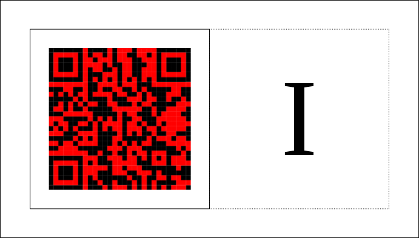

      
<h2>Esse est percipi</h2> 
All presented works are **Invocations**.  
          An Invocation encompasses two components:  
          - a **Symbol** (a tokenized digital image which is subject to ownership), and 
          - an **Invoked** (which is instantiated only upon interaction with the Symbol).
            
          An Invocation is **complete** *only upon interaction* with the Symbol which 
          produces the Invoked.  
          **Example.** From the [Q1 Universe is mine.](https://www.q1universeismine.net) 
          project:  
            
          - The **Symbol** is to the left in the schema 
          - **I** represents the **Invoked** in the schema (which is a page view of 
          [a digitally signed URL of Q42 in Wikidata](https://www.wikidata.org/wiki/Q42?@gsmilovanovic) 
          in this example)  
          - An **Invocation** is a complete piece only upon interaction: **[Symbol &#8594; I]**. 
          **Invocations:Q1 universe is mine.**   
